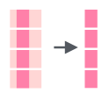

# Работа со строками {#strings}

## Работа со строками в R

Для работы со строками можно использовать:

* базовый R
* пакет `stringr` (часть `tidyverse`)
* пакет `stringi` -- отдельный пакет, так что не забудьте его установить:
```{r, eval=FALSE}
install.packages("stringi")
library(tidyverse)
library(stringi)
```

```{r, include=FALSE}
library(tidyverse)
library(stringi)
```

Мы будем пользоваться в основном пакетами `stingr` и `stringi`, так как они в большинстве случаях удобнее. К счастью функции этих пакетов легко отличить от остальных: функции пакет `stringr` всегда начинаются с `str_`, а функции пакета `stringi` --- c `stri_`.

Существует [cheat sheet по `stringr`](https://github.com/rstudio/cheatsheets/raw/master/strings.pdf).

## Как получить строку?

* следите за кавычками
```{r}
"the quick brown fox jumps over the lazy dog"
'the quick brown fox jumps over the lazy dog'
"the quick 'brown' fox jumps over the lazy dog"
'the quick "brown" fox jumps over the lazy dog'
```

* пустая строка
```{r}
""
''
character(3)
```

* преобразование
```{r}
typeof(4:7)
as.character(4:7)
```

* встроенные векторы
```{r}
letters
LETTERS
month.name
```

* помните, что функции `data.frame()`, `read.csv()`,  `read.csv2()`, `read.table()` из базового R всегда по-умолчанию преобразуют строки в факторы, и чтобы это предотвратить нужно использовать аргумент `stringsAsFactors`. Это много обсуждалось в сообществе R, можно, например, почитать про это [вот этот блог пост Роджера Пенга](https://simplystatistics.org/2015/07/24/stringsasfactors-an-unauthorized-biography/).
```{r}
str(data.frame(letters[6:10], LETTERS[4:8]))
str(data.frame(letters[6:10], LETTERS[4:8], stringsAsFactors = FALSE))
```

Но этом курсе мы учим использовать сразу `tibble()`, `read_csv()`, `read_csv2()`, `read_tsv()`, `read_delim()` из пакета `readr` (входит в `tidyverse`).

* Создание рандомных строк
```{r}
set.seed(42)
stri_rand_strings(n = 10, length = 5:14)
```

* Перемешивает символы внутри строки
```{r}
stri_rand_shuffle("любя, съешь щипцы, — вздохнёт мэр, — кайф жгуч")
stri_rand_shuffle(month.name)
```

* Генерирует псевдорандомный текст ^[Lorem ipsum --- классический текст-заполнитель на основе трактата Марка Туллия Цицерона "О пределах добра и зла". Его используют, чтобы посмотреть, как страница смотриться, когда заполнена текстом]
```{r}
stri_rand_lipsum(nparagraphs = 2)
```

## Соединение и разделение строк

Соединенить строки можно используя функцию `str_c()`, в которую, как и в функции `с()`, можно перечислять элементы через запятую:
```{r}
tibble(upper = rev(LETTERS), smaller = letters) %>% 
  mutate(merge = str_c(upper, smaller))
```

Кроме того, если хочется, можно использовать особенный разделитель, указав его в аргументе `sep`:

```{r}
tibble(upper = rev(LETTERS), smaller = letters) %>% 
  mutate(merge = str_c(upper, smaller, sep = "_"))
```

Аналогичным образом, для разделение строки на подстроки можно использовать функцию `separate()`. Это функция разносит разделенные элементы строки в соответствующие столбцы. У функции три обязательных аргумента: `col` --- колонка, которую следует разделить, `into` --- вектор названий новых столбец, `sep` --- разделитель.

```{r}
tibble(upper = rev(LETTERS), smaller = letters) %>% 
  mutate(merge = str_c(upper, smaller, sep = "_")) %>% 
  separate(col = merge, into = c("column_1", "column_2"), sep = "_")
```

## Количество символов

### Подсчет количества символов


```{r}
tibble(mn = month.name) %>% 
  mutate(n_charactars = str_count(mn))
```

### Подгонка количества символов

Можно обрезать строки, используя функцию `str_trunc()`:


```{r}
tibble(mn = month.name) %>% 
  mutate(mn_new = str_trunc(month.name, 6))
```

Можно решить с какой стороны обрезать, используя аргумент `side`:
```{r}
tibble(mn = month.name) %>% 
  mutate(mn_new = str_trunc(month.name, 6, side = "left"))
tibble(mn = month.name) %>% 
  mutate(mn_new = str_trunc(month.name, 6, side = "center"))
```

Можно заменить многоточие, используя аргумент `ellipsis`:
```{r}
tibble(mn = month.name) %>% 
  mutate(mn_new = str_trunc(month.name, 3, ellipsis = ""))
```

Можно наоборот "раздуть" строку:


```{r}
tibble(mn = month.name) %>% 
  mutate(mn_new = str_pad(month.name, 10))
```

Опять же есть аргумент `side`:
```{r}
tibble(mn = month.name) %>% 
  mutate(mn_new = str_pad(month.name, 10,  side = "right"))
```

```{block, type = "rmdtask"}
На Pudding вышла [статья про английские пабы](https://pudding.cool/2019/10/pubs/). [Здесь](https://raw.githubusercontent.com/agricolamz/DS_for_DH/master/data/UK_pubs.csv) лежит немного обработанный датасет, которые они использовали. Визуализируйте 50 самых частотоных названий пабов в Великобритании, отложив по оси x количество символов, а по оси y -- количество баров с таким названием.
```

```{r, echo=FALSE, message = FALSE}
read_csv("https://raw.githubusercontent.com/agricolamz/DS_for_DH/master/data/UK_pubs.csv") %>% 
  count(pub_name, sort = TRUE) %>% 
  mutate(nchar = str_length(pub_name)) %>% 
  filter(n>50) %>% 
  ggplot(aes(nchar, n, label = pub_name))+
  geom_point()+
  ggrepel::geom_text_repel()+
  labs(x = "number of symbols",
       y = "number of bars",
       titles = "50 most popular bar names in UK",
       caption = "data from https://pudding.cool/2019/10/pubs/")
```

<details> <summary> 📋 список подсказок ➡ </summary> 

<details> <summary> 👁 Датасет скачался, что дальше? ➡ </summary>
Перво-наперво следует создать переменную, в которой бы хранилось количество каждого из баров. <br>
</details>

<details> <summary> 👁 А как посчитать количество баров? ➡ </summary>
Это можно сделать при помощи функции `count()`. <br>
</details>

<details> <summary> 👁 Бары пересчитали, что дальше? ➡ </summary>
Теперь нужно создать новую переменную, где бы хранилась информация о количестве символов. <br>
</details>

<details> <summary> 👁 Все переменные есть, теперь рисуем? ➡ </summary>
Не совсем. Перед тем как рисовать нужно отфильтровать 50 самых популярных. <br>
</details>

<details> <summary> 👁 Так, все готово, а какие `geom_()`? ➡ </summary>
На графике `geom_point()` и `geom_text_repel()` из пакета `ggrepel`. <br>
</details>

<details> <summary> 👁 А-а-а-а! `could not find function "geom_text_repel"` ➡ </summary>
А вы включили библиотеку `ggrepel`? Если не включили, то функция, естественно будет недоступна. <br>
</details>

<details> <summary> 👁 А-а-а-а! `geom_text_repel requires the following missing aesthetics: label"` ➡ </summary>
Все, как написала программа: чтобы писать какой-то текст в функции `aes()` нужно добавить аргумент `label = pub_name`. Иначе откуда он узнает, что ему писать? <br>
</details>

<details> <summary> 👁 Фуф! Все готово! ➡ </summary>
А оси подписаны? А заголовок? А подпись про источник данных? <br>
</details>
</details>

## Сортировка
Для сортировки существует базовая функция `sort()` и функция из `stringr` `str_sort()`:

```{r}
unsorted_latin <- c("I", "♥", "N", "Y")
sort(unsorted_latin)
str_sort(unsorted_latin)
str_sort(unsorted_latin, locale = "lt")
unsorted_cyrillic <- c("я", "i", "ж")
str_sort(unsorted_cyrillic)
str_sort(unsorted_cyrillic, locale = "ru_UA")
```

Список локалей на копмьютере можно посмотреть командой `stringi::stri_locale_list()`. Список всех локалей вообще приведен [на этой странице](https://en.wikipedia.org/wiki/List_of_ISO_639-1_codes). Еще полезные команды: `stringi::stri_locale_info` и `stringi::stri_locale_set`.

Не углубляясь в [разнообразие алгоритмов сортировки](https://www.youtube.com/watch?v=BeoCbJPuvSE), отмечу, что алгоритм по-умолчанию хуже работает с большими данными:

```{r, cache= TRUE}
set.seed(42)
huge <- sample(letters, 1e7, replace = TRUE)
head(huge)
system.time(
  sort(huge)
)

system.time(
  sort(huge, method = "radix")
)

system.time(
  str_sort(huge)
)

huge_tbl <- tibble(huge)
system.time(
  huge_tbl %>% 
    arrange(huge)
)
```

Предварительный вывод: для больших данных -- `sort(..., method = "radix")`.

## Поиск подстроки
Можно использовать функцию `str_detect()`:


```{r}
tibble(mn = month.name) %>% 
  mutate(has_r = str_detect(mn, "r"))
```

Кроме того, существует функция, которая возвращает индексы, а не значения `TRUE`/`FALSE`:


```{r}
str_which(month.name, "r")
```

Также можно посчитать количество вхождений какой-то подстроки:


```{r}
tibble(mn = month.name) %>% 
  mutate(has_r = str_count(mn, "r"))
```

## Изменение строк
### Изменение регистра
```{r}
latin <- "tHe QuIcK BrOwN fOx JuMpS OvEr ThE lAzY dOg"
cyrillic <- "лЮбЯ, сЪеШь ЩиПцЫ, — вЗдОхНёТ мЭр, — кАйФ жГуЧ"
str_to_upper(latin)
str_to_lower(cyrillic)
str_to_title(latin)
```

### Выделение подстроки
Подстроку в строке можно выделить двумя способами: по индексам функцией `str_sub()`, и по подстроке функцией `str_png()`.



```{r}
tibble(mn = month.name) %>% 
  mutate(mutate = str_sub(mn, start = 1, end = 2))
```

      

```{r}
tibble(mn = month.name) %>% 
  mutate(mutate = str_extract(mn, "r"))
```

По умолчанию функция `str_extract()` возвращает первое вхождение подстроки, соответствующей шаблону. Также существует функция `str_extract_all()`, которая возвращает все вхождения подстрок, соответствующих шаблону, однако возвращает объект типа список.

```{r}
str_extract_all(month.name, "r")
```

### Замена подстроки

Существует функция `str_replace()`, которая позволяет заменить одну подстроку в строке на другую:


```{r}
tibble(mn = month.name) %>% 
  mutate(mutate = str_replace(mn, "r", "R"))
```

Как и другие функции `str_replace()` делает лишь одну замену, чтобы заменить все вхождения подстроки следует использовать функцию `str_replace_all()`:


```{r}
tibble(mn = month.name) %>% 
  mutate(mutate = str_replace_all(mn, "r", "R"))
```

### Удаление подстроки
Для удаления подстроки на основе шаблона, используется функция `str_remove()` и `str_remove_all()`

```{r}
tibble(month.name) %>% 
  mutate(mutate = str_remove(month.name, "r"))
tibble(month.name) %>% 
  mutate(mutate = str_remove_all(month.name, "r"))
```

### Транслитерация строк

В пакете `stringi` сууществует достаточно много методов транслитераций строк, которые можно вывести командой `stri_trans_list()`. Вот пример использования некоторых из них:

```{r}
stri_trans_general("stringi", "latin-cyrillic")
stri_trans_general("сырники", "cyrillic-latin")
stri_trans_general("stringi", "latin-greek")
stri_trans_general("stringi", "latin-armenian")
```

```{block, type = "rmdtask"}
Вот два датасета:

* [список городов России](https://raw.githubusercontent.com/agricolamz/DS_for_DH/master/data/cities_of_russia.csv)
* [частотный словарь русского языка [Шаров, Ляшевская 2011]](https://raw.githubusercontent.com/agricolamz/DS_for_DH/master/data/freq_dict_2011.csv)

Определите сколько городов называется обычным словом русского языка (например, город Орёл)? Не забудьте поменять ё на е.
```

```{r, cache=TRUE, include=FALSE}
read_csv("https://raw.githubusercontent.com/agricolamz/DS_for_DH/master/data/cities_of_russia.csv") %>% 
  mutate(city = str_to_lower(city),
         city = str_replace_all(city, "ё", "е"), 
         town = TRUE) ->
  cities

dict <- read_tsv("https://raw.githubusercontent.com/agricolamz/DS_for_DH/master/data/freq_dict_2011.csv") %>% 
  mutate(lemma = str_replace_all(lemma, "ё", "е")) %>% 
  left_join(cities, by = c("lemma" = "city")) ->
  result
result %>% 
  count(town)
# 69
```


<details> <summary> 📋 список подсказок ➡ </summary> 

<details> <summary> 👁 Датасеты скачались, что дальше? ➡ </summary>
Надо их преобразовать к нужному виду и объединить. <br>
</details>

<details> <summary> 👁 А как их соединить? Что у них общего? ➡ </summary>  
В одном датасете есть переменная `city`, в другом -- переменная `lemma`. Все города начинаются с большой буквы, все леммы с маленькой буквы. Я бы уменьшил букву в датасете с городами, сделал бы новый столбец в датасете с городами (например, `town`), соединил бы датасеты и посчитал бы сколько в результирующем датасете значений `town`.
<br>
</details>

<details> <summary> 👁 А как соеднить? ➡ </summary>
Я бы использовал `dict %>% ... %>% left_join(cities)`. Если в датасетах разные названия столбцов, то следует указывать какие столбцы, каким соответствуют:`dict %>% ... %>% left_join(cities, by = c("lemma" = "city"))`
<br>
</details>

<details> <summary> 👁 Соединилось вроде... А как посчитать? ➡ </summary>
Я бы, как обычно, использовал функцию `count()`.
<br>
</details>

</details>

## Регулярные выражения

## Определение языка

Для определения языка существует два пакета `cld2` (вероятностный) и `cld3` (нейросеть).

```{r}
udhr_24 <- read_csv("")
udhr_24
cldhttps://raw.githubusercontent.com/agricolamz/DS_for_DH/master/data/article_24_from_UDHR.csv2::detect_language(udhr_24$article_text)
cld2::detect_language(udhr_24$article_text, lang_code = FALSE)
cld3::detect_language(udhr_24$article_text)
cld2::detect_language("Ты женат? Говорите ли по-английски?")
cld3::detect_language("Ты женат? Говорите ли по-английски?")
cld2::detect_language("Варкалось. Хливкие шорьки пырялись по наве, и хрюкотали зелюки, как мюмзики в мове.")
cld3::detect_language("Варкалось. Хливкие шорьки пырялись по наве, и хрюкотали зелюки, как мюмзики в мове.")
cld2::detect_language("Варчилось… Хлив'язкі тхурки викрули, свербчись навкрузі, жасумновілі худоки гривіли зехряки в чузі.")
cld3::detect_language("Варчилось… Хлив'язкі тхурки викрули, свербчись навкрузі, жасумновілі худоки гривіли зехряки в чузі.")
cld2::detect_language_mixed("Многие в нашей команде OpenDataScience занимаются state-of-the-art технологиями машинного обучения: DL-фреймворками, байесовскими методами машинного обучения, вероятностным программированием и не только.")
cld3::detect_language_mixed("Многие в нашей команде OpenDataScience занимаются state-of-the-art технологиями машинного обучения: DL-фреймворками, байесовскими методами машинного обучения, вероятностным программированием и не только.")
```


## Расстояния между строками
