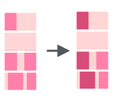
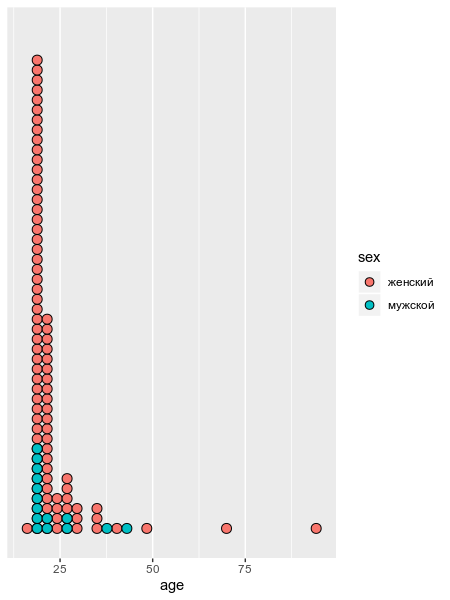

# Работа со строками {#strings}

## Работа со строками в R

Для работы со строками можно использовать:

* базовый R
* пакет `stringr` (часть `tidyverse`)
* пакет `stringi` -- отдельный пакет, так что не забудьте его установить:
```{r, eval=FALSE}
install.packages("stringi")
library(tidyverse)
library(stringi)
```

```{r, include=FALSE}
library(tidyverse)
library(stringi)
```

Мы будем пользоваться в основном пакетами `stingr` и `stringi`, так как они в большинстве случаях удобнее. К счастью функции этих пакетов легко отличить от остальных: функции пакет `stringr` всегда начинаются с `str_`, а функции пакета `stringi` --- c `stri_`.

Существует [cheat sheet по `stringr`](https://github.com/rstudio/cheatsheets/raw/master/strings.pdf).

## Как получить строку?

* следите за кавычками
```{r}
"the quick brown fox jumps over the lazy dog"
'the quick brown fox jumps over the lazy dog'
"the quick 'brown' fox jumps over the lazy dog"
'the quick "brown" fox jumps over the lazy dog'
```

* пустая строка
```{r}
""
''
character(3)
```

* преобразование
```{r}
typeof(4:7)
as.character(4:7)
```

* встроенные векторы
```{r}
letters
LETTERS
month.name
```

* помните, что функции `data.frame()`, `read.csv()`,  `read.csv2()`, `read.table()` из базового R всегда по-умолчанию преобразуют строки в факторы, и чтобы это предотвратить нужно использовать аргумент `stringsAsFactors`. Это много обсуждалось в сообществе R, можно, например, почитать про это [вот этот блог пост Роджера Пенга](https://simplystatistics.org/2015/07/24/stringsasfactors-an-unauthorized-biography/).
```{r}
str(data.frame(letters[6:10], LETTERS[4:8]))
str(data.frame(letters[6:10], LETTERS[4:8], stringsAsFactors = FALSE))
```

Но этом курсе мы учим использовать сразу `tibble()`, `read_csv()`, `read_csv2()`, `read_tsv()`, `read_delim()` из пакета `readr` (входит в `tidyverse`).

* Создание рандомных строк
```{r}
set.seed(42)
stri_rand_strings(n = 10, length = 5:14)
```

* Перемешивает символы внутри строки
```{r}
stri_rand_shuffle("любя, съешь щипцы, — вздохнёт мэр, — кайф жгуч")
stri_rand_shuffle(month.name)
```

* Генерирует псевдорандомный текст ^[Lorem ipsum --- классический текст-заполнитель на основе трактата Марка Туллия Цицерона "О пределах добра и зла". Его используют, чтобы посмотреть, как страница смотриться, когда заполнена текстом]
```{r}
stri_rand_lipsum(nparagraphs = 2)
```

## Соединение и разделение строк

Соединенить строки можно используя функцию `str_c()`, в которую, как и в функции `с()`, можно перечислять элементы через запятую:
```{r}
tibble(upper = rev(LETTERS), smaller = letters) %>% 
  mutate(merge = str_c(upper, smaller))
```

Кроме того, если хочется, можно использовать особенный разделитель, указав его в аргументе `sep`:

```{r}
tibble(upper = rev(LETTERS), smaller = letters) %>% 
  mutate(merge = str_c(upper, smaller, sep = "_"))
```

Аналогичным образом, для разделение строки на подстроки можно использовать функцию `separate()`. Это функция разносит разделенные элементы строки в соответствующие столбцы. У функции три обязательных аргумента: `col` --- колонка, которую следует разделить, `into` --- вектор названий новых столбец, `sep` --- разделитель.

```{r}
tibble(upper = rev(LETTERS), smaller = letters) %>% 
  mutate(merge = str_c(upper, smaller, sep = "_")) %>% 
  separate(col = merge, into = c("column_1", "column_2"), sep = "_")
```

Кроме того, есть инструмент `str_split()`, которая позволяет разбивать строки на подстроки, но возвращает *список*.

```{r}
str_split(month.name, "r")
```


## Количество символов

### Подсчет количества символов


```{r}
tibble(mn = month.name) %>% 
  mutate(n_charactars = str_count(mn))
```

### Подгонка количества символов

Можно обрезать строки, используя функцию `str_trunc()`:


```{r}
tibble(mn = month.name) %>% 
  mutate(mn_new = str_trunc(mn, 6))
```

Можно решить с какой стороны обрезать, используя аргумент `side`:
```{r}
tibble(mn = month.name) %>% 
  mutate(mn_new = str_trunc(mn, 6, side = "left"))
tibble(mn = month.name) %>% 
  mutate(mn_new = str_trunc(mn, 6, side = "center"))
```

Можно заменить многоточие, используя аргумент `ellipsis`:
```{r}
tibble(mn = month.name) %>% 
  mutate(mn_new = str_trunc(mn, 3, ellipsis = ""))
```

Можно наоборот "раздуть" строку:


```{r}
tibble(mn = month.name) %>% 
  mutate(mn_new = str_pad(mn, 10))
```

Опять же есть аргумент `side`:
```{r}
tibble(mn = month.name) %>% 
  mutate(mn_new = str_pad(mn, 10,  side = "right"))
```

Также можно выбрать, чем "раздувать строку":

```{r}
tibble(mn = month.name) %>% 
  mutate(mn_new = str_pad(mn, 10,  pad = "."))
```


```{block, type = "rmdtask"}
На Pudding вышла [статья про английские пабы](https://pudding.cool/2019/10/pubs/). [Здесь](https://raw.githubusercontent.com/agricolamz/DS_for_DH/master/data/UK_pubs.csv) лежит немного обработанный датасет, которые они использовали. Визуализируйте 40 самых частотоных названий пабов в Великобритании, отложив по оси x количество символов, а по оси y -- количество баров с таким названием.
```

```{r, echo=FALSE, message = FALSE}
read_csv("https://raw.githubusercontent.com/agricolamz/DS_for_DH/master/data/UK_pubs.csv") %>% 
  count(pub_name, sort = TRUE) %>% 
  mutate(nchar = str_length(pub_name)) %>% 
  slice(1:40) %>% 
  ggplot(aes(nchar, n, label = pub_name))+
  geom_point()+
  ggrepel::geom_text_repel()+
  labs(x = "number of symbols",
       y = "number of bars",
       titles = "40 most popular bar names in UK",
       caption = "data from https://pudding.cool/2019/10/pubs/")
```

<details> <summary> 📋 список подсказок ➡ </summary> 

<details> <summary> 👁 Датасет скачался, что дальше? ➡ </summary>
Перво-наперво следует создать переменную, в которой бы хранилось количество каждого из баров. <br>
</details>

<details> <summary> 👁 А как посчитать количество баров? ➡ </summary>
Это можно сделать при помощи функции `count()`. <br>
</details>

<details> <summary> 👁 Бары пересчитали, что дальше? ➡ </summary>
Теперь нужно создать новую переменную, где бы хранилась информация о количестве символов. <br>
</details>

<details> <summary> 👁 Все переменные есть, теперь рисуем? ➡ </summary>
Не совсем. Перед тем как рисовать нужно отфильтровать 50 самых популярных. <br>
</details>

<details> <summary> 👁 Так, все готово, а какие `geom_()`? ➡ </summary>
На графике `geom_point()` и `geom_text_repel()` из пакета `ggrepel`. <br>
</details>

<details> <summary> 👁 А-а-а-а! `could not find function "geom_text_repel"` ➡ </summary>
А вы включили библиотеку `ggrepel`? Если не включили, то функция, естественно будет недоступна. <br>
</details>

<details> <summary> 👁 А-а-а-а! `geom_text_repel requires the following missing aesthetics: label"` ➡ </summary>
Все, как написала программа: чтобы писать какой-то текст в функции `aes()` нужно добавить аргумент `label = pub_name`. Иначе откуда он узнает, что ему писать? <br>
</details>

<details> <summary> 👁 Фуф! Все готово! ➡ </summary>
А оси подписаны? А заголовок? А подпись про источник данных? <br>
</details>
</details>

## Сортировка
Для сортировки существует базовая функция `sort()` и функция из `stringr` `str_sort()`:

```{r}
unsorted_latin <- c("I", "♥", "N", "Y")
sort(unsorted_latin)
str_sort(unsorted_latin)
str_sort(unsorted_latin, locale = "lt")
unsorted_cyrillic <- c("я", "i", "ж")
str_sort(unsorted_cyrillic)
str_sort(unsorted_cyrillic, locale = "ru_UA")
```

Список локалей на копмьютере можно посмотреть командой `stringi::stri_locale_list()`. Список всех локалей вообще приведен [на этой странице](https://en.wikipedia.org/wiki/List_of_ISO_639-1_codes). Еще полезные команды: `stringi::stri_locale_info` и `stringi::stri_locale_set`.

Не углубляясь в [разнообразие алгоритмов сортировки](https://www.youtube.com/watch?v=BeoCbJPuvSE), отмечу, что алгоритм по-умолчанию хуже работает с большими данными:

```{r, cache= TRUE}
set.seed(42)
huge <- sample(letters, 1e7, replace = TRUE)
head(huge)
system.time(
  sort(huge)
)

system.time(
  sort(huge, method = "radix")
)

system.time(
  str_sort(huge)
)

huge_tbl <- tibble(huge)
system.time(
  huge_tbl %>% 
    arrange(huge)
)
```

Предварительный вывод: для больших данных -- `sort(..., method = "radix")`.

## Поиск подстроки
Можно использовать функцию `str_detect()`:


```{r}
tibble(mn = month.name) %>% 
  mutate(has_r = str_detect(mn, "r"))
```

Кроме того, существует функция, которая возвращает индексы, а не значения `TRUE`/`FALSE`:


```{r}
tibble(mn = month.name) %>% 
  slice(str_which(month.name, "r"))
```

Также можно посчитать количество вхождений какой-то подстроки:


```{r}
tibble(mn = month.name) %>% 
  mutate(has_r = str_count(mn, "r"))
```

## Изменение строк
### Изменение регистра
```{r}
latin <- "tHe QuIcK BrOwN fOx JuMpS OvEr ThE lAzY dOg"
cyrillic <- "лЮбЯ, сЪеШь ЩиПцЫ, — вЗдОхНёТ мЭр, — кАйФ жГуЧ"
str_to_upper(latin)
str_to_lower(cyrillic)
str_to_title(latin)
```

### Выделение подстроки
Подстроку в строке можно выделить двумя способами: по индексам функцией `str_sub()`, и по подстроке функцией `str_png()`.

extract(images/5.07_str_sub.png)

```{r}
tibble(mn = month.name) %>% 
  mutate(mutate = str_sub(mn, start = 1, end = 2))
```

      

```{r}
tibble(mn = month.name) %>% 
  mutate(mutate = str_extract(mn, "r"))
```

По умолчанию функция `str_extract()` возвращает первое вхождение подстроки, соответствующей шаблону. Также существует функция `str_extract_all()`, которая возвращает все вхождения подстрок, соответствующих шаблону, однако возвращает объект типа список.

```{r}
str_extract_all(month.name, "r")
```

### Замена подстроки

Существует функция `str_replace()`, которая позволяет заменить одну подстроку в строке на другую:



```{r}
tibble(mn = month.name) %>% 
  mutate(mutate = str_replace(mn, "r", "R"))
```

Как и другие функции `str_replace()` делает лишь одну замену, чтобы заменить все вхождения подстроки следует использовать функцию `str_replace_all()`:


```{r}
tibble(mn = month.name) %>% 
  mutate(mutate = str_replace_all(mn, "r", "R"))
```

### Удаление подстроки
Для удаления подстроки на основе шаблона, используется функция `str_remove()` и `str_remove_all()`

```{r}
tibble(month.name) %>% 
  mutate(mutate = str_remove(month.name, "r"))
tibble(month.name) %>% 
  mutate(mutate = str_remove_all(month.name, "r"))
```

### Транслитерация строк

В пакете `stringi` сууществует достаточно много методов транслитераций строк, которые можно вывести командой `stri_trans_list()`. Вот пример использования некоторых из них:

```{r}
stri_trans_general("stringi", "latin-cyrillic")
stri_trans_general("сырники", "cyrillic-latin")
stri_trans_general("stringi", "latin-greek")
stri_trans_general("stringi", "latin-armenian")
```

```{block, type = "rmdtask"}
Вот два датасета:

* [список городов России](https://raw.githubusercontent.com/agricolamz/DS_for_DH/master/data/cities_of_russia.csv)
* [частотный словарь русского языка [Шаров, Ляшевская 2011]](https://raw.githubusercontent.com/agricolamz/DS_for_DH/master/data/freq_dict_2011.csv)

Определите сколько городов называется обычным словом русского языка (например, город Орёл)? Не забудьте поменять ё на е.
```

```{r, cache=TRUE, include=FALSE, eval=FALSE}
read_csv("https://raw.githubusercontent.com/agricolamz/DS_for_DH/master/data/cities_of_russia.csv") %>% 
  mutate(city = str_to_lower(city),
         city = str_replace_all(city, "ё", "е")) ->
  cities

read_tsv("https://raw.githubusercontent.com/agricolamz/DS_for_DH/master/data/freq_dict_2011.csv") %>% 
  inner_join(cities, by = c("lemma" = "city")) %>% 
  count(lemma)
# 65
```


<details> <summary> 📋 список подсказок ➡ </summary> 

<details> <summary> 👁 Датасеты скачались, что дальше? ➡ </summary>
Надо их преобразовать к нужному виду и объединить. <br>
</details>

<details> <summary> 👁 А как их соединить? Что у них общего? ➡ </summary>  
В одном датасете есть переменная `city`, в другом -- переменная `lemma`. Все города начинаются с большой буквы, все леммы с маленькой буквы. Я бы уменьшил букву в датасете с городами, сделал бы новый столбец в датасете с городами (например, `town`), соединил бы датасеты и посчитал бы сколько в результирующем датасете значений `town`.
<br>
</details>

<details> <summary> 👁 А как соеднить? ➡ </summary>
Я бы использовал `dict %>% ... %>% inner_join(cities)`. Если в датасетах разные названия столбцов, то следует указывать какие столбцы, каким соответствуют:`dict %>% ... %>% inner_join(cities, by = c("lemma" = "city"))`
<br>
</details>

<details> <summary> 👁 Соединилось вроде... А как посчитать? ➡ </summary>
Я бы, как обычно, использовал функцию `count()`.
<br>
</details>

</details>

## Регулярные выражения
Большинство функций из раздела об операциях над векторами (`str_detect()`, `str_extract()`, `str_remove()` и т. п.) имеют следующую структуру:

* строка, с которой работает функция
* образец (pattern)

Дальше мы будем использовать функцию `str_view_all()`, которая позволяет показывать, выделенное образцом в исходной строке.

```{r}
str_view_all("Я всегда путаю с и c", "c") # я ищу латинскую c
```

### Экранирование метасимволов
```{r}
a <- "Всем известно, что 4$\\2 + 3$ * 5 = 17$? Да? Ну хорошо (а то я не был уверен). [|}^{|]"
str_view_all(a, "$")
str_view_all(a, "\\$")
str_view_all(a, "\\.")
str_view_all(a, "\\*")
str_view_all(a, "\\+")
str_view_all(a, "\\?")
str_view_all(a, "\\(")
str_view_all(a, "\\)")
str_view_all(a, "\\|")
str_view_all(a, "\\^")
str_view_all(a, "\\[")
str_view_all(a, "\\]")
str_view_all(a, "\\{")
str_view_all(a, "\\}")
str_view_all(a, "\\\\")
```

### Классы знаков
* `\\d` -- цифры. `\\D` -- не цифры.
```{r}
str_view_all("два 15 42. 42 15. 37 08 5. 20 20 20!", "\\d")
str_view_all("два 15 42. 42 15. 37 08 5. 20 20 20!", "\\D")
```

* `\\s` -- пробелы. `\\S` -- не пробелы.
```{r}
str_view_all("два 15 42. 42 15. 37 08 5. 20 20 20!", "\\s")
str_view_all("два 15 42. 42 15. 37 08 5. 20 20 20!", "\\S")
```

* `\\w` -- не пробелы и не знаки препинания. `\\W` -- пробелы и знаки препинания.
```{r}
str_view_all("два 15 42. 42 15. 37 08 5. 20 20 20!", "\\w")
str_view_all("два 15 42. 42 15. 37 08 5. 20 20 20!", "\\W")
```

* произвольная группа символов и обратная к ней
```{r}
str_view_all("Умей мечтать, не став рабом мечтанья", "[оауиыэёеяю]")
str_view_all("И мыслить, мысли не обожествив", "[^оауиыэёеяю]")
```

* встроенные группы символов
```{r}
str_view_all("два 15 42. 42 15. 37 08 5. 20 20 20!", "[0-9]")
str_view_all("Карл у Клары украл кораллы, а Клара у Карла украла кларнет", "[а-я]")
str_view_all("Карл у Клары украл кораллы, а Клара у Карла украла кларнет", "[А-Я]")
str_view_all("Карл у Клары украл кораллы, а Клара у Карла украла кларнет", "[А-я]")
str_view_all("The quick brown Fox jumps over the lazy Dog", "[a-z]")
str_view_all("два 15 42. 42 15. 37 08 5. 20 20 20!", "[^0-9]")
```


* выбор из нескольких групп
```{r}
str_view_all("Карл у Клары украл кораллы, а Клара у Карла украла кларнет", "лар|рал|арл")
```

* произвольный символ
```{r}
str_view_all("Везет Сенька Саньку с Сонькой на санках. Санки скок, Сеньку с ног, Соньку в лоб, все — в сугроб", "[Сс].н")
```

* знак начала и конца строки
```{r}
str_view_all("от топота копыт пыль по полю летит.", "^о")
str_view_all("У ежа — ежата, у ужа — ужата", "жата$")
```

* есть еще другие группы и другие обозначения уже приведенных групп, см. `?regex`


### Квантификация

* `?` -- ноль или один раз
```{r}
str_view_all("хорошее длинношеее животное", "еее?")
```

* `*` -- ноль и более раз
```{r}
str_view_all("хорошее длинношеее животное", "ее*")
```

* `+` -- один и более раз
```{r}
str_view_all("хорошее длинношеее животное", "е+")
```

* `{n}` -- `n` раз
```{r}
str_view_all("хорошее длинношеее животное", "е{2}")
```

* `{n,}` -- `n` раз и более
```{r}
str_view_all("хорошее длинношеее животное", "е{1,}")
```

* `{n,m}` -- от `n` до `m`. Отсутствие пробела важно: `{1,2}` -- правильно, `{1,␣2}` -- неправильно.
```{r}
str_view_all("хорошее длинношеее животное", "е{2,3}")
```

* группировка символов
```{r}
str_view_all("Пушкиновед, Лермонтовед, Лермонтововед", "(ов)+")
str_view_all("беловатый, розоватый, розововатый", "(ов)+")
```

* жадный vs. нежадный алоритмы
```{r}
str_view_all("Пушкиновед, Лермонтовед, Лермонтововед", "в.*ед")
str_view_all("Пушкиновед, Лермонтовед, Лермонтововед", "в.*?ед")
```


### Позиционная проверка (look arounds)

Позиционная проверка -- выглядит достаточно непоследовательно даже в свете остальных регулярных выражений.

Давайте найдем все *а* **перед** *р*:

```{r}
str_view_all("Карл у Клары украл кораллы, а Клара у Карла украла кларнет", "а(?=р)")
```

А теперь все *а* **перед** *р* или *л*:

```{r}
str_view_all("Карл у Клары украл кораллы, а Клара у Карла украла кларнет", "а(?=[рл])")
```

Давайте найдем все а **после** *р*

```{r}
str_view_all("Карл у Клары украл кораллы, а Клара у Карла украла кларнет", "(?<=р)а")
```

А теперь все *а* **после** *р* или *л*:

```{r}
str_view_all("Карл у Клары украл кораллы, а Клара у Карла украла кларнет", "(?<=[рл])а")
```

Также у этих выражений есть формы с отрицанием. Давайте найдем все *р* **не перед** *а*:

```{r}
str_view_all("Карл у Клары украл кораллы, а Клара у Карла украла кларнет", "р(?!а)")
```

А теперь все *р* **не после** *а*:

```{r}
str_view_all("Карл у Клары украл кораллы, а Клара у Карла украла кларнет", "(?<!а)р")
```

Запомнить с ходу это достаточно сложно, так что подсматривайте сюда:


```{block, type = "rmdtask"}
[Вот отсюда](https://raw.githubusercontent.com/agricolamz/DS_for_DH/master/data/zabolockiy_merknut_znaki_zodiaka.txt) можно скачать файл с текстом стихотворения Н. Заболоцкого "Меркнут знаки задиака". Посчитайте долю женских (ударение падает на **предпоследний** слог рифмующихся слов) и мужских (ударение падает на **последний** слог рифмующихся слов) рифм в стихотворении.
```

```{r, cache=TRUE, include=FALSE}
text <- read_lines("https://raw.githubusercontent.com/agricolamz/DS_for_DH/master/data/zabolockiy_merknut_znaki_zodiaka.txt")
tibble(text = text) %>% 
  filter(text != "") %>% 
  mutate(n_vowels = str_count(text, "[яёуеыаоэюиЯЁУЕЫАОЭЮИ]")) %>% 
  count(n_vowels) %>% 
  mutate(ratio = n/sum(n))
```

<details> <summary> 📋 список подсказок ➡ </summary> 

<details> <summary> 👁 Датасеты скачивается с ошибкой, почему? ➡ </summary>
Дело в том, что исходный файл в формате `.txt`, а не `.csv`. Его нужно скачивать, например, командой `read_lines()` <br>
</details>

<details> <summary> 👁 Ошибка: `...applied to an object of class "character"` ➡ </summary>  
Скачав файл Вы получили вектор со строками, где каждая элимент вектора -- строка стихотворения. Создайте `tibble()`, тогда можно будет применять стандартные инструменты `tidyverse`.
<br>
</details>

<details> <summary> 👁 Хорошо, `tibble()` создан, что дальше? ➡ </summary>
Дальше нужно создать переменную, из которой будет понятно, мужская в каждой строке рифма, или женская.
<br>
</details>

<details> <summary> 👁 А как определить, какая рифма? Нужно с словарем сравнивать? ➡ </summary>
Формально говоря, определять рифму можно по косвенным признакам. Все стихотворение написано четырехстопным хореем, значит в нем либо 7, либо 8 слогов. Значит, посчитав количество слогов, мы поймем, какая перед нами рифма.
<br>
</details>

<details> <summary> 👁 А как посчитать гласные?  ➡ </summary>
Нужно написать регулярное выражение... вроде бы это тема нашего занятия...
<br>
</details>

<details> <summary> 👁 Гласные посчитаны. А что дальше?   ➡ </summary>
Ну теперь нужно посчитать, сколько каких длин (в количестве слогов) бывает в стихотворении. Это можно сделать при помощи функции `count()`.
<br>
</details>

<details> <summary> 👁 А почему у меня есть строки длины 0 слогов   ➡ </summary>
Ну, видимо, в стихотворении были пустые строки. Они использовались для разделения строф.
<br>
</details>

<details> <summary> 👁 А почему у меня есть строки длины 6 слогов  ➡ </summary>
Ну, видимо, Вы написали регулярное выражение, которое не учитывает, что гласные буквы могут быть еще и в начале строки, а значит написаны с большой буквы.
<br>
</details>
</details>


```{block, type = "rmdtask"}
В ходе анализа данных чаще всего бороться со строками и регулярными выражениями приходится в процессе обработки неаккуратнособранных анкет. Предлагаю обработать переменные `sex` и `age` [такой вот неудачно собранной анкеты](https://raw.githubusercontent.com/agricolamz/DS_for_DH/master/data/mad_questionary.csv) и построить следующий график:
```




```{r cache=TRUE, include=FALSE}
read_csv("https://raw.githubusercontent.com/agricolamz/DS_for_DH/master/data/mad_questionary.csv") %>% 
  mutate(sex = str_replace_all(sex, "^[Жж].*", "женский"),
         sex = str_replace_all(sex, "^[Мм].*", "мужской"),
         age = str_remove_all(age, " лет"),
         age = as.integer(age)) %>%
  ggplot(aes(age, fill = sex))+
  geom_dotplot(method = "histodot")+
  scale_y_continuous(NULL, breaks = NULL) # чтобы убрать ось y
```

<details> <summary> 📋 список подсказок ➡ </summary> 

<details> <summary> 👁 А что это за `geom_...()`? ➡ </summary>
Это [`geom_dotplot()`](https://agricolamz.github.io/DS_for_DH/viz-1.html#%D0%B4%D0%BE%D1%82%D0%BF%D0%BB%D0%BE%D1%82) с аргументом `method = "histodot"` и с удаленной осью y при помощи команды `scale_y_continuous(NULL, breaks = NULL)` 
<br>
</details>

<details> <summary> 👁 Почему на графике рисутеся каждое значение возраста? ➡ </summary>
Если Вы все правильно преобразовали, должно помочь преобразование строковой переменной age в числовую при помощи функции as.integer(). 
<br>
</details>

</details>


## Определение языка

Для определения языка существует два пакета `cld2` (вероятностный) и `cld3` (нейросеть).

```{r, cache=TRUE}
udhr_24 <- read_csv("https://raw.githubusercontent.com/agricolamz/DS_for_DH/master/data/article_24_from_UDHR.csv")
udhr_24
cld2::detect_language(udhr_24$article_text)
cld2::detect_language(udhr_24$article_text, lang_code = FALSE)
cld3::detect_language(udhr_24$article_text)
cld2::detect_language("Ты женат? Говорите ли по-английски?")
cld3::detect_language("Ты женат? Говорите ли по-английски?")
cld2::detect_language("Варкалось. Хливкие шорьки пырялись по наве, и хрюкотали зелюки, как мюмзики в мове.")
cld3::detect_language("Варкалось. Хливкие шорьки пырялись по наве, и хрюкотали зелюки, как мюмзики в мове.")
cld2::detect_language("Варчилось… Хлив'язкі тхурки викрули, свербчись навкрузі, жасумновілі худоки гривіли зехряки в чузі.")
cld3::detect_language("Варчилось… Хлив'язкі тхурки викрули, свербчись навкрузі, жасумновілі худоки гривіли зехряки в чузі.")
cld2::detect_language_mixed("Многие в нашей команде OpenDataScience занимаются state-of-the-art технологиями машинного обучения: DL-фреймворками, байесовскими методами машинного обучения, вероятностным программированием и не только.")
cld3::detect_language_mixed("Многие в нашей команде OpenDataScience занимаются state-of-the-art технологиями машинного обучения: DL-фреймворками, байесовскими методами машинного обучения, вероятностным программированием и не только.")
```

## Расстояния между строками
Существует много разных метрик для измерения расстояния между строками (см. <code>?&grave;stringdist-metrics&grave;</code>), в примерах используется расстояние Дамерау — Левенштейна. Данное расстояние получается при подсчете количества операций, которые нужно сделать, чтобы перевести одну строку в другую.

* вставка ab → aNb
* удаление aOb → ab
* замена символа aOb → aNb
* перестановка символов ab → ba

```{r}
library(stringdist)
stringdist("корова","корова")
stringdist("коровы", c("курица", "бык", "утка", "корова", "осел"))
amatch(c("быки", "коровы"), c("курица", "бык", "утка", "корова", "осел"), maxDist = 2)
```

