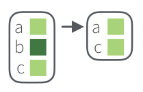
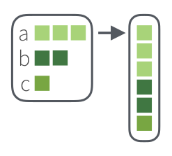

# Работа со списками {#lists}
```{r, message=FALSE}
library(tidyverse)
```

## Что такое списки?
Мы обсуждали в разделе \@ref{list} тип данных *список*, и все особенности их синтаксиса:

```{r}
x <- list(m = "a", n = c(2, 4), o = c("blue", "green", "red"))
x
x$m
x[1]
x[[2]]
x[[2]][2]
```


Списки вне R обычно хранят в файлах типа `.json` (по-английски говорят с ударением на первый слог, а вот по-русски прижился вариант с ударением на второй слог: джейсо́н) или `.xml`.

### Превращение JSON в список и обратно
Самое важное, что нужно знать, про `.json`, это то, что там могут хранится:

* пары ключ и значение, заключенные в фигурные скобки `{"ключ":"значение"}`
* упорядочные множества значений, заключенные в квадратные скобки `["значение_1","значение_2",...]`
* некоторые другие типы данных

Чтение и запись `.json` файлов осуществляется при помощи пакета `jsonlite` (не входит в `tidyverse`). Для примера скачаем датасет 30 героев Игры престолов, который  Дж. Р. Р. Мартин достал с ресурса [An API of Ice And Fire](https://anapioficeandfire.com/).

```{r}
got_chars <- jsonlite::read_json("https://raw.githubusercontent.com/agricolamz/DS_for_DH/master/data/got_chars.json")
got_chars[1]
```

Так как `jsonlite` конфликтует в одной функции с `tidyverse`, я не загружаю библиотеку полностью при помощи команды `library(jsonlite)`, а обращаюсь к функциям пакета при помощи выражения `jsonlite::...()`. Пакет `jsonlite` позволяет записывать `.json` файлы при помощи функции `write_json()`:
```{r, eval=FALSE}
jsonlite::write_json(got_chars, "got_chars.json", auto_unbox = TRUE)
# аргумент auto_unbox позволяет сохранять структуру, которую мы видим в R
```

### Превращение `.xml` в список и обратно
Самое важное, что нужно знать, про `.xml`, это то, что этот формат представляет собой набор некоторых сущностей, которые кодируются при помощи двух тегов: открывающего `<...>` и закрывающего `</...>`. 

```
<blablabla>Hello, world!</blablabla>
```

Набор сущностей может быть любым, а главное, нет фиксированного набора сущностей --- пользователи могут сочинять свои стандарты, используя `.xml`. Кроме того, у сущностей, могут быть свои атрибуты, которые перечисляются в открывающем теге:

```
<ingredient amount="3" unit="стакан">Мука</ingredient>
<ingredient amount="0.25" unit="грамм">Дрожжи</ingredient>
<ingredient amount="1.5" unit="стакан">Тёплая вода</ingredient>
```

Чтение и запись `.xml` файла осущетсвляется при помощи функций `read_xml()` и `write_xml()` из пакета `xml2`:

```{r}
library("xml2")
xml_example <- read_xml('<body>
<ingredient amount="3" unit="стакан">Мука</ingredient>
<ingredient amount="0.25" unit="грамм">Дрожжи</ingredient>
<ingredient amount="1.5" unit="стакан">Тёплая вода</ingredient>
</body>')
xml_example
```

```{r, eval = FALSE}
write_xml(xml_example, "path/to/the/file.xml")
```

Чтобы избавиться от тегов и превратить прочитанное в список используется команда 

```{r}
xml_example <- as_list(xml_example)
xml_example
```

Теперь полученная переменная уже является списком:

```{r}
xml_example$body[[2]]
```

Здесь также нужно отметить, некоторое важное отличие `.xml` и `.json`, которое видно в рассматриваемом примере: атрибуты, которые прописываются в открывающем теге, передаются и в список в R. Функция `attributes()` возвращает список атрибутов и их значений:

```{r}
xml_example$body[[2]] %>% 
  attributes()
```

Если нужен конкретный аттрибут, то нужно использовать функцию `attr()`:

```{r}
xml_example$body[[2]] %>% 
  attr("amount")
```

Также на данном примере видна самая большая проблема при работе с `.xml`: в нашем списке есть три узла под названием `ingredient`, так что хоть эти узлы и имеют имя, к ним все равно нужно обращаться по индексу.


### Просмотр списков в R 

Просмоторщик списков встроен в RStudio. Его можно увидеть, если ткнуть в объект в R или написать команду `View(got_chars)`. Альтернативой может стать функция `jsonedit()` из пакета `listviewer`. Кроме того, что-то можно попробовать выяснить, используя функцию `str()`.

```{r}
str(got_chars[1])
str(got_chars[1], max.level = 2)
str(xml_example)
```


## Пакет `purrr`

В `tidyverse` встроен пакет `purrr`, который среди прочего позволяет работать со списками. Существует [cheat sheet по `purrr`](https://github.com/rstudio/cheatsheets/raw/master/purrr.pdf).

### Функция `map()` и `map...()`
Можно выводить значения в списке на основе имени:

```{r}
got_chars %>% 
  map("name")
```

Можно выводить значения в списке на основе индекса:

```{r}
got_chars %>% 
  map(3)
```

Достаточно полезно знать о функции `unlist()`, которая "убивает" все сложную структуру:

```{r}
got_chars %>% 
  map("name") %>% 
  unlist()
```

Для этого есть и отдельные функции, которые позволяют превратить все в вектор заданного типа:
```{r}
got_chars %>% 
  map_chr("name")
got_chars %>% 
  map_int("id")
got_chars %>% 
  map_lgl("alive")
```

Можно даже создать новый датафрейм:
```{r}
got_chars %>% 
  tibble(name = map_chr(., "name"), # точка обозначает, в какой аргумент должно все пайпиться
         id = map_dbl(., "id"),
         alive = map_lgl(., "alive"))
```

Также существует способ создание датафреймов на основе вектора значений при помощи функции `enframe()`:

```{r}
got_chars %>% 
  map_chr("name") %>% 
  enframe()
```

```{block, type = "rmdtask"}
Скачайте [частотный словарь русского языка [Шаров, Ляшевская 2011]](https://raw.githubusercontent.com/agricolamz/DS_for_DH/master/data/freq_dict_2011.csv), разбейте столбец `lemma` на буквы при помощи функции `str_split(dict$lemma, "")`, а на основе полученного списка постройте график, на котором изображено, сколько раз встретилась какая буква:
```

```{r, echo=FALSE, cache=TRUE, message=FALSE}
dict <- read_tsv("https://raw.githubusercontent.com/agricolamz/DS_for_DH/master/data/freq_dict_2011.csv")

str_split(dict$lemma, "") %>% 
  unlist() %>%  
  enframe() %>% 
  mutate(value = str_to_lower(value)) %>% 
  filter(str_detect(value, "\\w")) %>% 
  count(value, sort = TRUE) %>% 
  ggplot(aes(fct_reorder(value, n), n, label = n))+
  geom_col()+
  coord_flip()+
  labs(x = "", y = "", caption = "данные из [Ляшевская, Шаров 2011]")
```


### Фильтрация списков

Если в списке есть логические выражения, их можно использовать как фильтры. Например, вот так мы оставим только живых героев:
```{r}
got_chars %>% 
  keep("alive") %>% 
  map_chr("name")
```



А так -- только мертвых:
```{r}
got_chars %>% 
  discard("alive") %>% 
  map_chr("name")
```


Также есть особый фильтр `head_while()` и `tail_while()`, который выделяет единицы (с начала и конца) до первого `FALSE`.

```{r}
got_chars %>% 
  head_while("alive") %>% 
  map_chr("name")

got_chars %>% 
  tail_while("alive") %>% 
  map_chr("name")
```


Если все еще не понятно, взгляните на нашу таблицу:
```{r}
got_chars %>% 
  tibble(name = map_chr(., "name"), # точка обозначает, в какой аргумент должно все пайпиться
         alive = map_lgl(., "alive"))
```

### Операции со списками

Рассмотрим простой пример:

```{r}
my_l <- list(a = 1:3, b = c("a", "b"), c = list("z", c(8, 9)))
my_l
```

Как уже говорилось выше, функция `unlist()` линеаризует списки, превращая их в векторы:

```{r}
my_l %>% 
  unlist()
```

Получился поименнованный вектор, если этого недостаточно, можно уничтожить и имена при помощи функции `unname()`:

```{r}
my_l %>% 
  unlist() %>% 
  unname()
```

Функция `flatten` позволяет уничтожить **лишь один, верхний,**, уровень иерархии:
```{r}
my_l %>% 
  flatten()
```



Как видно из этого примера, первый элемент списка `my_l` превратился в три первых элемента списка, а вот подсписок `c = list("z", c(8, 9))` превратился в элемент `z` и вектор `c(8, 9)`.

Существуют также функции `append()` и `prepend()`, которые позволяют добавлять новый посписок после (или до) старого:

```{r}
list(c(1, 2), c("a", "b", "c")) %>% 
  append(list(new = c(TRUE, FALSE)))
list(c(1, 2), c("a", "b", "c")) %>% 
  prepend(list(new = c(TRUE, FALSE)))
```

Существует также 
```{r}
list(c("a", "b"), 1:3) %>% 
  cross() %>% 
  str()

list("a", "b") %>% 
  cross2(1:3) %>% 
  str()
```

```{block, type = "rmdtask"}
[Скачайте пьесу "Ревизор"](https://raw.githubusercontent.com/dracor-org/rusdracor/master/tei/gogol-revizor.xml), размеченную в [TEI формате](https://tei-c.org/Guidelines/P5/) и постройте представленный ниже график. Превратив данные в список, лушче начинать работать с переменной `revizor\$TEI\$text\$body`:
```

```{r cache=TRUE, echo=FALSE}
revizor <- read_xml("https://raw.githubusercontent.com/dracor-org/rusdracor/master/tei/gogol-revizor.xml")
revizor <- as_list(revizor)

revizor$TEI$text$body %>% 
  flatten() %>% 
  flatten() %>% 
  map(attr_getter("who")) %>% 
  unlist() %>% 
  enframe()  %>% 
  mutate(value = str_remove_all(value, "\\.")) %>% 
  count(value, sort = TRUE) %>% 
  filter(!str_detect(value, " ")) %>% 
  ggplot(aes(fct_reorder(value, n), n))+
  geom_col()+
  coord_flip()+
  labs(x = "", y = "", caption = "данные из RusDraCor", 
       title = 'Количество реплик в "Ревизоре" Н. Гоголя')
```
