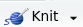

```{r, include=FALSE}
knitr::opts_chunk$set(comment = NA)
```
  
# Представление данных: `rmarkdown` {#data_presentation}

Достаточно важной частью работы с данными является их представление. Мы рассмотрим наиболее распространенный варианты: `rmarkdown`, `flexdashboard` и `shiny`. Смотрите книжку [@xie19](https://bookdown.org/yihui/rmarkdown/) или [cheatsheet](https://rstudio.com/wp-content/uploads/2016/03/rmarkdown-cheatsheet-2.0.pdf).

## `rmarkdown`

`rmarkdown` -- это пакет, который позволяет соединять R команды и их исполнения в один документ. В результате можно комбинировать текст и исполняемый код, что в свою очередь позволяет делать:
* докумунты в формате `.html`, `.pdf` (используя \LaTeX, мы почти не будем это обсуждать), `.docx`
* презентации в формате `.html`, `.pdf` (используя \LaTeX пакет `beamer`) `.pptx`-презентации
* набор связанных `.html` документов (полноценный сайт или книга)

### Установка
Как и все пакеты `rmarkdown` можно установить из CRAN
```{r, eval = FALSE}
install.packages("rmarkdown")
```

### Составляющие `rmarkdown`-документа

* [yaml](https://en.wikipedia.org/wiki/YAML) шапка (факультативна)
* обычный текст с [markdown](https://en.wikipedia.org/wiki/Markdown) форматированием (расширенный при помощи [Pandoc](https://en.wikipedia.org/wiki/Pandoc))
* блоки кода (не обязательно на языке R), оформленные с двух сторон тройным бэктиком ``` (у меня на клавиатуре этот знак на букве ё).

### Пример `rmarkdown`-документа

Создайте файл .Rmd в какой-нибудь папке (в RStudio, это можно сделать `File > New file > R Markdown`). Скомпелировать файл можно командой:
```{r, eval=FALSE}
rmarkdown::render("ваш_файл.Rmd")
```

или кнопкой . Вот пример кода:

```{bash, echo = FALSE}
cat ./rmd_examples/ex_01.Rmd
```

[Результат](https://raw.githubusercontent.com/agricolamz/DS_for_DH/master/rmd_examples/ex_01.html).

```{block, type = "rmdtask"}
Создайте и скомпелируйте свой `rmarkdown`-документ с заголовком, текстом и кодом.
```

### `Markdown`

Универсальны язык разметки, работает во многих современных он-лайн системах создания текста.

#### Заголовки

```
## Заголовок уровня 2
#### Заголовок уровня 4
```

#### Форматирование
```
_италик_ или *другой италик*

__жирный__ или **другой жирный**

~~зачеркивание~~
```
_италик_ или *другой италик*

__жирный__ или **другой жирный**

~~зачеркивание~~

#### Списки
```
* кролик
* заяц
    * заяц серый

1. машины
    1. автобус
2. самолеты

+ можно еще ставить плюс
- и минус
```
* кролик
* заяц
    * заяц серый

1. машины
    1. автобус
2. самолеты

+ можно еще ставить плюс
- и минус

#### Ссылки и картинки
```
[Ссылка 1](https://agricolamz.github.io/2018_ANDAN_course_winter/2_ex.html)

<https://agricolamz.github.io/2018_ANDAN_course_winter/2_ex.html>

[Можно вставить ссылку потом, а пока отсавить метку][1]

Или даже просто голую [метку].


Опять же можно вставить только метку ![][2]

[1]: https://agricolamz.github.io/2018_ANDAN_course_winter/2_ex.html
[метку]: https://agricolamz.github.io/2018_ANDAN_course_winter/2_ex.html
[2]: https://raw.githubusercontent.com/agricolamz/2018_ANDAN_course_winter/master/rmarkdown.png
```
[Ссылка 1](https://agricolamz.github.io/2018_ANDAN_course_winter/2_ex.html)

<https://agricolamz.github.io/2018_ANDAN_course_winter/2_ex.html>

[Можно вставить ссылку потом, а пока отсавить метку][1]

Или даже просто голую [метку].


Опять же можно вставить только метку ![][2]

[1]: https://agricolamz.github.io/2018_ANDAN_course_winter/2_ex.html
[метку]: https://agricolamz.github.io/2018_ANDAN_course_winter/2_ex.html
[2]: https://raw.githubusercontent.com/agricolamz/2018_ANDAN_course_winter/master/rmarkdown.png

#### Код

```
Код нужно оформалять вот так `rmarkdown::render()`
```
Код нужно оформалять вот так `rmarkdown::render()`

```{bash, echo = FALSE}
cat ./rmd_examples/ex_02.Rmd
```

```{python}
collection = ['hey', 5, 'd']
for x in collection:
    print(x)
```

Если хочется использовать результат работы кода в тексте, нужно в начале поставить язык, который будет исполнять код, например, в 

Фигурные скобки не обязательны, но тогда RStudio подсветит.

#### Цитаты
```
> Цитаты нужно офрмлять так.
> Это попадет в тот же фрагмент.

> А вот тут произошел разрыв. Кстати, здесь тоже можно использовать *markdown*.
```

> Цитаты нужно офрмлять так.
> Это попадет в тот же фрагмент.

> А вот тут произошел разрыв. Кстати, здесь тоже можно использовать *markdown*.


#### Разрыв страницы
```
***
```

***

#### HTML
```
<dl>
  <dt>Чистый HTML</dt>
  <dd>Еще можно писать в HTML.</dd>

  <dt>и Markdown в  HTML </dt>
  <dd> даже работает **правильно**. Но можно использовать и <em>теги</em>.</dd>
</dl>
```
<dl>
  <dt>Чистый HTML</dt>
  <dd>Еще можно писать в HTML.</dd>

  <dt>и Markdown в  HTML </dt>
  <dd> даже работает **правильно**. Но можно использовать и <em>теги</em>.</dd>
</dl>

#### Таблицы
Еще есть целая наука как делать таблицы в Markdown, но я предпочитаю использовать [он-лайн генератор](http://www.tablesgenerator.com/markdown_tables).

### `Pandoc`
[`Pandoc`](https://pandoc.org/) это программа, созданная [Дж. МакФарлэйном (J. MacFarlane)](johnmacfarlane.net), которая позволяет переходить из разных текстовых форматов в другие, а также смешивать их. Я покожу лишь несколько полезных расширений.

#### Верхние и нижние индексы
```
2^10^ C~n~^k^
```
2^10^ C~n~^k^

#### Нумерованные примеры
```
(@) Славный пример номер раз.
(@) Славный пример номер два.
(@three) Славный пример номер три, у которого есть *имя*.

Я могу сослаться на пример (@three)!
```
(@) Славный пример номер раз.
(@) Славный пример номер два.
(@three) Славный пример номер три, у которого есть *имя*.

Я могу сослаться на пример (@three)!

#### Сноски
```
Вот и сноска[^1]

[^1]: Сноска, сноска, сноска.
```
Вот и сноска[^1]

[^1]: Сноска, сноска, сноска.

#### Математика: $\LaTeX$
```
$\LaTeX$  код может быть в тексте $\frac{\pi}{\sum{n+1}}$ или отдельной строчкой:

$$\frac{\pi}{\sum{n+1}}$$
```
$\LaTeX$  код может быть в тексте $\frac{\pi}{\sum{n+1}}$ или отдельной строчкой:

$$\frac{\pi}{\sum{n+1}}$$

### Code chunks

Фрагменты кода имеют свои наборы свойств, который можно записывать в фигурных скобках.

#### Язык программирования

```{bash, echo = FALSE}
cat ./rmd_examples/ex_03.Rmd
```

```{r}
summary(cars)
```

```{python}
x = "my string"
print(x.split(" "))
```

#### Появление и исполнение кода

```{bash, echo = FALSE}
cat ./rmd_examples/ex_04.Rmd
```

#### Другие полезные аргументы

Существует достаточно [много аргументов](https://yihui.name/knitr/options/#chunk_options), которые можно перечислить в фигурных скобках в фрагменте кода, вот некоторые из них:

* `error`: показывать ли ошибки.
* `warning`: показывать ли предупреждения.
* `message`: показывать ли сообщения (например, при подключении пакетов).
* `comment`: по умолчанию, результат работы кода предваряется знаком `##`, используйте `NA`, чтобы их не было, или любую другую строку.
* `cache`: сохранить ли результат работы фрагмента кода. Очень полезно, если происходят какие-то операции, занимающая много времени. Сохранив результат, не нужно будет тратить время, на пересчет, при каждой новой компиляции.
* `fig.width`, `fig.height` (по умолчанию, 7)

Все эти аргументы можно перечислить в функции `knitr::opts_chunk$set(...)`: 

#### Pets or livestock?
В RMarkdown каждому фрагменту кода можно дать имя (но избегайте пробелов и точек):
```{bash, echo = FALSE}
cat ./rmd_examples/ex_06.Rmd
```

Maëlle Salmon написал [отличный пост](http://www.masalmon.eu/2017/08/08/chunkpets/), почему полезно именовать фрагменты кода:

* проще ориентироваться
* код более читаемый
* ошибки при компеляции показывают имя, а не номер
* если фрагмент кэшировался, то добавление одного фрагменты перед ним, не заставит все пересчитываться
* в `blogdown` можно ссылаться

### YAML шапка
Факультативная YAML шапка обычно содержит метаданные документа, и аргументы, необходимые для работы некоторых дополнений.

```
---
title: "Мой RMarkdown"
author: Славный Автор
date: 20 ноября 2019
---
```

#### Тип получившегося файла

* `output: html_document` (по умолчанию)
* `output: word_document`
* `output: pdf_document` (но нужно договориться с $\LaTeX$ом на вашем компьютере)
* `output: ioslides_presentation`
* `output: slidy_presentation`
* `output: slidy_presentation`
* `output: beamer_presentation`

и др.

#### Библиография
Существует [несколько сопособов](http://rmarkdown.rstudio.com/authoring_pandoc_markdown.html#citations) вставлять библиографию в RMarkdown. Я раскажу, как использовать пакет `Bibtex` (как видно из названия, сделанный для $\LaTeX$). Для начала нужно создать файл с раширением .bib, в который записать все источники, которые будут использоваться (библиографию в формате `BibTeX` выдает, например,  [GoogleScholar](https://scholar.google.ru)):

```{bash, echo = FALSE}
cat ./rmd_examples/bibliography.bib
```

На следующем шаге нужно добавить название файла с раширением .bib в YAML шапку:

```
---
bibliography: bibliography.bib
---
```
После этого, можно использовать сслыки в тексте 
```
В своей работе @gordon02 раскрыл...
```
В своей работе @gordon02 раскрыл...
```
Об этом можно узнать из [@ladefoged96; @gordon02], но ...
```
Об этом можно узнать из [@ladefoged96; @gordon02], но ...
```
В своей работе [@gordon02] раскрыл...
```
В своей работе [@gordon02] раскрыл...
```
Об этом можно узнать из [см. @gordon02, с. 33--35; а также @ladefoged96, гл. 1]...
```
Об этом можно узнать из [см. @gordon02, с. 33--35; а также @ladefoged96, гл. 1]...

Список литературы автоматически появляется в конце.

#### Оглавление и пр.
Существует сразу несколько аргументов, отвечающих за оглавление.

* `toc` вставлять ли оглавление
* `toc_depth`  глубина иерархии, которую отражать в огловлении
* `toc_float`  должно ли оглавление все время следовать за текстом
* `collapsed`  должно ли оглавление быть все время полностью раскрыто
* `collapsed`  должно ли оглавление быть все время полностью раскрыто
* `number_sections` автоматическая нумерация секций
* `code_folding` (hide) --- делать ли кнопочку, показывающую/скрывающую весь код
* `theme` одна из [Bootstrap тем](https://bootswatch.com/)
* `highlight`: "default", "tango", "pygments", "kate", "monochrome", "espresso", "zenburn", "haddock" или "textmate"

```
---
html_document:
    theme: spacelab
    highlight: pygments
    toc: yes
    toc_position: right
    toc_depth: 3
    toc_float: yes
    smooth_scroll: false
---
```

#### Отображение датафреймов

* `df_print: default`
* `df_print: kable`
* `df_print: tibble`
* `df_print: paged`

```
---
output:
  html_document:
    df_print: paged
---
```

### Где хостить `.html`?

Полученные `.html` можно разместить в интернете:

* на каком-то вашем хосте

* опубликовать на бесплатном хостинке Rpubs


* опубликовать на гитхабе и включить Github Pages

```{block, type = "rmdtask"}
Теперь создайте документ index.Rmd, в котором напишите код на R и на Python, вставьте картинку, сноску, ссылку на литературу, таблицу и оглавление. Скомпелируйте `.html` документ и опубликуйте его на Github, пройдя [по этой ссылке](https://classroom.github.com/a/ypZeK32c). Cделайте Github Pages и заполните `README.md` файл.
```

## Бывают и другие способы представления данных

* [`flexdashboard`](https://rmarkdown.rstudio.com/flexdashboard/examples.html) -- динамические дэшборды
* [`shiny`](https://shiny.rstudio.com/gallery/) -- динамические сайты, которые позволяют взаимодействовать с пользователем
* [`posterdown`](https://brentthorne.github.io/posterdown_html_showcase/) -- постеры в RMarkdown
* [`pagedown`](https://pagedown.rbind.io/) -- содержит много шаблонов: для книги, статьи, постера, резюме, визитки... да хоть приглашение на свадьбу можно сделать.