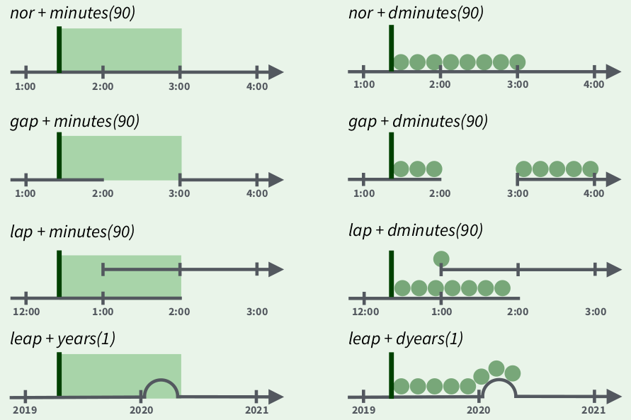
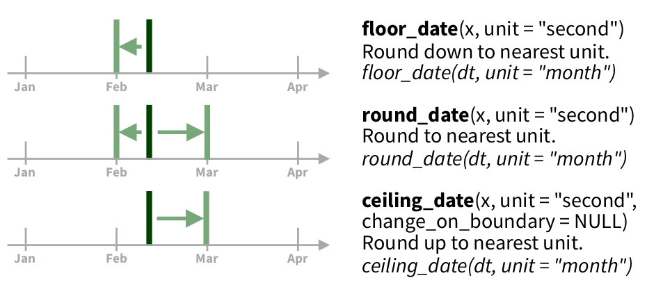

# Работа со временем: `lubridate`

```{r, message=FALSE}
library(tidyverse)
```


Мы обсуждали, что переменные бывают разные. О них, возможно, следует думать как о шкале:

```{r,echo=FALSE}
types <- c("категориальные", "порядковые", "время", "числовые")
examples <- c("голубые глаза, карие глаза, зеленые глаза...", 
              "младшая школа, средняя школа, техникум/колледж, бакалавриат...", 
              "понедельник, вторник, среда...\n 21 декабря 2019, 12 января 2020...", 
              "2, -3.2, pi")
tibble(x = factor(types, levels = types),
       caption = factor(examples, levels = examples),
       y = 1.05) %>% 
  ggplot(aes(x, y, label = caption))+
  geom_text(hjust = 0)+
  geom_segment(aes(x=1, xend=4, y=1, yend=1), arrow = arrow(type = "open", ends = "both", length = unit(0.1, "inches"))) +
  ylim(1, 2)+
  theme_minimal()+
  coord_flip()+
  labs(x = "", y = "")+
  theme(axis.text.x = element_blank(), panel.grid.major = element_blank(), panel.grid.minor = element_blank())
```

Кажется, что время -- просто обычная числовая переменная, на которой определены все обычные операции сложения вычитания и т. п. Однако стоит держать в голове несколько фактов:

* Не каждый год содержит 365 дней. Существуют високосные года.
* Не каждый день содержит 24 часа. Во многих странах используют переход на летнее и зимнее время.
* Не в каждой минуте 60 секунд. Существуют дополнительная секунда, которую добавляют чтобы компенсировать замедление во вращении земли (тогда после секунды 23:59:59 идет секунда 23:59:60).

Все это мелочи учтены в пакете lubridate, созданном для работы со временем в R ([https://rawgit.com/rstudio/cheatsheets/master/lubridate.pdf](cheatsheet), туториал доступен [здесь](https://cran.r-project.org/web/packages/lubridate/vignettes/lubridate.html) и по команде `vignette("lubridate")`). Первые команды, которые нужно изучить:

```{r}
library(lubridate)
today()
now()
```

Как видно, из этих функций в R можно работать как с датами, так и с временем. В качестве иллюстрации мы будем использовать датасет `flights` из пакета `nycflights13`, в котором содержатся данные полетов из Нью Йорка в 2013 года.

```{r}
library(nycflights13)
flights
```

## Создание даты

Самый простой способ получить дату --- это преобразовать строку в формат даты, для этого надо просто упорядочить `y` (year), `m` (month) и `d` (day) в команде:
```{r}
ymd("2020-01-21")
ymd("20-01-21")
ymd("20.01.21")
ymd("20/01/21")
ymd("200121")
mdy("January 21st, 2020")
dmy("21-Jan-2020")
```

Команды понимают не только английский (хоть и с трудом):
```{r}
dmy("21 янв 2020", locale = "ru_RU.UTF-8")
dmy("21 янв. 2020", locale = "ru_RU.UTF-8")
dmy("21 ян 2020", locale = "ru_RU.UTF-8")
dmy("21 янва 2020", locale = "ru_RU.UTF-8")
dmy("21 января 2020", locale = "ru_RU.UTF-8")
dmy("21 январь 2020", locale = "ru_RU.UTF-8")
dmy("21 Январь 2020", locale = "ru_RU.UTF-8")
```

Аналогично сделаны команды состоящие из `h`, `m`, `s`:
```{r}
hms("20:01:02")
hm("20.01")
ms("23:59")
```

Также существует команда `make_datetime()`, которая позволяет сделать дату из нескольких переменных:
```{r}
flights %>% 
  mutate(departure = make_datetime(year, month, day, hour, minute)) %>% 
  select(departure)
```

## Извлечение компонентов даты

Для извлечения компонентов даты используются функции `year()`, `month()`, `week()` (номер недели в году), `mday()` (day of the month), `wday()` (номер дня в неделе), `yday()` (номер дня в году), `hour()`, `minute()` и `second()`:

```{r, include=FALSE}
Sys.setlocale("LC_ALL", "en_US.UTF-8")
```

```{r}
date_example <- flights$time_hour[1]
date_example
year(date_example)
month(date_example)
month(date_example, label = TRUE)
month(date_example, label = TRUE, abbr = FALSE)
month(date_example, label = TRUE, locale = "ru_RU.UTF-8")
week(date_example)
mday(date_example)
wday(date_example)
wday(date_example, label = TRUE)
wday(date_example, label = TRUE, abbr = FALSE)
wday(date_example, label = TRUE, locale = "ru_RU.UTF-8")
yday(date_example)
hour(date_example)
minute(date_example)
second(date_example)
```

Так же есть функция `leap_year()`, которая сообщает информацию, является ли выбранный год високосным:
```{r}
leap_year(2019)
leap_year(2020)
```

```{block, type = "rmdtask"}
Постройте график распределения полетов по дням недели из датасета `flights` пакета `nycflights13`.
```

```{r, echo = FALSE}
flights %>% 
  mutate(week_day = wday(time_hour, label = TRUE)) %>% 
  ggplot(aes(week_day))+
  geom_bar()+
  labs(x = "", caption = "данные из RITA, Bureau of transportation statistics")
```

## Операции с датами

Если взять две даты, то можно узнать разницу между ними и т. п.:

```{r}
ymd("2020-01-21") - ymd("2020-01-19")
ymd("2020-01-19") - ymd("2020-01-21")
```

Обратите внимание на результат работы этого выражения:
```{r, message=FALSE}
hm("21:00") - hm("18:10")
```

Видимо, почему-то в таком использовании происходит поэлементная операция с часами, минутами, и секундами, так что в результате получаются отрицательные минуты. Однако, если использовать полные даты, то этого эффекта нет:
```{r}
ymd_hm("2020-01-21, 21:00") - ymd_hm("2020-01-21, 18:10")
ymd_hm("2020-01-21, 21:00") - hm("18:10")
```

Также существует функция `difftime()`, которая позволяет настраивать единицы, в которых выдается результат:

```{r}
difftime(ymd_hm("2020-01-21, 21:00"), ymd_hm("2020-01-21, 18:10"), units = "mins")
difftime(ymd_hm("2020-01-21, 21:00"), ymd_hm("2020-01-21, 18:10"), units = "hours")
```

```{block, type = "rmdtask"}
У меня есть шенгенская мультивиза на 90 дней. Я совершил несколько поездок в Европу и записал их в [этот датасет](https://raw.githubusercontent.com/agricolamz/DS_for_DH/master/data/visa_question.csv). Определите, сколько дней я еще могу находиться в Евросоюзе?
```

```{r, include=FALSE}
read_csv("https://raw.githubusercontent.com/agricolamz/DS_for_DH/master/data/visa_question.csv") %>% 
  mutate_all(dmy) %>% 
  summarise(diff = sum(to-from))
# 42
```

Однако простые даты, не являются временными отрезками, так что их нельзя складывать, вычитать, умножать и т. д. Для удобства операций в `lubridate` вводится несколько сущностей:

* **periods** --- промежутки времени, которые игнорируют нерегулярности во времени, сразу прибавляя 1 к соответствующему разряду, вводятся функциями `years()`, `months()`, `weeks()`, `days()`, `hours()`, `minutes()`, `seconds()`, `period()`
* **duration** --- промежутки времени, которые учитывают нерегулярности во времени, добавляя стандартную длительность единицы, вводятся функциями `dyears()`, `dweeks()`, `ddays()`, `dhours()`, `dminutes()`, `dseconds()`, `duration()`



Рассмотрим несколько сложных случаев:

* високосный год
```{r}
ymd("2019-03-01")+years(1)
ymd("2019-03-01")+dyears(1)
```

* переход на летнее время
```{r}
ymd_hms("2020-03-07 13:00:00", tz = "America/New_York") + days(1)
ymd_hms("2020-03-07 13:00:00", tz = "America/New_York") + ddays(1)
```

* переход на зимнее время
```{r}
ymd_hms("2020-10-31 13:00:00", tz = "America/New_York") + days(1)
ymd_hms("2020-10-31 13:00:00", tz = "America/New_York") + ddays(1)
```

Последняя операция с датами, которую мы рассмотрим --- округление:

* `floor_date()` --- округление в меньшую сторону
* `round_date()` --- математическое округление
* `ceiling_date()` --- округление в большую сторону



```{r}
floor_date(ymd("2020-01-16"), unit = "month")
round_date(ymd("2020-01-16"), unit = "month")
round_date(ymd("2020-01-17"), unit = "month")
ceiling_date(ymd("2020-01-16"), unit = "month")
ceiling_date(ymd("2020-01-16"), unit = "year")
```

## Визуализация времени: данные Левада-центра

Пакет `tidyverse` понимает переменные типа дата, и позволяет их фильтровать и визуализировать. Возьмем для примера [датасет](https://raw.githubusercontent.com/agricolamz/DS_for_DH/master/data/death_of_migrants_and_refugees_from_the_Unwelcomed_project.csv) из проекта [The Unwelcomed](http://alhadaqa.com/2019/08/the_unwelcomed/) Мохамада А. Вэйкда (Mohamad A. Waked), содержащий информацию о месте и причинах смерти мигрантов и беженцев по всему миру с января 2014 года по июнь 2019 года.

```{r, message=FALSE}
unwelcomed <- read_csv("https://raw.githubusercontent.com/agricolamz/DS_for_DH/master/data/death_of_migrants_and_refugees_from_the_Unwelcomed_project.csv")
unwelcomed %>% 
  mutate(date = dmy(date)) %>% 
  ggplot(aes(date, total_death_missing, color = collapsed_cause))+
  geom_point()+
  scale_y_log10()+
  labs(y = "number of death/missing")

unwelcomed %>% 
  mutate(date = dmy(date)) %>% 
  filter(date < dmy("1-1-2016")) %>% 
  ggplot(aes(date, total_death_missing, color = collapsed_cause))+
  geom_point()+
  scale_y_log10()+
  labs(y = "number of death/missing")
```

Однако ко переменным со врменем не всегда относятся аккуратно. Рассмотрим график с сайта Левада-центра --- российской негосударственной исследовательской организации, которая проводит социологические и маркетинговые исследования (график взят [отсюда](https://www.levada.ru/indikatory/otnoshenie-k-stranam/)):


На первый взгляд, в этом графике нет ничего странного, однако если присмотреться к динамической версии на сайте Левада-центра, можно обнаружить, что на идущие подряд измерения расположены на одинаковом расстоянии друг от друга, например, 05.2014, 07.2014, 11.2014. Вот [здесь](https://raw.githubusercontent.com/agricolamz/DS_for_DH/master/data/2019.01_levada_countries.csv) можно скачать данные, по которым строился этот график. Вот как он выглядит, если считать временную переменную как время

```{r, warning=FALSE,message=FALSE}
levada <- read_csv("https://raw.githubusercontent.com/agricolamz/DS_for_DH/master/data/2019.01_levada_countries.csv")
levada %>% 
  mutate(date = str_c("1-", date),
         date = dmy(date)) %>% 
  filter(towards == "USA") %>% 
  pivot_longer(names_to = "answer", values_to = "number", good:bad) %>% 
  ggplot(aes(date, number, color = answer))+
  geom_line()+
  labs(x = "", y = "", caption = "данные Левада-центра")+
  scale_y_continuous(limits = c(0, 100))+
  theme(legend.position = c(0.1, 0.9), legend.title = element_blank())
```

На графике теперь видно, насколько регулярно проводились опросы: в начале 90-ых опросы проводились реже, потом часто, потом в районе 2010 года был перерыв. График Левада-центра можно оправдать тем, что они представляют данные от замера к замеру, так что по оси x находится как бы категориальная переменная со значениями `замер 05.2014`, `замер 07.2014`, `замер 11.2014` и т. д. Однако это совсем неочевидно из графика.

```{block, type = "rmdtask"}
Используя весь датасет Левада-центра, постройте следующий график.
```

```{r, echo=FALSE, warning=FALSE}
levada %>% 
  mutate(date = str_c("1-", date),
         date = dmy(date)) %>% 
  pivot_longer(names_to = "answer", values_to = "number", good:no_answer) %>% 
  ggplot(aes(date, number, color = answer))+
  geom_line()+
  labs(x = "", y = "", caption = "данные Левада-центра")+
  scale_y_continuous(limits = c(0, 100))+
  theme(legend.position = "bottom", legend.title = element_blank())+
  facet_wrap(~towards, scales = "free")
```
