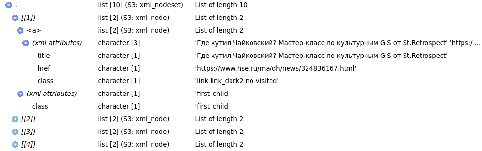
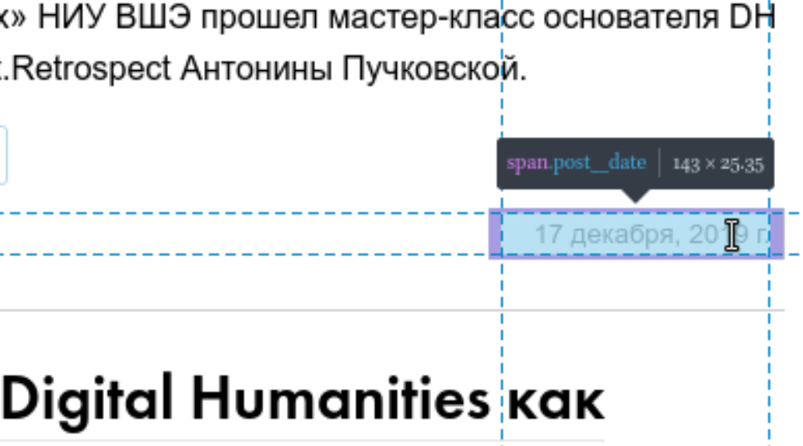

# Сбор данных из интернета: `rvest`

```{r, message=FALSE}
library(tidyverse)
```

Достаточно часто данные не ходят упакованные в готовые файлы `.csv` или `.json`. Иногда данные лежат в открытом доступе на какой-нибудь странице в интернете (например, таблицы Левада-центра из предыдущего занятия). А иногда никто и не думал, что что-то станет данными: заголовки и тексты новостей, комментарии, твиты и т. п. В этом разделе мы обсудим основы извлечения данных из вебстраниц.

## Введение

Любая `html`-документ --- это обычный xml файл. Обычно самый верхний узел называется `html`, который имеет два дочерних узла `head` и `body`. Каждый html-документ является инструкцией для браузера, в которой говориться что и в каком порядке нужно отображать, но одновременно эта инструкция является кодом, который мы можем посмотреть. В большинстве браузеров это можно сделать при помощи горячих клавиш `Ctrl+U`, в Apple Safari --- `Cmd+Option+U`. Кроме того есть режим разработчика, который позволяет делать много всего, в том числе наводить на какой-то объект в браузере и узнавать какой фрагмент кода ему соответствует (этот режим можно вызвать, нажав `F12` или `Ctrl+Shift+I`, в Apple Safari вроде нет горячих клавиш и нужно вызывать как-то из меню). Большинство узлов `html`-документа состоят из

* тег узла, например, `p`
* значения узла, например, `Жили-были три медведя.`
* `id` (уникальные объекты в `html`-документе), `class` (неуникальные объекты в `html`-документе) и другием атрибуты узла

Например:

```
<p class="story" some_atribute = 42>Жили-были три медведя.</p>
```

Некоторые `html`-документ не являются статическими и изменяются после того, как страница была открыта при помощи JavaScript'а. Это динамичность может быть скрытой, когда пользователь лишь видит, как открывается страница, а иногда может быть завязана на некоторые действия пользователя. Информацию со статических страниц собирать достаточно просто и для этого нам хватит пакета `rvest`. C динамическими сайтами все иногда несколько сложнее. Иногда на диномических страницах можно отследить источник данных, посмотрев вкладку `Network` в режиме разработчика (ведь откуда-то эти данные появляются в браузере, правда?). Иногда необходимо делать `POST` и `GET` запросы, хранить cookies, и т. п. --- все это можно сделать при помощи пакета [`httr`](https://cran.r-project.org/web/packages/httr/vignettes/quickstart.html), а в самых сложных случаях (когда JavaScript JavaScript погоняет) поможет пакет [`RSelenium`](https://docs.ropensci.org/RSelenium/).

## Работа с пакетом `rvest`

[Пакет `rvest`](http://rvest.tidyverse.org/index.html) позволяет скачивать страницы и потом их обрабатывать. Включим библиотеку:

```{r}
library(rvest)
```

### Простой случай

В качестве примера рассмотрим сайт Центра цифровых гуманитарных исследований НИУ ВШЭ:

```{r}
source <- read_html("https://hum.hse.ru/digital")
```

Объект `source` является списком, который содержит `html`-страницу. Давайте допустим, что мы хотем скачать все заголовки новостей, т. е. нам нужны значения всех узло `h2`. Функция `html_nodes()` позволяет вычленить исключительно узлы с каким-то тегом из всего `xml`-файла.

```{r}
source %>% 
  html_nodes("h2")
```

Теперь если мы хотим обратиться к значениям этих узлов, мы можем использовать функцию `html_text()`

```{r}
source %>% 
  html_nodes("h2") %>% 
  html_text()
```

Если мы откроем превью узла `h2` (команда `View()`), то мы увидим что-то такое:



Эта схема показывает, что каждый узел `h2` содержит узел `a` который содержит три атрибута: `title` и `href`. Вложенность отображается знаком `>`, а обращаться к атрибутам можно, используя функцию `html_attr()`:

```{r}
source %>% 
  html_nodes("h2 > a") %>% 
  html_attr("title") ->
  titles

source %>% 
  html_nodes("h2 > a") %>% 
  html_attr("href") ->
  links

tibble(titles, links)
```

Как видно из получившейся таблицы, на первой странице сайта всего 10 новостей. А что если мы хотим скачать все новости? Исследовав страницу Центра цифровых гуманитарных исследований, становится понятно, что все новые страницы генерятся по одному и тому же паттерну: 

* <https://hum.hse.ru/digital/news/page2.html>
* <https://hum.hse.ru/digital/news/page3.html>
* ...
* <https://hum.hse.ru/digital/news/page6.html>
* и даже на первую страницу, на которую мы попали по короткому адресу <hum.hse.ru/digital>, можно также попасть по этому адресу <https://hum.hse.ru/digital/news/page1.html>

Сгенерим список страниц:
```{r}
str_c("https://hum.hse.ru/digital/news/page", 1:6, ".html")
```

А теперь сделаем функцию, которая ходит по страницам и все собирает
```{r, cache=TRUE}
map_dfr(str_c("https://hum.hse.ru/digital/news/page", 1:6, ".html"), function(x){
  source <- read_html(x)  
  
  source %>% 
    html_nodes("h2 > a") %>% 
    html_attr("title") ->
    titles
  
  source %>% 
    html_nodes("h2 > a") %>% 
    html_attr("href") ->
    links
  
  tibble(titles, links)
}) ->
  df_news

df_news
```

```{block, type = "rmdtask"}
Создайте датафрейм, содержащий заголовки и ссылки на новости со страницы [Магистерской программы «Цифровые методы в гуманитарных науках»](https://www.hse.ru/ma/dh).
```

## Использование атрибута `class`

Допустим, нас интересует дата создания новости на странице Центра цифровых гуманитарных исследований. Исследовав сайт, легко обнаружить, что информация о дате создания новости хранится в теге `span`. Однако, если мы попробуем использовать лишь эту информацию, то мы получим много лишнего:

```{r}
source %>% 
  html_nodes("span") %>% 
  html_text() %>% 
  head(20)
```

Дело в том, что тег `span` имеется у многих других объектов на странице. Однако, если присмотреться к значениям, которые мы находим в режиме разработчика, можно заметить следующее:



Если посмотреть код, то мы увидем следующее:

```{html}
...
<span class="post__date"> 17 декабря, 2019 г.</span>
...
```

Чтобы обратиться к таким элементам нужно использовать точку:

```{r}
source %>% 
  html_nodes("span.post__date") %>% 
  html_text()
```

Почистим:
```{r}
source %>% 
  html_nodes("span.post__date") %>% 
  html_text() %>% 
  str_remove_all("\\n|\\t")
```

```{block, type = "rmdtask"}
Постройте график, показывающий количество новостей Центра цифровых гуманитарных исследований за каждый месяц.
```

```{r, echo = FALSE, message=FALSE, cache=TRUE}
library(lubridate)
map_dfr(str_c("https://hum.hse.ru/digital/news/page", 1:6, ".html"), function(x){
  source <- read_html(x)  
  
  source %>% 
    html_nodes("h2 > a") %>% 
    html_attr("title") ->
    titles
  
  source %>% 
    html_nodes("h2 > a") %>% 
    html_attr("href") ->
    links
  
  source %>% 
    html_nodes("span.post__date") %>% 
    html_text() %>% 
    str_remove_all("\\n|\\t") ->
    date
  
  tibble(titles, links, date)
}) ->
  with_dates
  
with_dates %>% 
  mutate(date = lubridate::dmy(date, locale = "ru_RU.UTF-8"), 
         date = make_datetime(year = year(date),
                              month = month(date),
                              day = 1)) %>% 
  count(date) %>% 
  ggplot(aes(date, n))+
  geom_col()+
  scale_y_continuous(breaks = 0:12)+
  labs(x = "", y = "", 
       title = "Количество новостей Центра ЦГИ каждый месяц", 
       caption = "данные с сайта https://hum.hse.ru/digital")
```

### Чтение таблиц

Таблицы, которые хранятся на `html`-странице можно считывать как таблицы (а, не например, построчно). Рассмотрим вкладку "Число студентов и вакантные места" на сайте Магистерской программы «Цифровые методы в гуманитарных науках»:

```{r}
source <- read_html("https://www.hse.ru/ma/dh/vacant")

source %>% 
  html_node("table") %>% 
  html_table()
```

Функция `html_node()` возвращает первую таблицу на странице. В предыдущих разделах мы использовали функцию `html_nodes()`, которая вытаскивает все узлы с соответствующими атрибутами:

```{r}
source %>% 
  html_nodes("table") %>% 
  html_table() ->
  l
str(l)
```

Получился список (объект типа `list`), в котором содержаться все таблицы со страницы. Так что, для того, чтобы работать с конкретной таблицей нужно использовать индексацию списков:

```{r}
l[[1]]
```


### Некоторые советы

Некоторые ресурсы блокируют возможность скачивать из них данные. Обычно это делается на уровне сервера, который видит, что с какого-то IP приходит по 5 запросов в секунду и ограничивает доступ, на случай если вы начинаете DDoS атаку. Если сервер не отдает вам данные или отдает, но раз в какой-то временной промежуток, следует прописать в вашей программе ожидание (команда `Sys.sleep()`). Некоторые сайты, например, Википедия, специально архивирует данные, чтобы люди не пытались ее обкачать: [вот страница](https://en.wikipedia.org/wiki/Wikipedia:Database_download), на которой это подробно описано.