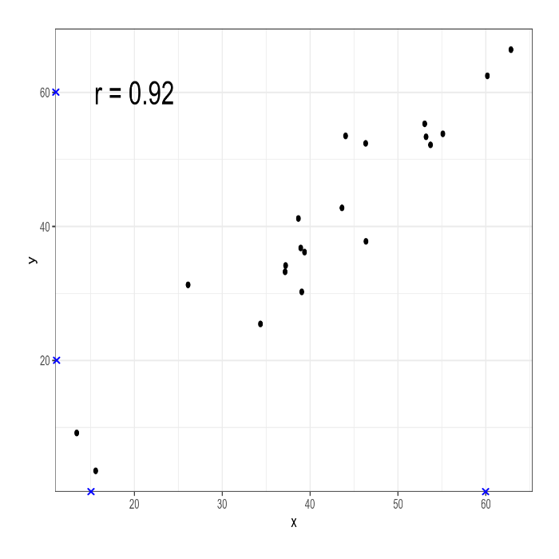

# Работа статистического детектива

```{r, message=FALSE}
library("tidyverse")
```

```{r, include=FALSE}
theme_set(theme_bw())
```

## Введение

До сих пор мы лишь использовали разные статистические тесты, чтобы ответить на разные исследовательские вопросы, которые могут возникнуть. Однако часто в статистические выкладки никто не вчитывается и принимает их как данность, надеясь что софт все правильно посчитал. Здесь есть две опасности: во-первых, бывают недобросовестные исследователи; во-вторых, люди часто ошибаются во время применения и представления результатов статистического анализа (и видимо, это случается чаще). Мы рассмотрим несколько методов, которые позволят проверять некоторые простые случаи, что может быть полезно при критическом чтении (например, во время ревью статей ученых и дата журналистов) в случаях, когда к данным нет доступа. Данный раздел вдохнавлен лекцией [Кристин Сайнани](http://learn.stanford.edu/WBN-MED-STATS-On-Demand-2020-02-05_LP-OD-Registration-2020-02-11.html?utm_source=coursera&utm_medium=email&utm_campaign=med-stats).

## Возможно ли такое среднее?

Представим себе, что кто-то провел эксперимент с биномиальными данными, например, посчитал количество *не* в рассказе А. П. Чехова длинной  322 слова "Жизнь прекрасна!" и обнаружил среднее 0.095. Возможно ли это?

Давайте посмотри на все возможные результаты:

```{r}
tibble(ratio = round(1:322/322, 3)) %>% 
  ggplot()+
  geom_vline(aes(xintercept = ratio), color = "lightblue")+
  geom_vline(xintercept = 0.095, color = "red")
```

Так ничего не видно, давайте сконцентрируемся на промежуке от 0.085 до 0.1, в котором лежит завяленное значение 0.095, и добавим подписи:

```{r, warning=FALSE}
tibble(ratio = round(1:322/322, 3)) %>% 
  ggplot()+
  geom_vline(aes(xintercept = ratio), color = "lightblue")+
  geom_vline(xintercept = 0.095, color = "red")+
  geom_label(aes(x = ratio, label = ratio), y = 0.5)+
  xlim(0.085, 0.1)
```

Мы видим, что красные линии повторяются регулярно с интервалом 0.03 и что синяя линия явно не вписывается в этот паттерн. Может быть было использовано другое округление?

```{r, warning=FALSE}
tibble(ratio = round(1:322/322, 5)) %>% 
  ggplot()+
  geom_vline(aes(xintercept = ratio), color = "lightblue")+
  geom_vline(xintercept = 0.095, color = "red")+
  geom_label(aes(x = ratio, label = ratio), y = 0.5)+
  xlim(0.085, 0.1)
```

Если бы числа округлялись вверх, на месте 0.09317 мы бы увидели 0.094. Если бы числа округлялись вниз, на месте 0.09627 мы бы увидели 0.096. Так что доля *не* в рассказе длинной 322 никак не может быть 0.095. Может быть автор ошибся с количеством слов? 

```{r}
200:400*0.095
```

Среди полученных числе целые числа есть только в значениях 200 и 400. Так что, если автор и ошибся в количестве слов, то слишком масштабно. Еще автор мог ошибиться и там, и там. Этот процесс можно немного автоматизировать:

```{r}
round(200:400*0.095) == 200:400*0.095
```

Эта идея лежит в основе Granularity-Related Inconsistent Means test (GRIM). Я не нашел его реализации на R, но вот есть [он-лайн приложение](http://www.prepubmed.org/grim_test/).

## Пакет `statcheck`

Пакет `statcheck` написан для извлечения и проверки результатов статистических тестов, которые приводятся в статьях. Рассмотрим пример двустороннего и одностороннего t-тестов:

```{r}
t.test(data = mtcars, qsec ~ am)
t.test(data = mtcars, qsec ~ am, alternative = "greater")
```

Запустим в функцию `statcheck()` три варианта:

* результат двустороннего теста;
* результат одностороннего теста;
* совсем неправильный результат.

```{r, message = FALSE}
library("statcheck")
s <- statcheck(c("t(25.534) = 1.2878, p = 0.21", 
                 "t(25.534) = 1.2878, p = 0.10",
                 "t(22.716) = 3.7671, p < 0.01"))
s
```

Теперь в переменной `s` находится датафрейм со следующими переменными:

* `Source`
* `Statistic`
* `df1`
* `df2` 
* `Test.Comparison` 
* `Value` 
* `Reported.Comparison` 
* `Reported.P.Value` 
* `Computed` 
* `Raw` 
* `Error` 
* `DecisionError` 
* `OneTail` 
* `OneTailedInTxt` 
* `APAfactor`

Функция `statcheck()` работает со следующими статистиками: $t$-статистика, $F$-статистика (мы ее видели в регрессии), коэффициент корреляции, хи-квадрат и $z$-score (используется в z-тесте).

В [мануале](https://rpubs.com/michelenuijten/statcheckmanual) к пакету описаны много дополнительных функций, которые позволяют не копировать текст из статьи, а автоматически извлекать данные для проверки из .pdf или .html.

## Пакет `digitize`

Иногда нам может случится, что данные представлены визуально:

```{r}
set.seed(42)
tibble(x = rnorm(20, mean = 40, sd = 10),
       y = x + rnorm(20, mean = 0, sd = 5)) %>% 
  ggplot(aes(x, y))+
  geom_point()+
  annotate(geom = "text", x = 20, y = 60, label = "r = 0.92", size = 8)
```

Как бы нам проверить корреляцию Пирсона, которая представлена на графике? Для этого мы воспользуемся пакетом `digitize` (однако аналогичные операции можно сделать и [онлайн](https://apps.automeris.io/wpd/)). На первом шаге нужно определить границы. При помощи функции `ReadAndCal()` сначала отметьте минимальное значение по оси x, затем максимальное значение по оси х, затем отметьте минимальное значение по оси y, затем максимальное значение по оси y:

```{r, eval=FALSE}
library(digitize)
calibration <-  ReadAndCal('images/test_correlaton.png')
```

После того, как вы отметите границы появятся синие крестики:



Следующий шаг --- это отметить наблюдения. Это делается при помощи функции `DigitData()` (нажмите на кнопку `Finish` наверху или клавишу `Esc`):

```{r, eval=FALSE}
data.points <- DigitData(col = 'red')
```

Теперь на графике появились не только синие крестики, но и красные точки:


После этого используйте функцию `Calibrate()`, чтобы откалибрировать полученные точки:

```{r, eval=FALSE}
df <- Calibrate(data.points, calibration, 
                15, # минимум по оси x
                60, # максимум по оси x
                20, # минимум по оси y
                60) # максимум по оси y
```

```{r, include=FALSE}
df <- read_csv("data/test_correlation_dataset.csv")
```

Давайте проверим, как точки соотносятся с оригиналом: 
```{r}
df$type <- "obtained"

set.seed(42)
tibble(x = rnorm(20, mean = 40, sd = 10),
       y = x + rnorm(20, mean = 0, sd = 5),
       type = "original") %>% 
  bind_rows(df) %>% 
  ggplot(aes(x, y, color = type))+
  geom_point()
```

Результат достаточно близкий, давайте теперь проверим коэффициент корреляции:

```{r}
cor(df$x, df$y)
```

И вот мы выяснили, что коэффициент корреляции Пирсона на этих данных равен `0.95`, что отличается от заявленных `0.92`.

У этого метода, конечно, есть очевидные недостатки:

* при большом количестве точек метод становится слишком трудоемким;
* сам процесс тыкания плохо верефицируем, исследователь может случайно ткнуть два раза на одну точку или отметить два раза группу точек, потому что ему показалось, что раньше он эту группу не отмечал;
* даже при маленьком количестве точек мы не можем заметить случаи, когда значения совпадают или слишком похожи. Т. е. в оригинальных данных может быть две точки, а детектив поставит лишь одну;
* если Ваше изображение повернуто, то результаты может получиться неправильный.
