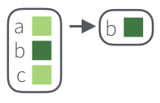
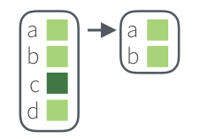

--- 
title: "Наука о данных в R для программы Цифровых гуманитарных исследований"
author: "Г. А. Мороз, И. С. Поздняков"
bibliography:
- bibliography.bib
editor_options:
  chunk_output_type: console
link-citations: yes
documentclass: book
site: bookdown::bookdown_site
biblio-style: apalike
---

# О курсе

Материалы для курса Наука о данных для магистерской программы Цифровых гуманитарные исследования НИУ ВШЭ.

<!--chapter:end:index.Rmd-->

# Введение в R {#intro}

## Наука о данных
Наука о данных --- это новая область знаний, которая активно развивается в последнее время. Она находиться на пересечении компьютерных наук, статистики и математики, и трудно сказать, действительно ли это наука. При этом это движение развивается в самых разных научных направлениях, иногда даже оформляясь в отдельную отрасль:

* биоинформатика
* вычислительная криминалистика
* цифровые гуманитарные исследования
* датажурналистика
* ...

Все больше книг "Data Science for ...":

* psychologists [@hansjoerg19]
* immunologists [@thomas19]
* business [@provost13]
* public policy [@brooks13]
* fraud detection [@baesens15]
* ...

Среди умений датасаентистов можно перечислить следующие:

* сбор и обработка данных
* трансформация данных
* визуализация данных
* статистическое моделирование данных
* представление полученных результатов
* организация всей работы **воспроизводимым способом**

Большинство этих тем в той или иной мере будет представлено в нашем курсе.

## Установка R и RStudio

В данной книге используется исключительно R [@r_core_team19], так что для занятий понадобятся:

* R
    * [на Windows](https://cran.r-project.org/bin/windows/base/)
    * [на Mac](https://cran.r-project.org/bin/macosx/)
    * [на Linux](https://cran.rstudio.com/bin/linux/), также можно добавить зеркало и установить из командной строки:
    
```
sudo apt-get install r-cran-base
```

* RStudio --- IDE для R ([можно скачать здесь](https://www.rstudio.com/products/rstudio/download/))
* и некоторые пакеты на R

Часто можно увидеть или услышать, что R --- язык программирования для "статистической обработки данных". Изначально это, конечно, было правдой, но уже давно R --- это полноценный язык программирования, который при помощи своих пакетов позволяет решать огромный спектр задач. В данной книге используется следующая версия R:

```{r}
sessionInfo()$R.version$version.string
```

Некоторые люди не любят устанавливать лишние программы себе на компьютер, несколько вариантов есть и для них:

* [RStudio cloud](https://rstudio.cloud/) --- полная функциональность RStudio, пока бесплатная, но скоро это исправят;
* [RStudio on rollApp](https://www.rollapp.com/app/rstudio) --- облачная среда, позволяющая разворачивать программы.

Первый и вполне закономерный вопрос: зачем мы ставили R и отдельно еще какой-то RStudio?
Если опустить незначительные детали, то R --- это сам язык программирования, а RStudio --- это среда (IDE), которая позволяет в этом языке очень удобно работать.

## Полезные ссылки

В интернете легко найти документацию и туториалы по самым разным вопросам в R, так что главный залог успеха --- грамотно пользоваться поисковиком, и лучше на английском языке.

* [книга [@wickham16]](https://r4ds.had.co.nz/) является достаточно сильной альтернативой всему курсу
* [stackoverflow](https://stackoverflow.com) --- сервис, где достаточно быстро отвечают на любые вопросы (не обязательно по R)
* [RStudio community](https://community.rstudio.com/) --- быстро отвечают на вопросы, связанные с R
* [русский stackoverflow](https://ru.stackoverflow.com)
* [R-bloggers](https://www.r-bloggers.com/) --- сайт, где собираются новинки, связанные с R
* [чат](https://t.me/rlang_ru), где можно спрашивать про R на русском (но почитайте [правила чата](https://github.com/r-lang-group-ru/group-rules/blob/master/README.md), перед тем как спрашивать)
* [чат](https://t.me/joinchat/CxZg5goGc6rlWGjcvOYrpA) по визуализации данных, [чат](https://t.me/ddjrus) датажурналистов
* [канал про визуализацию ](https://t.me/chartomojka), [дата-блог "Новой газеты"](https://t.me/novaya_data), ...

## Rstudio
Когда вы откроете RStudio первый раз, вы увидите три панели: консоль, окружение и историю, а также панель для всего остального. Если ткнуть в консоли на значок уменьшения, то можно открыть дополнительную панель, где можно писать скрипт.

```{r, echo=FALSE}
knitr::include_graphics("images/01_01_rstudio.png")
```

Существуют разные типы пользователей: одни любят работать в консоли (на картинке это **2 --- R Console**), другие предпочитают скрипты (**1 --- Code Editor**). Консоль позволяет использовать интерактивный режим команда-ответ, а скрипт является по сути текстовым документом, фрагменты которого можно для отладки запускать в консоли.

**3 --- Workspace and History**: Здесь можно увидеть переменные. Это поле будет автоматически обновляться по мере того, как Вы будете запускать строчки кода и создавать новые переменные. Еще там есть вкладка с историей последних команд, которые были запущены.

**4 --- Plots and files**: Здесь есть очень много всего. Во-первых, небольшой файловый менеджер, во-вторых, там будут появляться графики, когда вы будете их рисовать. Там же есть вкладка с вашими пакетами (Packages) и Help по функциям. Но об этом потом.  

## Введение в R

### R как калькулятор  {#calc}

Ой-ей, консоль, скрипт че-то все непонятно.  
Давайте начнем с самого простого и попробуем использовать R как простой калькулятор. `+`, `-`, `*`, `/`, `^` (степень), `()` и т.д.

Просто запускайте в консоли пока не надоест:  

```{r}
40+2
3-2
5*6
99/9
2^3
(2+2)*2
```

Ничего сложного, верно? Вводим выражение и получаем результат. Порядок выполнения арифметических операций как в математике, так что не забывайте про скобочки.

> Если Вы не уверены в том, какие операции имеют приоритет, то используйте скобочки, чтобы точно обозначить, в каком порядке нужно производить операции.


### Функции  {#func}

Давайте теперь извлечем корень из какого-нибудь числа. В принципе, тем, кто помнит школьный курс математики, возведения в степень вполне достаточно:

```{r}
16^0.5
```


Ну а если нет, то можете воспользоваться специальной **функцией**: это обычно какие-то буквенные символы с круглыми скобками сразу после названия функции. Мы подаем на вход (внутрь скобочек) какие-то данные, внутри этих функций происходят какие-то вычисления, которые выдают в ответ какие-то другие данные (или же функция записывает файл, рисует график и т.д.).

Вот, например, функция для корня:

```{r}
sqrt(16)
```

> R --- case-sensitive язык, т.е. регистр важен. `SQRT(16)` не будет работать.

А вот так выглядит функция логарифма:  

```{r}
log(8)
```

Так, вроде бы все нормально, но... Если Вы еще что-то помните из школьной математики, то должны понимать, что что-то здесь не так.  

Здесь не хватает основания логарифма!   

> Логарифм --- показатель степени, в которую надо возвести число, называемое основанием, чтобы получить данное число.  

То есть у логарифма 8 по основанию 2 будет значение 3:

$\log_2 8 = 3$

То есть если возвести 2 в степень 3 у нас будет 8:

$2^3 = 8$

Только наша функция считает все как-то не так.  

Чтобы понять, что происходит, нам нужно залезть в хэлп этой функции:  

```{r, eval = F}
?log
```

Справа внизу в RStudio появится вот такое окно:


Действительно, у этой функции есть еще аргумент *`base =`*. По дефолту он равен числу Эйлера (`r exp(1)`...), т.е. функция считает натуральный логарифм. 
В большинстве функций R есть какой-то основной инпут --- данные в том или ином формате, а есть и дополнительные параметры, которые можно прописывать вручную, если параметры по умолчанию нас не устраивают.

```{r}
log(x = 8, base = 2)
```

...или просто (если Вы уверены в порядке аргументов):

```{r}
log(8,2)
```

Более того, Вы можете использовать оутпут одних функций как инпут для других:  

```{r}
log(8, sqrt(4))
```

Если эксплицитно писать имена аргументов, то их порядок в функции не важен:

```{r}
log(base = 2, x = 8)
```

А еще можно недописывать имена аргументов, если они не совпадают с другими:

```{r}
log(b = 2, x = 8)
```

Мы еще много раз будем возвращаться к функциям. Вообще, функции --- это одна из важнейших штук в R (примерно так же как и в Python). Мы будем создавать свои функции, использовать функции как инпут для функций и многое-многое другое. В R очень крутые возможности работы с функциями. Поэтому подружитесь с функциями, они клевые.  

> Арифметические знаки, которые мы использовали: +,-,/,^ и т.д. называются **операторами** и на самом деле тоже являются функциями:

```{r}
'+'(3,4)
```

### Переменные  {#variables}

Важная штука в программировании на практически любом языке --- возможность сохранять значения в **переменных**. В R это обычно делается с помощью вот этих символов: *<-* (но можно использовать и обычное *=*, хотя это не очень принято). Для этого есть удобное сочетание клавиш: нажмите одновременно `Alt -` (или `option -` на Маке).

```{r}
a <- 2
a
```

После присвоения переменная появляется во вкладке **Environment** в RStudio:


Можно использовать переменные в функциях и просто вычислениях:

```{r}
b <- a^a+a*a
b
log(b,a)
```

Вы можете сравнивать разные переменные:

```{r}
a == b
```

Заметьте, что сравнивая две переменные мы используем два знака равно ==, а не один =. Иначе это будет означать присвоение.

```{r}
a = b
a
```

Теперь Вы сможете понять комикс про восстание роботов на следующей странице (пусть он и совсем про другой язык программирования)  


Этот комикс объясняет, как важно не путать присваивание и сравнение *(хотя я иногда путаю до сих пор =( )*.

Иногда нам нужно проверить на *не*равенство:
```{r}
a <- 2
b <- 3

a==b
a!=b
```

Восклицательный язык в программировании вообще и в R в частности стандартно означает отрицание.

Еще мы можем сравнивать на больше/меньше:

```{r}
a>b
a<b
a>=b
a<=b
```

## Типы данных  {#data_types}

До этого момента мы работали только с числами (numeric):

```{r}
class(a)
```


> Вообще, в R много типов numeric: integer (целые), double (с десятичной дробью), complex (комплексные числа). Последние пишутся так: `complexnumber <- 2+2i`
> Однако в R с этим обычно можно вообще не заморачиваться, R сам будет конвертить между форматами при необходимости. Немного подробностей здесь:  

[Разница между numeric и integer](https://stackoverflow.com/questions/23660094/whats-the-difference-between-integer-class-and-numeric-class-in-r), [Как работать с комплексными числами в R](http://www.r-tutor.com/r-introduction/basic-data-types/complex)

Теперь же нам нужно ознакомиться с двумя другими важными типами данных в R:

1. **character**: строки символов. Они должны выделяться кавычками. Можно использовать как `"`, так и `'` (что удобно, когда строчка внутри уже содержит какие-то кавычки).

```{r}
s <- "Всем привет!"
s
class(s)
```

2. **logical**: просто `TRUE` или `FALSE`. 

```{r}
t1 <- TRUE
f1 <- FALSE

t1
f1
```
Вообще, можно еще писать `T` и `F` (но не `True` и `False`!)
```{r}
t2 <- T
f2 <- F
```

Это дурная практика, так как R защищает от перезаписи переменные `TRUE` и `FALSE`, но не защищает от этого `T` и `F`
```{r error=TRUE}
TRUE <- FALSE
TRUE
T <- FALSE
T
```

Теперь вы можете догадаться, что результаты сравнения, например, числовых или строковых переменных вы можете сохранять в переменные тоже!

```{r}
comparison <- a == b
comparison
```

Это нам очень понадобится, когда мы будем работать с реальными данными: нам нужно будет постоянно вытаскивать какие-то данные из датасета, а это как раз и построено на игре со сравнением переменных.  

Чтобы этим хорошо уметь пользоваться, нам нужно еще освоить как работать с логическими операторами. Про один мы немного уже говорили --- это не (`!`):

```{r}
t1
!t1
!!t1 #Двойное отрицание!
```

Еще есть И (выдаст `TRUE` только в том случае если обе переменные `TRUE`):

```{r}
t1&t2
t1&f1
```

А еще ИЛИ (выдаст `TRUE` в случае если хотя бы одна из переменных `TRUE`):

```{r}
t1 | f1
f1 | f2
```

Если кому-то вдруг понадобиться другое ИЛИ --- есть функция `xor()`, принимающий два аргумента.

Поздравляю, мы только что разобрались с самой занудной частью.
Пора переходить к важному и интересному. ВЕКТОРАМ!

## Вектор  {#atomic}

Если у вас не было линейной алгебры (или у вас с ней было все плохо), то просто запомните, что **вектор** (или **atomic vector** или **atomic**) --- это набор (столбик) чисел в определенном порядке.  

> P.S. Если вы привыкли из школьного курса физики считать вектора стрелочками, то не спешите возмущаться и паниковать. Представьте стрелочки как точки из нуля координат {0,0} до какой-то точки на координатной плоскости, например, {2,1}. Вот последние два числа и будем считать вектором. Поэтому постарайтесь на время выбросить стрелочки из головы.

На самом деле, мы уже работали с векторами в R, но, возможно, Вы об этом даже не догадывались. Дело в том, что в R нет как таковых "значений", **есть вектора длиной 1**. Такие дела!

Чтобы создать вектор из нескольких значений, нужно воспользоваться функцией *`c()`*:

```{r}
c(4,8,15,16,23,42)
c("Хэй", "Хэй", "Ха")
```

>Одна из самых мерзких и раздражающих причин ошибок в коде --- это использование `с` из кириллицы вместо `c` из латиницы. Видите разницу? И я не вижу. А R видит. И об этом сообщает:

```{r error=TRUE}
с(3, 4, 5)
```

Для создания числовых векторов есть удобный **оператор** `:`

```{r}
1:10
5:-3
```

Этот оператор создает вектор от первого числа до второго с шагом 1. Вы не представляете, как часто эта штука нам пригодится... Если же нужно сделать вектор с другим шагом, то есть функция `seq()`:

```{r}
seq(10,100, by = 10)
```

Кроме того, можно задавать не шаг, а длину вектора. Тогда шаг функция `seq()` посчитает сама:

```{r}
seq(1,13, length.out = 4)
```

Другая функция --- `rep()` --- позволяет создавать вектора с повторяющимися значениями. Первый аргумент --- значение, которое нужно повторять, а второй аргумент --- сколько раз повторять.

```{r}
rep(1, 5)
```

И первый, и второй аргумент могут быть векторами!

```{r}
rep(1:3, 3)
rep(1:3, 1:3)
```


Еще можно объединять вектора (что мы, по сути, и делали, просто с векторами длиной 1):
```{r}
v1 <- c("Hey", "Ho")
v2 <- c("Let's", "Go!")
c(v1,v2)
```

### Coercion   {#coercion}

Что будет, если вы объедините два вектора с значениями разных типов? Ошибка? 
Мы уже обсуждали, что в *atomic* может быть только один тип данных. В некоторых языках программирования при операции с данными разных типов мы бы получили ошибку. А вот в R при несовпадении типов пройзойдет попытка привести типы к "общему знаменателю", то есть конвертировать данные в более "широкий" тип.

Например:  
```{r}
c(FALSE, 2)
```

`FALSE` превратился в `0` (а `TRUE` превратился бы в `1`), чтобы можно было оба значения объединить в вектор. То же самое произошло бы в случае операций с векторами:

```{r}
2 + TRUE
```

Это называется **coercion**.
Более сложный пример:

```{r}
c(TRUE, 3, "Привет")
```

У R есть иерархия коэрсинга: 
`NULL < raw < logical < integer < double < complex < character < list < expression`. 
Мы из этого списка еще многого не знаем, сейчас важно запомнить, что логические данные --- `TRUE` и `FALSE` --- превращаются в `0` и `1` соответственно, а `0` и `1` в строчки `"0"` и `"1"`. 

Если Вы боитесь полагаться на coercion, то можете воспользоваться функциями `as.нужныйтипданных`:

```{r}
as.numeric(c(TRUE, FALSE, FALSE))
as.character(as.numeric(c(TRUE, FALSE, FALSE)))
```

Можно превращать и обратно, например, строковые значения в числовые. Если среди числа встретится буква или другой неподходящий знак, то мы получим предупреждение `NA` --- пропущенное значение (мы очень скоро научимся с ними работать).

```{r}
as.numeric(c("1", "2", "три"))
```

### Операции с векторами   {#vector_op}

Все те арифметические операции, что мы использовали ранее, можно использовать с векторами одинаковой длины:

```{r}
n <- 1:4
m <- 4:1
n + m
n - m
n * m
n / m
n ^ m + m * (n - m)
```

> Если после какого-нибудь MATLAB Вы привыкли, что по умолчанию операторы работают по правилам линейной алгебры и `m*n` будет давать скалярное произведение (dot product), то снова нет. Для скалярного произведения нужно использовать операторы с `%` по краям:  

```{r}
n %*% m
```

> Абсолютно так же и с операциями с матрицами в R, хотя про матрицы будет немного позже.  

В принципе, большинство функций в R, которые работают с отдельными значениями, так же хорошо работают и с целыми векторами. Скажем, Вы хотите извлечь корень из нескольких чисел, для этого не нужны никакие циклы (как это обычно делается в других языках программирования). Можно просто "скормить" вектор функции и получить результат применения функции к каждому элементу вектора:

```{r}
sqrt(1:10)
```

### Recycling {#recycling}

Допустим мы хотим совершить какую-нибудь операцию с двумя векторами. Как мы убедились, с этим обычно нет никаких проблем, если они совпадают по длине. А что если вектора не совпадают по длине? 
Ничего страшного! Здесь будет работать правило ресайклинга (**recycling** = *правило переписывания*). Это означает, что если короткий вектор кратен по длине длинному, то он будет повторять короткий необходимое количество раз:

```{r}
n <- 1:4
m <- 1:2
n * m
```

А что будет, если совершать операции с вектором и отдельным значением? Можно считать это частным случаем ресайклинга: короткий вектор длиной 1 будет повторятся столько раз, сколько нужно, чтобы он совпадал по длине с длинным:

```{r}
n * 2
```

Если же меньший вектор не кратен большему (например, один из них длиной 3, а другой длиной 4), то R посчитает результат, но выдаст предупреждение. 

```{r}
n + c(3,4,5)
```

Проблема в том, что эти предупреждения могут в неожиданный момент стать причиной ошибок. Поэтому не стоит полагаться на ресайклинг некратных по длине векторов. [См. здесь](https://stackoverflow.com/questions/6555651/under-what-circumstances-does-r-recycle). А вот ресайклинг кратных по длине векторов --- это очень удобная штука, которая используется очень часто. 

### Индексирование векторов {#index_atomic}  

Итак, мы подошли к одному из самых сложных моментов. И одному из основных. От того, как хорошо вы научись с этим работать, зависит весь Ваш дальнейший успех на R-поприще!

Речь пойдет об **индексировании** векторов. Задача, которую Вам придется решать каждые пять минут работы в R - как выбрать из вектора (или же списка, матрицы и датафрейма) какую-то его часть. Для этого используются квадратные скобочки `[]` (не круглые - они для функций!).  

Самое простое - индексировать по номеру индекса, т.е. порядку значения в векторе. 

```{r}
n <- 1:10
n[1]
n[10]
```

> Если вы знакомы с другими языками программирования (не MATLAB, там все так же) и уже научились думать, что индексация с 0 --- это очень удобно и очень правильно (ну или просто свыклись с этим), то в R Вам придется переучиться обратно. Здесь первый индекс --- это 1, а последний равен длине вектора --- ее можно узнать с помощью функции `length()`. С обоих сторон индексы берутся включительно.   

С помощью индексирования можно не только вытаскивать имеющиеся значения в векторе, но и присваивать им новые:

```{r}
n[3] <- 20
n
```

Конечно, можно использовать целые векторы для индексирования:

```{r}
n[4:7]
n[10:1]
```

Индексирование с минусом выдаст вам все значения вектора кроме выбранных (простите, пользователя Python, которые ожидают здесь отсчет с конца...):

```{r}
n[-1]
n[c(-4, -5)]
```

Более того, можно использовать логический вектор для индексирования. В этом случае нужен логический вектор такой же длины:

```{r}
n[c(TRUE,FALSE,TRUE,FALSE,TRUE,FALSE,TRUE,FALSE,TRUE,FALSE)]
```

Ну а если они не равны, то тут будет снова работать правило ресайклинга! 

```{r}
n[c(TRUE,FALSE)] #то же самое - recycling rule!
```

Есть еще один способ индексирования векторов, но он несколько более редкий: индексирование по имени. Дело в том, что для значений векторов можно (но не обязательно) присваивать имена:

```{r}
my_named_vector <- c(first = 1, second = 2, third = 3)
my_named_vector['first']
```

А еще можно "вытаскивать" имена из вектора с помощью функции `names()` и присваивать таким образом новые.

```{r}
d <- 1:4
names(d) <- letters[1:4]
d["a"]
```

> `letters` - это "зашитая" в R константа - вектор букв от a до z. Иногда это очень удобно! Кроме того, есть константа `LETTERS` - то же самое, но заглавными буквами. А еще есть названия месяцев на английском и числовая константа `pi`.  

Теперь посчитаем среднее вектора `n`:

```{r}
mean(n)
```

А как вытащить все значения, которые больше среднего?  

Сначала получим логический вектор --- какие значения больше среднего:  

```{r}
larger <- n > mean(n)
larger
```

А теперь используем его для индексирования вектора `n`:  

```{r}
n[larger]
```

Можно все это сделать в одну строчку:  

```{r}
n[n>mean(n)]
```

Предыдущая строчка отражает то, что мы будем постоянно делать в R: вычленять (subset) из данных отдельные куски на основании разных условий.   

### NA --- пропущенные значения  {#na} 

В реальных данных у нас часто чего-то не хватает. Например, из-за технической ошибки или невнимательности не получилось записать какое-то измерение. Для этого в R есть `NA`. `NA` --- это не строка `"NA"`, не `0`, не пустая строка `""` и не `FALSE`. `NA` --- это `NA`.
Большинство операций с векторами, содержащими `NA` будут выдавать `NA`:

```{r}
missed <- NA
missed == "NA"
missed == ""
missed == NA
```

Заметьте: даже сравнение `NA`  c  `NA` выдает `NA`!

Иногда `NA` в данных очень бесит:

```{r}
n[5] <- NA
n
mean(n)
```

Что же делать?  
Наверное, надо сравнить вектор с `NA` и исключить этих пакостников. Давайте попробуем:

```{r}
n == NA
```

Ах да, мы ведь только что узнали, что даже сравнение `NA` c `NA` приводит к `NA`.

Чтобы выбраться из этой непростой ситуации, используйте функцию `is.na()`:

```{r}
is.na(n)
```

Результат выполнения `is.na(n)` выдает `FALSE` в тех местах, где у нас числа и `TRUE` там, где у нас `NA`. Нам нужно сделать наоборот. Здесь нам понадобится оператор `!` (мы его уже встречали), который инвертирует логические значения:

```{r}
n[!is.na(n)]
```

Ура, мы можем считать среднее!

```{r}
mean(n[!is.na(n)])
```

Теперь Вы понимаете, зачем нужно отрицание (`!`)
 
Вообще, есть еще один из способов посчитать среднее, если есть `NA`. Для этого надо залезть в хэлп по функции *mean()*:

```{r, eval = FALSE}
?mean()
```

В хэлпе мы найдем параметр `na.rm =`, который по дефолту `FALSE`. Вы знаете, что нужно делать!

```{r}
mean(n, na.rm = TRUE)
```

Еееее!  

> `NA` может появляться в векторах других типов тоже. Кроме `NA` есть еще `NaN` --- это разные вещи. `NaN` расшифровывается как Not a Number и получается в результате таких операций как `0/0`.

### В любой непонятной ситуации --- ищите в поисковике  {#google}

Если вдруг вы не знаете, что искать в хэлпе, или хэлпа попросту недостаточно, то... ищите в поисковике!


Нет ничего постыдного в том, чтобы искать в Интернете решения проблем. Это абсолютно нормально. Используйте силу интернета во благо и да помогут Вам *Stackoverflow* и бесчисленные R-туториалы! 

<blockquote class="twitter-tweet" data-lang="en">
<p lang="en" dir="ltr">Computer Programming To Be Officially Renamed “Googling Stack Overflow”<br><br>Source: <a href="http://t.co/xu7acfXvFF">http://t.co/xu7acfXvFF</a> <a href="http://t.co/iJ9k7aAVhd">pic.twitter.com/iJ9k7aAVhd</a></p>&mdash; Stack Exchange <a href="https://twitter.com/StackExchange/status/623139544276299776?ref_src=twsrc%5Etfw">July 20, 2015</a></blockquote> <script async src="https://platform.twitter.com/widgets.js" charset="utf-8"></script> 
Главное, помните: загуглить работающий ответ всегда недостаточно. Надо понять, как и почему он работает. Иначе что-то обязательно пойдет не так. 

Кроме того, правильно загуглить проблему --- не так уж и просто.

<blockquote class="twitter-tweet" data-lang="en">
<p lang="en" dir="ltr">Does anyone ever get good at R or do they just get good at googling how to do things in R</p>&mdash; 🔬🖤Lauren M. Seyler, Ph.D.❤️⚒ href="https://twitter.com/mousquemere/status/1125522375141883907?ref_src=twsrc%5Etfw">May 6, 2019</a></blockquote> <script async src="https://platform.twitter.com/widgets.js" charset="utf-8"></script> 


Итак, с векторами мы более-менее разобрались. Помните, что вектора --- это один из краеугольных камней Вашей работы в R. Если Вы хорошо с ними разобрались, то дальше все будет довольно несложно. Тем не менее, вектора --- это не все. Есть еще два важных типа данных: списки (**list**) и матрицы (**matrix**). Их можно рассматривать как своеобразное "расширение" векторов, каждый в свою сторону. Ну а списки и матрицы нужны чтобы понять основной тип данных в R --- **data.frame**.  


## Матрицы (matrix)  {#matrix}

Если вдруг Вас пугает это слово, то совершенно зря. Матрица --- это всего лишь "двумерный" вектор: вектор, у которого есть не только длина, но и ширина. Создать матрицу можно с помощью функции `matrix()` из вектора, указав при этом количество строк и столбцов.

```{r}
A <- matrix(1:20, nrow=5,ncol=4)
A
```

Если мы знаем сколько значений в матрице и сколько мы хотим строк, то количество столбцов указывать необязательно:

```{r}
A <- matrix(1:20, nrow=5)
A
```

Все остальное так же как и с векторами: внутри находится данные только одного типа. Поскольку матрица --- это уже двумерный массив, то у него имеется два индекса. Эти два индекса разделяются запятыми.

```{r}
A[2,3]
A[2:4, 1:3]
```

Первый индекс --- выбор строк, второй индекс --- выбор колонок. Если же мы оставляем пустое поле вместо числа, то мы выбираем все строки/колонки в зависимости от того, оставили мы поле пустым до или после запятой:  

```{r}
A[,1:3]
A[2:4,]
A[,]
```


В принципе, это все, что нам нужно знать о матрицах. Матрицы используются в R довольно редко, особенно по сравнению, например, с MATLAB. Но вот индексировать матрицы хорошо бы уметь: это понадобится в работе с датафреймами.

> То, что матрица - это просто двумерный вектор, не является метафорой: в R матрица - это по сути своей вектор с дополнительными *атрибутами* `dim` и `dimnames`. Атрибуты --- это неотъемлемые свойства объектов, для всех объектов есть обязательные атрибуты типа и длины и могут быть любые необязательные атрибуты. Можно задавать свои атрибуты или удалять уже присвоенные: удаление атрибута `dim` у матрицы превратит ее в обычный вектор. Про атрибуты подробнее можно почитать [здесь](https://perso.esiee.fr/~courivad/R/06-objects.html) или на стр. 99--101 книги "R in a Nutshell" [@adler2010r].

## Списки (list)  {#list}

Теперь представим себе вектор без ограничения на одинаковые данные внутри. И получим список!

```{r}
l <- list(42, "Пам пам", TRUE)
l
```

А это значит, что там могут содержаться самые разные данные, в том числе и другие списки и векторы!  

```{r}
lbig <- list(c("Wow", "this", "list", "is", "so", "big"), "16", l)
lbig
```

Если у нас сложный список, то есть очень классная функция, чтобы посмотреть, как он устроен, под названием `str()`:  

```{r}
str(lbig)
```

Как и в случае с векторами мы можем давать имена элементам списка:  

```{r}
namedl <- list(age = 24, PhDstudent = T, language = "Russian")
namedl
```

К списку можно обращаться как с помощью индексов, так и по именам. Начнем с последнего:  

```{r}
namedl$age
```

А вот с индексами сложнее, и в этом очень легко запутаться. Давайте попробуем сделать так, как мы делали это раньше:  
```{r}
namedl[1]
```

Мы, по сути, получили элемент списка - просто как часть списка, т.е. как список длиной один:  

```{r}
class(namedl)
class(namedl[1])
```

А вот чтобы добраться до самого элемента списка (и сделать с ним что-то хорошее) нам нужна не одна, а две квадратных скобочки:  

```{r}
namedl[[1]]
class(namedl[[1]])
```

<blockquote class="twitter-tweet" data-lang="en">
<p lang="en" dir="ltr">Indexing lists in <a href="https://twitter.com/hashtag/rstats?src=hash&amp;ref_src=twsrc%5Etfw">#rstats</a>. Inspired by the Residence Inn <a href="http://t.co/YQ6axb2w7t">pic.twitter.com/YQ6axb2w7t</a></p>&mdash; Hadley Wickham (@ href="https://twitter.com/hadleywickham/status/643381054758363136?ref_src=twsrc%5Etfw">September 14, 2015</a></blockquote> <script async src="https://platform.twitter.com/widgets.js" charset="utf-8">

</script> 


Как и в случае с вектором, к элементу списка можно обращаться по имени.

```{r list}
namedl[['age']]
```

Хотя последнее --- практически то же самое, что и использование знака $.

> Списки довольно часто используются в R, но реже, чем в Python. Со многими объектами в R, такими как результаты статистических тестов, объекты ggplot и т.д. удобно работать именно как со списками --- к ним все вышеописанное применимо. Кроме того, некоторые данные мы изначально получаем в виде древообразной структуры --- хочешь не хочешь, а придется работать с этим как со списком. Но обычно после этого стоит как можно скорее превратить список в датафрейм.

## Data.frame  {#df}

Итак, мы перешли к самому главному. Самому-самому. Датафреймы (**data.frames**). Более того, сейчас станет понятно, зачем нам нужно было разбираться со всеми предыдущими темами.

Без векторов мы не смогли бы разобраться с матрицами и списками. А без последних мы не сможем понять, что такое датафрейм.  

```{r}
name <- c("Ivan", "Eugeny", "Lena", "Misha", "Sasha") 
age <- c(26, 34, 23, 27, 26) 
student <- c(FALSE, FALSE, TRUE, TRUE, TRUE) 
df = data.frame(name, age, student)  
df
str(df)
```

Вообще, очень похоже на список, не правда ли? Так и есть, датафрейм --- это что-то вроде проименованного списка, каждый элемент которого является atomic вектором фиксированной длины. Скорее всего, список Вы представляли "горизонтально". Если это так, то теперь "переверните" его у себя в голове. Так, чтоб названия векторов оказались сверху, а колонки стали столбцами. Поскольку длина всех этих векторов равна (обязательное условие!), то данные представляют собой табличку, похожую на матрицу. Но в отличие от матрицы, разные столбцы могут имет разные типы данных: первая колонка --- character, вторая колонка --- numeric, третья колонка --- logical. Тем не менее, обращаться с датафреймом можно и как с проименованным списком, и как с матрицей:  

```{r}
df$age[2:3]
```

Здесь мы сначала вытащили колонку `age` с помощью оператора `$`. Результатом этой операции является числовой вектор, из которого мы вытащили кусок, выбрав индексы `2` и `3`.

Используя оператор `$` и присваивание можно создавать новые колонки датафрейма:  

```{r}
df$lovesR <- TRUE #правило recycling - узнали? 
df
```

Ну а можно просто обращаться с помощью двух индексов через запятую, как мы это делали с матрицей:

```{r}
df[3:5, 2:3]
```

Как и с матрицами, первый индекс означает строчки, а второй --- столбцы.

А еще можно использовать названия колонок внутри квадратных скобок:

```{r}
df[1:2,"age"]
```


И здесь перед нами открываются невообразимые возможности! Узнаем, любят ли R те, кто моложе среднего возраста в группе:

```{r}
df[df$age < mean(df$age), 4]
```

Эту же задачу можно выполнить другими способами:

```{r dataframe}
df$lovesR[df$age < mean(df$age)]
df[df$age < mean(df$age), 'lovesR']
```

В большинстве случаев подходят сразу несколько способов --- тем не менее, стоит овладеть ими всеми.

Датафреймы удобно просматривать в RStudio. Для это нужно написать команду `View(df)` или же просто нажать на названии нужной переменной из списка вверху справа (там где Environment). Тогда увидите табличку, очень похожую на Excel и тому подобные программы для работы с таблицами. Там же есть и всякие возможности для фильтрации, сортировки и поиска... Но, конечно, интереснее все эти вещи делать руками, т.е. с помощью написания кода.

На этом пора заканчивать с введением и приступать к реальным данным.


## Начинаем работу с реальными данными {#real_data}  

Итак, пришло время перейти к реальным данным. Мы начнем с использования датасета (так мы будем называть любой набор данных) по Игре Престолов, а точнее, по книгам цикла *"Песнь льда и пламени"* Дж. Мартина. Да, будут спойлеры, но сериал уже давно закончился и сильно разошелся с книгами...

### Рабочая папка и проекты {#wd}

Для начала скачайте файл по [ссылке](https://raw.githubusercontent.com/Pozdniakov/stats/master/data/character-deaths.csv)

Он, скорее всего, появился у Вас в папке "Загрузки". Если мы будем просто пытаться прочитать этот файл (например, с помощью `read.csv()`  --- мы к этой функцией очень скоро перейдем), указав его имя и разрешение, то наткнемся на такую ошибку:

> Ошибка в file(file, "rt") :не могу открыть соединение
> Вдобавок: Предупреждение:
> В file(file, "rt") :
>   не могу открыть файл 'character-deaths.csv': No such file or directory

Это означает, что R не может найти нужный файл. Вообще-то мы даже не сказали, где искать. Нам нужно как-то совместить место, где R ищет загружаемые файлы и сами файлы. Для этого есть несколько способов.

- Магомет идет к горе: перемещение файлов в рабочую папку.

Для этого нужно узнать, какая папка является рабочей с помощью функции `getwd()` (без аргументов), найти эту папку в проводнике и переместить туда файл. После этого можно использовать просто название файла с разрешением:

```{r, eval = FALSE}
got <- read.csv("character-deaths.csv")
```

- Гора идет к Магомету: изменение рабочей папки.

Можно просто сменить рабочую папку с помощью `setwd()` на ту, где сейчас лежит файл, прописав путь до этой папки. Теперь файл находится в рабочей папке:

```{r, eval = FALSE}
got <- read.csv("character-deaths.csv")
```

Этот вариант использовать не рекомендуется. Как минимум, это сразу делает невозможным запустить скрипт на другом компьютере.

- Гора находит Магомета по месту прописки: указание полного пути файла.

```{r, eval = FALSE}
got <- read.csv("/Users/Username/Some_Folder/character-deaths.csv")
```

Этот вариант страдает теми же проблемами, что и предыдущий, поэтому тоже не рекомендуется. 

> Для пользователей Windows есть дополнительная сложность: знак `/` является особым знаком для R, поэтому вместо него нужно использовать двойной `//`.

- Магомет использует кнопочный интерфейс: Import Dataset.

Во вкладке Environment справа в окне RStudio есть кнопка "Import Dataset". Возможно, у Вас возникло непреодолимое желание отдохнуть от написания кода и понажимать кнопочки --- сопротивляйтесь этому всеми силами, но не вините себя, если не сдержитесь.  

- Гора находит Магомета в интернете. 

Многие функции в R, предназначенные для чтения файлов, могут прочитать файл не только на Вашем компьютере, но и сразу из интернета. Для этого просто используйте ссылку вместо пути:

```{r import}
got <- read.csv("https://raw.githubusercontent.com/Pozdniakov/stats/master/data/character-deaths.csv")
```

- Каждый Магомет получает по своей горе: использование проектов в RStudio.

На первый взгляд это кажется чем-то очень сложным, но это не так. Это очень просто и ОЧЕНЬ удобно. При создании проекта создается отдельная папочка, где у Вас лежат данные, хранятся скрипты, вспомогательные файлы и отчеты. Если нужно вернуться к другому проекту --- просто открываете другой проект, с другими файлами и скриптами. Это еще помогает не пересекаться переменным из разных проектов --- а то, знаете, использование двух переменных `data` в разных скриптах чревато ошибками. Поэтому очень удобным решением будет выделение отдельного проекта под этот курс.

### Импорт данных  {#import}

Как Вы уже поняли, импортирование данных - одна из самых муторных и неприятных вещей в R. Если у Вас получится с этим справится, то все остальное - ерунда. Мы уже разобрались с первой частью этого процесса - нахождением файла с данными, осталось научиться их читать.  

Здесь стоит сделать небольшую ремарку. Довольно часто данные представляют собой табличку. Или же их можно свести к табличке. Такая табличка, как мы уже выяснили, удобно репрезентируется в виде датафрейма. Но как эти данные хранятся на компьютере? Есть два варианта: в *бинарном* и в *текстовом* файле.

Текстовый файл означает, что такой файл можно открыть в программе "Блокнот" или ее аналоге и увидеть напечатанный текст: скрипт, роман или упорядоченный набор цифр и букв. Нас сейчас интересует именно последний случай. Таблица может быть представлена как текст: отдельные строчки в файле будут разделять разные строчки таблицы, а какой-нибудь знак-разделитель отделет колонки друг от друга.

Для чтения данных из текстового файла есть довольно удобная функция `read.table()`. Почитайте хэлп по ней и ужаснитесь: столько разных параметров на входе! Но там же вы увидете функции `read.csv()`, `read.csv2()` и некоторые другие --- по сути, это тот же `read.table()`, но с другими дефолтными параметрами, соответствующие формату файла, который мы загружаем. В данном случае используется формат .csv, что означает Comma Separated Values (Значения, Разделенные Запятыми). Это просто текстовый файл, в котором "закодирована" таблица: разные строчки разделяют разные строчки таблицы, а столбцы отделяются запятыми. С этим связана одна проблема: в некоторых странах (в т.ч. и России) принято использовать запятую для разделения дробной части числа, а не точку, как это делается в большинстве стран мира. Поэтому есть "другой" формат .csv, где значения разделены точкой с запятой (`;`), а дробные значения - запятой (`,`). В этом и различие функций `read.csv()` и `read.csv2()` --- первая функция предназначена для "международного" формата, вторая - для (условно) "Российского".  

В первой строчке обычно содержатся названия столбцов - и это чертовски удобно, функции `read.csv()` и `read.csv2()` по дефолту считают первую строчку именно как название для колонок.  

Итак, прочитаем наш файл. Для этого используем только параметр `file = `, который идет первым, и для параметра `stringsAsFactors = ` поставим значение `FALSE`:  

```{r, eval = FALSE}
got <- read.csv("data/character-deaths.csv", stringsAsFactors = FALSE)
```

> По сути, факторы - это примерно то же самое, что и character, но закодированные числами. Когда-то это было придумано для экономии используемых времени и памяти, сейчас же обычно становится просто лишней морокой. Но некоторые функции требуют именно character, некоторые factor, в большинстве случаев это без разницы. Но иногда непонимание может привести к дурацким ошибкам.  В данном случае мы просто пока обойдемся без факторов.

Можете проверить с помощью `View(got)`: все работает! Если же вылезает какая-то странная ерунда или же просто ошибка - попробуйте другие функции и покопаться с параметрами. Для этого читайте Help. 

Кроме .csv формата есть и другие варианты хранения таблиц в виде текста. Например, .tsv
 - тоже самое, что и .csv,  но разделитель - знак табуляции. Для чтения таких файлов есть функция  `read.delim()`  и `read.delim2()`. Впрочем, даже если бы ее и не было, можно было бы просто подобрать нужные параметры для функции `read.table()`. Есть даже функции, которые пытаются сами "угадать" нужные параметры для чтения --- часто они справляются с этим довольно удачно. Но не всегда. Поэтому стоит научиться справляться с любого рода данными на входе.
 
Тем не менее, далеко не всегда таблицы представлены в виде текстового файла. Самый распространенный пример таблицы в бинарном виде --- родные форматы Microsoft Excel. Если Вы попробуете открыть .xlsx  файл в Блокноте, то увидите кракозябры. Это делает работу с этим файлами гораздо менее удобной, поэтому стоит избегать экселевских форматов и стараться все сохранять в .csv.

> Для работы с экселевскими файлами есть много пакетов: readxl, xlsx, openxlsx. Для чтения файлов SPSS, Stata, SAS есть пакет foreign. Что такое пакеты и как их устанавливать мы изучим позже. 

## Препроцессинг данных в R {#prep}

Вчера мы узнали про основы языка R, про то, как работать с векторами, списками, матрицами и, наконец, датафреймами. Мы закончили день на загрузке данных, с чего мы и начнем сегодня:

```{r day2}
got <- read.csv("data/character-deaths.csv", stringsAsFactors = F)
```

После загрузки данных стоит немного "осмотреть" получившийся датафрейм `got`.

### Исследование данных  {#explore}

Ок, давайте немного поизучаем датасет. Обычно мы привыкли глазами пробегать по данным, листая строки и столбцы --- и это вполне правильно и логично, от этого не нужно отучаться. Но мы можем дополнить наш базовый зрительнопоисковой инструментарий несколькими полезными командами.  

Во-первых, вспомним другую полезную функцию `str()`:
```{r}
str(got)
```

Давайте разберемся с переменными в датафрейме:

Колонка `Name` --- здесь все понятно. Важно, что эти имена записаны абсолютно по-разному: где-то с фамилией, где-то без, где-то в скобочках есть пояснения. Колонка `Allegiances` --- к какому дому принадлежит персонаж. С этим сложно, иногда они меняют дома, здесь путаются сами семьи и персонажи, лояльные им. Особой разницы между `Stark` и `House Stark` нет.  Следующие колонки - `Death Year`, `Book.of.Death`, `Death.Chapter`, `Book.Intro.Chapter` --- означают номер главы, в которой персонаж впервые появляется, а так же номер книги, глава и год (от завоевания Вестероса Эйгоном Таргариеном), в которой персонаж умирает. `Gender` --- `1` для мужчин, `0` для женщин. `Nobility` --- дворянское происхождение персонажа. Последние 5 столбцов содержат информацию, появлялся ли персонаж в книге (всего книг пока что 5).   

Другая полезная функция для больших таблиц --- функция `head()`: она выведет первые несколько (по дефолту 6) строчек датафрейма.

```{r}
head(got)
```

Есть еще функция `tail()`. Догадайтесь сами, что она делает.

Для некоторых переменных полезно посмотреть таблицы частотности с помощью функции table():

```{r}
table(got$Allegiances)
```

Уау! Очень просто и удобно, не так ли? Функция `table()` может принимать сразу несколько столбцов. Это удобно для получения *таблиц сопряженности*:

```{r}
table(got$Allegiances, got$Gender)
```

### Subsetting  {#subset}
 
Как мы обсуждали на прошлом занятии, мы можем сабсеттить (выделять часть датафрейма) датафрейм, обращаясь к нему и как к матрице: *датафрейм[вектор_с_номерами_строк, вектор_с_номерами_колонок]*

```{r}
got[100:115, 1:2]
```

и используя имена колонок:

```{r}
got[508:515, "Name"]
```

и даже используя вектора названий колонок!

```{r}
got[508:515, c("Name", "Allegiances", "Gender")]
```

Мы можем вытаскивать отдельные колонки как векторы:  

```{r}
houses <- got$Allegiances
unique(houses) #посмотреть все уникальные значения --- почти как с помощью table()
```

Итак, давайте решим нашу первую задачу --- вытащим в отдельный датасет всех представителей Ночного Дозора.
Для этого нам нужно создать вектор логических значений --- результат сравнений колонки `Allegiances` со значением `"Night's Watch"` и использовать его как вектор индексов для датафрейма.

```{r}
vectornight <- got$Allegiances == "Night's Watch"
head(vectornight)
```

Теперь этот вектор с `TRUE` и `FALSE` нам надо использовать для индексирования строк. Но что со столбцами? Если мы хотем сохранить все столбцы, то после запятой внутри квадратных скобок нам не нужно ничего указывать:  

```{r}
nightswatch <- got[vectornight,]
head(nightswatch)
```

Вуаля!
Все это можно сделать проще и в одну строку:

```{r}
nightswatch <- got[got$Allegiances == "Night's Watch",]
```

И не забывайте про запятую!

Теперь попробуем вытащить одновременно всех Одичалых (`Wildling`) и всех представителей Ночного Дозора. Это можно сделать, используя оператор `|` (ИЛИ) при выборе колонок:

```{r}
nightwatch_wildling <- got[got$Allegiances == "Night's Watch" | got$Allegiances == "Wildling",]
head(nightwatch_wildling)
```

> Кажется очевидным следующий вариант: `got[got$Allegiances == c("Night's Watch", "Wildling"),]`. Однако это выдаст не совсем то, что нужно, хотя результат может показаться верным на первый взгляд. Попробуйте самостоятельно ответить на вопрос, что происходит в данном случае и чем результат отличается от предполагаемого. Подсказка: вспомните правило recycling.

Для таких случаев есть удобный оператор `%in%`, который позволяет сравнить каждое значение вектора с целым набором значений. Если значение вектора хотя бы один раз встречается в векторе справа от `%in%`, то результат --- `TRUE`:

```{r}
1:6 %in% c(1,4,5)

nightwatch_wildling <- got[got$Allegiances %in% c("Night's Watch", "Wildling"),]
head(nightwatch_wildling)
```


### Создание новых колонок {#newcol}

Давайте создадим новую колонку, которая будет означать, жив ли еще персонаж (по книгам). 
Заметьте, что в этом датасете, хоть он и посвящен смертям персонажей, нет нужной колонки. Мы можем попытаться "вытащить" эту информацию.  В колонках `Death.Year`, `Death.Chapter` и `Book.of.Death` стоит `NA` у многих персонажей. Например, у `Arya Stark`, которая и по книгам, и по сериалу живее всех живых и мертвых:
```{r}
got[got$Name == "Arya Stark",]
```

Следовательно, если в `Book.of.Death` стоит `NA`, мы можем предположить, что Джордж Мартин еще не занес своей карающей руки над этим героем.

Мы можем создать новую колонку `Is.Alive`:

```{r}
got$Is.Alive <- is.na(got$Book.of.Death)
```

### data.table vs. tidyverse {#dtvstidy} 

В принципе, с помощью базового R можно сделать все, что угодно. Однако базовые инструменты R --- не всегда самые удобные. Идея сделать работу с датафреймами в R еще быстрее и удобнее сподвигла разработчиков на создание новых инструментов --- `data.table` и `tidyverse` (`dplyr`). Это два конкурирующих подхода, которые сильно перерабатывают язык, хотя это по-прежнему все тот же R --- поэтому их еще называют "диалектами" R.

Оба подхода обладают своими преимуществами и недостатками, но на сегодняшний день `tidyverse` считается более популярным. Основное преимущество этого подхода --- в относительной легкости освоения. Обычно код, написанный в `tidyverse` можно примерно понять, даже не владея им. 

Преимущество `data.table` --- в суровом лаконичном синтаксисе и наиболее эффективных алгоритмах. Последние обеспечивают очень серьезный прирост в скорости в работе с данными. Чтение файлов и манипуляция данными может быть на порядки быстрее, поэтому если Ваш датасет с трудом пролезает в оперативную память компьютера, а исполнение скрипта занимает длительное время - стоит задуматься о переходе на `data.table`. 

Что из этого учить --- решать Вам, но знать оба совсем не обязательно: они решают те же самые задачи, просто совсем разными способами. За data.table --- скорость, за tidyverse - понятность синтаксиса. Очень советую почитать обсуждение на эту тему [здесь](https://stackoverflow.com/questions/21435339/data-table-vs-dplyr-can-one-do-something-well-the-other-cant-or-does-poorly). 


<!--chapter:end:01-intro_to_r.Rmd-->

---
output: html_document
editor_options: 
  chunk_output_type: console
---
# `tidyverse`: Загрузка и трансформация данных {#tidy_dplyr}

[_tidyverse_](https://www.tidyverse.org) --- это набор пакетов:

* _ggplot2_, для визуализации
* _tibble_, для работы с тибблами, современный вариант датафрейма
* _tidyr_, для формата tidy data
* _readr_, для чтения файлов в R
* _purrr_, для функционального программирования
* _dplyr_, для преобразованиия данных
* _stringr_, для работы со строковыми переменными
* _forcats_, для работы с переменными-факторами

Полезно также знать о следующих:

* _readxl_, для чтения .xls и .xlsx
* _jsonlite_, для работы с JSON
* _rvest_, для веб-скреппинга
* _lubridate_, для работы с временем
* _tidytext_, для работы с текстами и корпусами
* _broom_, для перевода в tidy формат статистические модели

```{r, message = TRUE}
library("tidyverse")
```

## Загрузка данных
### Рабочая директория

Все в R происходит где-то. Нужно загружать файлы с данными, нужно их куда-то сохранять. Желательно иметь для каждого проекта некоторую отдельную папку на компьютере, куда складывать все, отнсящееся к этому проекту. Две команды позволят опредить текущую рабочую дерикторию (`getwd()`) и (`setwd(.../path/to/your/directory)`).

### Форматы данных: `.csv`

Существет много форматов данных, которые придумали люди. Большинство из них можно загрузить в R. Так как центральный объект в R -- таблица $n \times k$, то и работать мы большую часть времени будем с таблицами. Наиболее распространенные способы хранить данные сейчас это `.csv` (разберем в данном разделе) и `.json` (разберем в разделе @ref{lists}).

`.csv` (comma separated values) -- является обычным текстовым файлом, в котором перечислены значения с некоторым фиксированным разделителем: запятой, табуляцией, точка с запятой, пробел и др. Такие файлы обычно легко открывает LibreOffice, а в [Microsoft Excel нужны некоторые трюки](https://superuser.com/questions/291445/how-do-you-change-default-delimiter-in-the-text-import-in-excel).

### Загрузка данных: readr, readxl
Стандартной функцией для чтения `.csv` файлов в R является функция `read.csv()`, но мы будем использовать функцию `read_csv()` из пакета `readr`.

```{r, eval = FALSE}
read_csv("...")
```

Вместо многоточия может стоять:

* название файла  (если он, есть в текущей рабочей дериктории)
```{r, eval = FALSE}
read_csv("my_file.csv")
```

* относительный путь к файлу (если он, верен для текущей рабочей дериктории)
```{r, eval = FALSE}
read_csv("data/my_file.csv")
```

* полный путь к файлу (если он, верен для текущей рабочей дериктории)
```{r, eval = FALSE}
read_csv("/home/user_name/work/data/my_file.csv")
```

* интернет ссылка (тогда, компьютер должен быть подключен к интернету)
```{r, eval = FALSE}
read_csv("https://my_host/my_file.csv")
```

Для чтения других форматов `.csv` файлов используются другие функции:

* `read_tsv()` -- для файлов с табуляцией в качестве разделителя
* `read_csv2()` -- для файлов с точкой с запятой в качестве разделителя 
* `read_delim(file = "...", delim = "...")` -- для файлов с любым разделителем, задаваемым аргументом `delim`

Стандартной практикой является создавать первой строкой `.csv` файлов названия столбцов, поэтому по умолчанию функции `read_...()`  будут создавать таблицу, считая первую строку названием столбцов. Чтобы изменить это поведение следует использовать аргумент `col_names = FALSE`.

Другая проблема при чтении файлов -- кодировка и локаль. На разных компьютерах разные локали и дефолтные кодировки, так что имеет смысл знать про аргумент `locale(encoding = "UTF-8")`.

```{block, type = "rmdtask"}
Попробуйте корректно считать в R файл [по этой ссылке](https://raw.githubusercontent.com/agricolamz/DS_for_DH/master/data/scary_letters.csv).
```

```{r, echo=FALSE, message=FALSE, warning=FALSE}
read_csv2("https://raw.githubusercontent.com/agricolamz/DS_for_DH/master/data/scary_letters.csv")
```

Благодаря `readxl` пакету Также данные можно скачать напрямую из файлов `.xls` (функция `read_xls`) и `.xlsx` (функция `read_xlsx`), однако эти функции не умеют читать из интернета.

```{r, eval = FALSE}
library("readxl")
xlsx_example <- read_xlsx("...")
```

Существует еще один экстравагантный способ хранить данные: это формат файлов R `.RData`. Создадим data.frame:

```{r}
my_df <- data.frame(letters = c("a", "b"),
                    numbers = 1:2)
my_df
```

Теперь можно сохранить файл...

```{r}
save(my_df, file = "data/my_df.RData")
```

удалить переменную...

```{r error = TRUE}
rm(my_df)
my_df
```

и загрузить все снова:

```{r}
load("data/my_df.RData")
my_df
```

#### Misspelling dataset
Этот датасет я переработал из данных, собранных для статьи [The Gyllenhaal Experiment](https://pudding.cool/2019/02/gyllenhaal/), написанной Расселом Гольденбергом и Мэттом Дэниэлсом для издания [pudding](https://pudding.cool). Они анализировали ошибки в правописании при поиске имен и фамилий звезд.

```{r}
misspellings <- read_csv("https://raw.githubusercontent.com/agricolamz/DS_for_DH/master/data/misspelling_dataset.csv")
```
  

```{r}
misspellings
```

В датасете следующие переменные:

* `correct` -- корректное написание фамилии
* `spelling` -- написание, которое сделали пользователи
* `count` -- количество случаев такого написания

#### `diamonds`

```{r}
diamonds
?diamonds
```


## `tibble`

Пакет `tibble` -- является альтернативой штатного датафрейма в R. Существует встроенная переменная `month.name`:

```{r}
month.name
```

Можно создать датафрейм таким образом:

```{r error=TRUE}
data.frame(id = 1:12,
           months = month.name,
           n_letters = nchar(months))
```

Однако переменная `months` не создана пользователем, так что данный код выдает ошибку. Корректный способ сделать это базовыми средствами:

```{r}
data.frame(id = 1:12,
           months = month.name,
           n_letters = nchar(month.name))
```

Одно из отличий `tibble` от базового датафрейма -- возможность использовать создаваемые "по ходу пьесы переменные"

```{r}
tibble(id = 1:12,
       months = month.name,
       n_letters = nchar(months))
```

Если в окружении пользователя уже есть переменная с датафреймом, его легко можно переделать в `tibble` при помощи функции `as_tibble()`:

```{r}
df <- data.frame(id = 1:12,
                 months = month.name)

df
as_tibble(df)
```

Функицонально `tibble` от `data.frame` ничем не отличается, однако существует ряд несущественных отличий. Кроме того стоит помнить, что многие функции из `tidyverse` возвращают именно `tibble`, а не `data.frame`.

## `dplyr`
В сжатом виде содержание этого раздела хранится [вот здесь](https://www.rstudio.com/wp-content/uploads/2015/02/data-wrangling-cheatsheet.pdf) или [здесь](https://github.com/rstudio/cheatsheets/raw/master/data-transformation.pdf).

### `dplyr::filter()`


Эта функция фильтрует строчки по условиям, основанным на столбцах.

Сколько неправильных произношений, которые написали меньше 10 юзеров?

```{r}
misspellings %>%
  filter(count < 10)
```

`%>%` --- конвеер (pipe) отправляет результат работы одной функции в другую.

```{r}
sort(sqrt(abs(sin(1:22))), decreasing = TRUE)
1:22 %>% 
  sin() %>% 
  abs() %>% 
  sqrt() %>% 
  sort(., decreasing = TRUE) # зачем здесь точка?
```

Конвееры в _tidyverse_ пришли из пакета _magrittr_. Иногда они работают не корректно с функциями не из _tidyverse_.


### `dplyr::slice()`

Эта функция фильтрует строчки по индексу.


```{r}
misspellings %>%
  slice(3:7)
```

### `dplyr::select()`

Эта функция позволяет выбрать столбцы.


```{r}
diamonds %>%
  select(8:10)

diamonds %>%
  select(color:price)

diamonds %>%
  select(-carat)

diamonds %>%
  select(-c(carat, cut, x, y, z))

diamonds %>%
  select(cut, depth, price)
```

### `dplyr::arrange()`

Эта функция сортирует (строки по алфавиту, а числа по порядку).

```{r}
misspellings %>%
  arrange(count)

diamonds %>%
  arrange(desc(carat), price)
```

### `dplyr::distinct()`
Эта функция возращает уникальные значения в столбце или комбинации столбцов.

```{r}
misspellings %>%
  distinct(correct)

misspellings %>%
  distinct(spelling)

diamonds %>%
  distinct(color, cut)
```

```{block, type = "rmdtask"}
Во встроенном в `tidyverse` датасете `starwars` отфильтруйте существ выше 180 (`height`) и весом меньше 80 (`mass`) и выведите уникальные значений мест, откуда они происходят (`homeworld`).
```

```{r, include=FALSE}
starwars %>% 
  filter(height > 180, mass < 80) %>% 
  distinct(homeworld)
```


### `dplyr::mutate()`

Эта функция позволяет создать новые переменные.


```{r}
misspellings %>%
  mutate(misspelling_length = nchar(spelling),
         id = 1:n())
```

```{block2, type = "rmdtask"}
Создайте переменную с [индексом Кетле](https://ru.wikipedia.org/wiki/%D0%98%D0%BD%D0%B4%D0%B5%D0%BA%D1%81_%D0%BC%D0%B0%D1%81%D1%81%D1%8B_%D1%82%D0%B5%D0%BB%D0%B0):  $\frac{mass}{height^2}$ для всех существ датасета `starwars`. Сколько героев страдают ожирением (т. е. имеют индекс массы тела больше 30)? (Не забудьте перевести рост из сантиметров в метры).
```

```{r,include=FALSE}
starwars %>% 
  mutate(height = height/100,
         BMI = mass/(height^2)) %>% 
  select(name, height, mass, BMI) %>% 
  filter(BMI >= 30)
```


### `dplyr::group_by(...) %>% summarise(...)`

Эта функция позволяет сгруппировать переменные по какому-то из столбцов и получить какой-нибудь вывод из описательной статистики (максимум, минимум, последний, первый, среднее, медиану и т. п.).


  
```{r}
misspellings %>%
  summarise(min(count), mean(count))

misspellings %>%
  group_by(correct) %>% 
  summarise(mean(count))

misspellings %>%
  group_by(correct) %>% 
  summarise(my_mean = mean(count))
```

Если нужно посчитать количество вхождений, то можно использовать функцию `n()` в `summarise()` или же функцию `count()`:

```{r}
misspellings %>%
  group_by(correct) %>% 
  summarise(n = n())


misspellings %>%
  count(correct)
```

```{block, type = "rmdtask"}
А что будет, если в датасете `misspellings` создать переменную `n` и зоставить отсортировать по переменным `correct` и `n`?
```

Можно даже отсортировать результат:

```{r}
misspellings %>%
  count(correct, sort = TRUE)
```

Если вы хотите создать не какое-то саммари, а целый дополнительный столбец с этим саммари вместо функции `summarise()` нужно использовать функцию `mutate()`:

```{r}
misspellings %>%
  group_by(correct) %>% 
  mutate(my_mean = mean(count))
```

Схематически это выглядит так:


```{block, type = "rmdtask"}
В датасете starwars запишите в отдельную переменную среднее значение роста (`height`) по каждой расе (`species`).
```

```{r, include=FALSE}
starwars %>% 
  group_by(species) %>% 
  mutate(mean_height = mean(height, na.rm = TRUE))
```

## Соединение датафреймов

### `bind_...`

Это семейство функций позволяет соединять разные датафреймы:

```{r}
my_tbl <- tibble(a  = c(1, 5, 2), 
                 b = c("e", "g", "s"))
```

Чтобы соединить строчки датафреймов с одинаковым набором колонок:
```{r}
my_tbl %>% 
  bind_rows(my_tbl)
```

Вместо отсутствующих колонок появятся `NA`:

```{r}
my_tbl %>% 
  bind_rows(my_tbl[,-1])
```

Чтобы соединить строчки датафреймов с одинаковым набором строчек (если названия столбцов будут пересекаться, то они будут пронумерованы):
```{r}
my_tbl %>% 
  bind_cols(my_tbl) # соединяет колонки
```

Соединяя датафреймы с разным количеством строк
```{r error = TRUE}
my_tbl %>% 
  bind_cols(my_tbl[-1,])
```

### `dplyr::.._join()`

Эти функции позволяют соединять датафреймы.

```{r}
languages <- data_frame(
  languages = c("Selkup", "French", "Chukchi", "Polish"),
  countries = c("Russia", "France", "Russia", "Poland"),
  iso = c("sel", "fra", "ckt", "pol")
  )
languages
country_population <- data_frame(
  countries = c("Russia", "Poland", "Finland"),
  population_mln = c(143, 38, 5))
country_population
inner_join(languages, country_population)
left_join(languages, country_population)
right_join(languages, country_population)
anti_join(languages, country_population)
anti_join(country_population, languages)
full_join(country_population, languages)
```


## `tidyr` package

Давайте посмотрим на датасет с количеством носителей разных языков в Индии согласно переписи 2001 года (данные из Википедии):


```{r}
langs_in_india_short <- read_csv("https://raw.githubusercontent.com/agricolamz/DS_for_DH/master/data/languages_in_india.csv")
```

* Short format

```{r}
langs_in_india_short
```

* Long format

```{r, echo = FALSE}
langs_in_india_short %>% 
  pivot_longer(names_to = "type", values_to = "n_speakers", n_L1_sp:n_all_sp)->
  langs_in_india_long
langs_in_india_long
```

* Short format → Long format: `tidyr::pivot_longer()`

```{r}
langs_in_india_short %>% 
  pivot_longer(names_to = "type", values_to = "n_speakers", n_L1_sp:n_all_sp)->
  langs_in_india_long

langs_in_india_long
```

* Long format → Short format: `tidyr::pivot_wider()`

```{r}
langs_in_india_long %>% 
  pivot_wider(names_from = "type", values_from = "n_speakers")->
  langs_in_india_short
langs_in_india_short
```


```{block, type = "rmdtask"}
[Вот здесь](https://github.com/agricolamz/DS_for_DH/blob/master/data/daghestan_census.xlsx?raw=true) лежит датасет, который содержит информацию о селах в Дагестане в формате `.xlsx`. Данные разделены по разным листам и содержат следующие переменные (данные получены из разных источников, поэтому имеют суффикс `_s1` -- первый источник и `_s2` -- второй источник):

* `id_s1` -- (s1) идентификационный номер из первого источника;
* `name_1885` -- (s1) название селения из переписи 1885
* `census_1885` -- (s1) число людей из переписи 1885
* `name_1895` -- (s1) название селения из переписи 1895
* `census_1895` -- (s1) число людей из переписи 1895
* `name_1926` -- (s1) название селения из переписи 1926
* `language_s1` -- (s1) язык данного селения согласно первому источнику
* `census_1926` -- (s1) число людей из переписи 1926
* `name_2010` -- (s1) название селения из переписи 2010
* `census_2010` -- (s1) число людей из переписи 2010
* `name_s2` -- (s2) название селения согласно второму источнику
* `language_s2` -- (s2) язык данного селения согласно первому источнику
* `Lat` -- (s2) широта селения
* `Lon` -- (s2) долгота селения
* `elevation` -- (s2) высота селения над уровнем моря

Во-первых, объедините все листы `.xlsx` воедино:
```

```{r,  echo=FALSE, message=FALSE}
s1 <- readxl::read_xlsx("data/daghestan_census.xlsx", 1)
s2 <- readxl::read_xlsx("data/daghestan_census.xlsx", 2)
s3 <- readxl::read_xlsx("data/daghestan_census.xlsx", 3)
s4 <- readxl::read_xlsx("data/daghestan_census.xlsx", 4)
s5 <- readxl::read_xlsx("data/daghestan_census.xlsx", 5)
s6 <- readxl::read_xlsx("data/daghestan_census.xlsx", 6)

s1 %>% 
  left_join(s2) %>%
  left_join(s3) %>% 
  left_join(s4) %>% 
  left_join(s6) %>% 
  left_join(s5) %>% 
  distinct() ->
  merged
head(merged)
```

```{block, type = "rmdtask"}
Во-вторых, посчитайте, относительно скольких селений первый и второй источник согласуются относительно языка селения.
```

```{r,  include=FALSE}
merged %>% 
  count(language_s1 == language_s2)
```

```{block, type = "rmdtask"}
В-третьих, посчитайте среднюю высоту над уровнем моря для языков из первого источника. Какой выше всех?
```

```{r,  include=FALSE}
merged %>% 
  group_by(language_s1) %>% 
  summarise(m_el = mean(elevation)) %>% 
  arrange(-m_el)
```

```{block, type = "rmdtask"}
В-четвертых, посчитайте количество населения, которое говорило на каждом из языков из второго датасета, согласно каждой переписи. Приведите значения для лакского языка (`Lak`).
```

```{r,  echo=FALSE, message=FALSE}
merged %>% 
  group_by(language_s2) %>% 
  summarise(s_1885 <- sum(census_1885),
            s_1895 <- sum(census_1895),
            s_1926 <- sum(census_1926),
            s_2010 <- sum(census_2010))
```

## Полезные надстройки

Существует достаточно много пакетов надстроек для `tidyverse`.

* `tidylog` -- делает лог пайпов:

```{r}
library(tidylog)
mtcars %>% 
  group_by(cyl, gear) %>% 
  summarise(mean_mpg = mean(mpg)) %>% 
  pivot_wider(names_from = gear, values_from = mean_mpg)
```

```{r, include=FALSE}
detach("package:tidylog")
```

  * `dtplyr` -- позволяет вызывать функции `dplyr`, но используя `data.table` внутри. Это полезно для работы с большими датасетами.

* `sparklyr` -- связывает R с Apache Spark (инструмент для кластерных вычислений)

* ...

<!--chapter:end:02-transform.Rmd-->

---
output: html_document
editor_options: 
  chunk_output_type: console
---

```{r setup, include=FALSE}
knitr::opts_chunk$set(warning = FALSE)
ggplot2::theme_set(ggplot2::theme_bw())
```

# Визуализация данных {#viz_1}

```{r, message = FALSE}
library("tidyverse")
```

## Зачем визуализировать данные?
### Квартет Анскомба
В работе Anscombe, F. J. (1973). "Graphs in Statistical Analysis" представлен следующий датасет:

```{r, message= FALSE}
quartet <- read_csv("https://raw.githubusercontent.com/agricolamz/DS_for_DH/master/data/anscombe.csv")
quartet
quartet %>% 
  group_by(dataset) %>% 
  summarise(mean_X = mean(x),
            mean_Y = mean(y),
            sd_X = sd(x),
            sd_Y = sd(y),
            cor = cor(x, y),
            n_obs = n()) %>% 
  select(-dataset) %>% 
  round(2)
```

```{r, echo = FALSE, message=FALSE}
library(ggplot2)
quartet %>% 
  ggplot(aes(x, y))+
  geom_point()+
  geom_smooth(method = "lm", se = F)+
  facet_wrap(~dataset)+
  theme_bw()
```

### Датазаурус
В работе [Matejka and Fitzmaurice (2017) "Same Stats, Different Graphs"](https://www.autodeskresearch.com/sites/default/files/SameStats-DifferentGraphs.pdf) были представлены следующие датасеты:

```{r, message= FALSE}
datasaurus <- read_csv("https://raw.githubusercontent.com/agricolamz/DS_for_DH/master/data/datasaurus.csv")
datasaurus
```

```{r, echo=FALSE, message= FALSE}
datasaurus %>% 
  ggplot(aes(x, y))+
  geom_point()+
  facet_wrap(~dataset)+
  theme_bw()
```

```{r}
datasaurus %>% 
  group_by(dataset) %>% 
  summarise(mean_X = mean(x),
            mean_Y = mean(y),
            sd_X = sd(x),
            sd_Y = sd(y),
            cor = cor(x, y),
            n_obs = n()) %>% 
  select(-dataset) %>% 
  round(1)
```

## Основы `ggplot2`
Пакет `ggplot2` -- современный стандарт для создания графиков в R. Для этого пакета пишут [массу расширений](http://www.ggplot2-exts.org/gallery/). В сжатом виде информация про ggplot2 [содержиться здесь](https://github.com/rstudio/cheatsheets/raw/master/data-visualization-2.1.pdf).

### Диаграмма рассеяния (Scaterplot)

* ggplot2
```{r, cache=TRUE}
ggplot(data = diamonds, aes(carat, price)) +
  geom_point()
```

* dplyr, ggplot2
```{r, cache=TRUE}
diamonds %>%
  ggplot(aes(carat, price))+
  geom_point()
```

### Слои

```{r, cache=TRUE}
diamonds %>%
  ggplot(aes(carat, price))+
  geom_point()+
  geom_smooth()
```

```{r, cache=TRUE}
diamonds %>%
  ggplot(aes(carat, price))+
  geom_smooth()+
  geom_point()
```


### `aes()`

```{r, cache=TRUE}
diamonds %>%
  ggplot(aes(carat, price, color = cut))+
  geom_point()
```

```{r, cache=TRUE}
diamonds %>%
  ggplot(aes(carat, price))+
  geom_point(color = "green")
```

```{r, cache=TRUE}
diamonds %>%
  ggplot(aes(carat, price))+
  geom_point(aes(color = cut))
```

```{r, cache=TRUE}
diamonds %>%
  ggplot(aes(carat, price, shape = cut))+
  geom_point()
```

```{r, cache=TRUE}
diamonds %>%
  ggplot(aes(carat, price, label = color))+
  geom_text()
```

```{r}
diamonds %>%
  slice(1:100) %>% 
  ggplot(aes(carat, price, label = color))+
  geom_label()
```

Иногда аннотации налезают друг на друга:

```{r}
library(ggrepel)
diamonds %>%
  slice(1:100) %>% 
  ggplot(aes(carat, price, label = color))+
  geom_text_repel()
```

```{r}
diamonds %>%
  slice(1:100) %>% 
  ggplot(aes(carat, price, label = color))+
  geom_text_repel()+
  geom_point()
```

```{r}
diamonds %>%
  slice(1:100) %>% 
  ggplot(aes(carat, price, label = color, fill = cut))+ # fill отвечает за закрашивание
  geom_label_repel(alpha = 0.5)+ # alpha отвечает за прозрачность
  geom_point()
```

### Оформление

```{r, cache=TRUE}
diamonds %>%
  ggplot(aes(carat, price, color = cut))+
  geom_point() + 
  labs(x = "вес (в каратах)",
       y = "цена (в долларах)",
       title = "Связь цены и веса бриллиантов",
       subtitle = "Данные взяты из датасеты diamonds",
       caption = "график сделан при помощи пакета ggplot2")+
  theme(legend.position = "bottom") # у функции theme() огромный функционал
```

### Логарифмические шкалы


Рассмотрим словарь [Ляшевской, Шарова 2011]

```{r freqdict_download, cache=TRUE}
freqdict <- read_tsv("https://github.com/agricolamz/DS_for_DH/raw/master/data/freq_dict_2011.csv")
freqdict %>% 
  arrange(desc(freq_ipm)) %>% 
  mutate(id = 1:n()) %>% 
  slice(1:150) %>% 
  ggplot(aes(id, freq_ipm))+
  geom_point()
```

```{r freqdict_visualise, cache=TRUE}
freqdict %>% 
  arrange(desc(freq_ipm)) %>% 
  mutate(id = 1:n()) %>% 
  slice(1:150) %>% 
  ggplot(aes(id, freq_ipm, label = lemma))+
  geom_point()+
  geom_text_repel()+
  scale_y_log10()
```

### `annotate()`
Функция `annotate` добавляет `geom` к графику.
```{r, cache=TRUE}
diamonds %>%
  ggplot(aes(carat, price, color = cut))+
  geom_point()+
  annotate(geom = "rect", xmin = 4.8, xmax = 5.2,
           ymin = 17500, ymax = 18500, fill = "red", alpha = 0.2) + 
  annotate(geom = "text", x = 4.7, y = 16600,
           label = "помогите...\n я в розовом\nквадратике")
```

```{block, type = "rmdtask"}
Скачайте [вот этот датасет](https://raw.githubusercontent.com/agricolamz/DS_for_DH/master/data/first_scatterplot.csv) и постройте диаграмму рассеяния.
```

```{r, include = FALSE}
read_csv("https://raw.githubusercontent.com/agricolamz/DS_for_DH/master/data/first_scatterplot.csv") %>% 
  ggplot(aes(x, y))+
  geom_point()
```


## Столбчатые диаграммы (barplots)

Одна и та же информация может быть представлена в агрегированном и не агрегированном варианте:

```{r}
misspelling <- read_csv("https://raw.githubusercontent.com/agricolamz/DS_for_DH/master/data/misspelling_dataset.csv")
misspelling 
```

* переменные spelling **аггрегирована**: для каждого значения представлено значение в столбце count, которое обозначает количество каждого из написаний
* переменные correct **неаггрегированы**: в этом столбце она повторяется, для того, чтобы сделать вывод, нужно отдельно посчитать количество вариантов


Для аггрегированных данных используется `geom_col()`
```{r}
misspelling %>% 
  slice(1:20) %>% 
  ggplot(aes(spelling, count))+
  geom_col()
```

Перевернем оси:
```{r}
misspelling %>% 
  slice(1:20) %>% 
  ggplot(aes(spelling, count))+
  geom_col()+
  coord_flip()
```

Для неаггрегированных данных используется `geom_bar()`

```{r}
misspelling %>% 
  ggplot(aes(correct))+
  geom_bar()
```

Перевернем оси:
```{r}
misspelling %>% 
  ggplot(aes(correct))+
  geom_bar()+
  coord_flip()
```


Неаггрегированный вариант можно перевести в аггрегированный:
```{r}
diamonds %>% 
  count(cut)
```

Аггрегированный вариант можно перевести в неаггрегированный:
```{r}
diamonds %>% 
  count(cut) %>% 
  uncount(n)
```

## Факторы
Как можно заметить по предыдущему разделу, переменные на графике упорядочены по алфавиту. Чтобы это исправить нужно обсудить факторы:

```{r}
my_factor <- factor(misspelling$correct)
head(my_factor)
levels(my_factor)
levels(my_factor) <- rev(levels(my_factor))
head(my_factor)

misspelling %>% 
  mutate(correct = factor(correct, levels = c("deschanel",
                                              "galifianakis",
                                              "johansson",
                                              "kaepernick",
                                              "labeouf",
                                              "macaulay",
                                              "mcgwire",
                                              "mclachlan",
                                              "minaj",
                                              "morissette",
                                              "palahniuk",
                                              "picabo",
                                              "poehler",
                                              "shyamalan",
                                              "mcconaughey"))) %>% 
  ggplot(aes(correct))+
  geom_bar()+
  coord_flip()
```

Для работы с факторами удобно использовать пакет `forcats` (входит в `tidyverse`, вот [ссылка на cheatsheet](https://github.com/rstudio/cheatsheets/raw/master/factors.pdf)).

Иногда полезной бывает функция `fct_reorder()`:

```{r}
misspelling %>% 
  count(correct)

misspelling %>% 
  count(correct) %>% 
  ggplot(aes(fct_reorder(correct, n), n))+
  geom_col()+
  coord_flip()
```

Кроме того, в функцию `fct_reorder()` можно добавит функцию, которая будет считаться на векторе, по которому группируют:

```{r}
diamonds %>% 
  mutate(cut = fct_reorder(cut, price, mean)) %>% 
  ggplot(aes(cut)) +
  geom_bar()
```

В этом примере переменная `cut` упорядочена по средней `mean` цене `price`. Естественно, вместо `mean` можно использовать другие функции (`median`, `min`, `max` или даже собственные функции).

Можно совмещать разные `geom_...`:

```{r}
misspelling %>% 
  count(correct) %>% 
  ggplot(aes(fct_reorder(correct, n), n, label = n))+
  geom_col()+
  geom_text(nudge_y = 150)+
  coord_flip()
```

```{block, type = "rmdtask"}
На Pudding вышла [статья про английские пабы](https://pudding.cool/2019/10/pubs/). [Здесь](https://raw.githubusercontent.com/agricolamz/DS_for_DH/master/data/UK_pubs.csv) лежит немного обработанный датасет, которые они использовали. Визуализируйте 30 самых частотоных названий пабов в Великобритании. 
```

```{r, echo=FALSE, message = FALSE}
read_csv("https://raw.githubusercontent.com/agricolamz/DS_for_DH/master/data/UK_pubs.csv") %>% 
  count(pub_name, sort = TRUE) %>% 
  mutate(pub_name = reorder(pub_name, n)) %>% 
  slice(1:30) %>% 
  ggplot(aes(pub_name, n, label = n))+
  geom_col()+
  geom_text(nudge_y = 10)+
  coord_flip()+
  labs(x = "", y = "", caption = "data from https://pudding.cool/2019/10/pubs/")
```


<details> <summary> 📋 список подсказок ➡ </summary> 

<details> <summary> 👁 Как получить нужный датафрейм, где все поссчитано? ➡ </summary>
Этомо моо сделать функцией `count`. <br>
</details>

<details> <summary> 👁 Стоп, а почему у меня нарисовалось так много значений? ➡ </summary>
Может быть нужно было, как написано в задании, взять лишь 30 наблюдений? Полезная функция для этого `slice()`. <br>
</details> 

<details> <summary> 👁 Почему нарисовались лишь бары с частотностью 1?. ➡ </summary>
По умолчанию `count` не сортирует вообще, так что в `slice()` попали бары с частотностью 1. Надо отсортировать от большего к меньшему, перед тем как делать `slice()`. Это можно сделать при помощи функции `arrange()` или использовать аргумент `sort = TRUE` в функции `count()` <br>
</details> 

<details> <summary> 👁 Кажется все? ➡ </summary>
А Вы убрали подписи осей x и y? А подпись добавили?
<br>
</details>
</details>

```{block, type = "rmdtask"}
На новостном портале meduza.io недавно вышла [новость о применения закона "о неуважении к власти в интернете"](https://meduza.io/short/2019/09/30/pervye-polgoda-primeneniya-zakona-o-neuvazhenii-k-vlasti-v-internete-doklad-agory). Постройте графики из этой новости. При построении графиков я использовал цвет `"tan3"`.
```


```{r, echo=FALSE}
months <- c("апрель", "май", "июнь", "июль", "август", "сентябрь")
tibble(month = factor(months, levels = months),
       value = c(2, 12, 14, 8, 5, 4),
       type = 1) %>% 
  ggplot(aes(month, value, label = value, group = type))+
  geom_line(color = "tan3")+
  geom_point(color = "white", size = 4)+
  geom_point(color = "tan3")+
  geom_text(nudge_y = 1)+
  labs(title = "Сколько дел возбудили по новому закону", x = "", y = "") ->
  p1

tibble(words = c("Путин", "общество", "губернаторы", "силовики", '"Единая Россия"', "местные чиновники", "судьи", "депутаты", "конституция", "Росатом"),
       values = c(26, 4, 3, 3, 2, 2, 2, 1, 1, 1)) %>%
  ggplot(aes(fct_reorder(words, values), values, label = values))+
  geom_col(fill = "tan3")+
  geom_text(nudge_y = 0.6)+
  coord_flip()+
  labs(title = "Кто был объектом неуважения", x = "", y = "", caption = "данные meduza.io") ->
  p2

plot(gridExtra::arrangeGrob(p1, p2, nrow = 2))
```

<details> <summary> 📋 список подсказок ➡ </summary> 

<details> <summary> 👁 А ссылка на датафрейм, где все посчитано? ➡ </summary>
А ее нет. Вам надо самим создать датафрейм. Вспоммнайте функцию `tibble()` <br>
</details>

<details> <summary> 👁 Не понятно, а что это за `geom_` такой линия с точкой? ➡ </summary>
Такого `geom_`-а нет. Нужно использовать три `geom_`-а: `geom_point()`, `geom_text()` и `geom_line()`. <br>
</details> 

<details> <summary> 👁 Почему все рисуется в алфавитном порядке? ➡ </summary>
Здесь нужно использовать функцию `factor()`, чтобы задать эксплицитный порядок. <br>
</details> 

<details> <summary> 👁 Почему точки рисуются, а линия не хочет? Спойлер: самим тут не справиться. ➡ </summary>
Действительно, здесь спрятана хитрость: `ggplot` не знает как ему соединить имеющиеся точки, поэтому чтобы все заработало нужно создать новую переменную в датафрейме (например, `type = 1`), а в функции `aes()` вставить аргумент `group = type`. Тогда `ggplot` объединит линией все, что имеет одно и то же значение в аргументе `group`.
 <br>
</details> 

<details> <summary> 👁 Ой, а как добавить белое окружение вокруг точек?  ➡ </summary>
Нужно пойти на военную хитрость: добавить еще один `geom_point()` белого цвета и большего размера, а потом уже наложить обычные точки. Тут и возникают проблемы с порядокм: сначала нужно нарисовать линию, потом белые точки, а потом уже коричневые. А где должен быть `geom_text()`?
 <br>
</details> 

<details> <summary> 👁 Кажется все? ➡ </summary>
А Вы убрали подписи осей x и y? А подпись добавили?
<br>
</details>
</details>


## Дотплот
Иногда для случаев, когда мы исследуем числовую переменную подходит простой график, который отображает распределение наших наблюдений на одной соответствующей числовой шкале.

```{r}
mtcars %>% 
  ggplot(aes(mpg)) +
  geom_dotplot(method = "histodot")
```

По оси x отложена наша переменная, каждая точка -- одно наблюдение, а отложенное по оси y стоит игнорировать -- оно появляется из-за ограничений пакета `ggplot2`. Возможно чуть понятнее будет, если добавить `geom_rug()`, который непосредственно отображает **каждое** наблюдение.

```{r}
mtcars %>% 
  ggplot(aes(mpg)) +
  geom_rug()+
  geom_dotplot(method = "histodot")
```


Больший смысл имеет раскрашенный вариант:

```{r}
mtcars %>% 
  mutate(cyl = factor(cyl)) %>% 
  ggplot(aes(mpg, fill = cyl)) +
  geom_rug()+
  geom_dotplot(method = "histodot")+
  scale_y_continuous(NULL, breaks = NULL) # чтобы убрать ось y
```
Как видно, на графике, одна синяя точка попала под одну зеленую: значит они имеют общее наблюдение.

## Гистограммы
Если наблюдений слишком много, дотплот не имеем много смысла:

```{r}
diamonds %>% 
  ggplot(aes(price)) +
  geom_dotplot(method = "histodot")+
  scale_y_continuous(NULL, breaks = NULL) # чтобы убрать ось y

diamonds %>% 
  ggplot(aes(price)) +
  geom_histogram()
```

Обсудим на предыдущем примере

```{r}
mtcars %>% 
  ggplot(aes(mpg))+
  geom_rug()+
  geom_histogram()
```

По оси x отложена наша переменная, а высота столбца говорит, сколько наблюдений имеют такое же наблюдение. Однако многое зависит от того, что мы считаем одинаковым значением:

```{r}
mtcars %>% 
  ggplot(aes(mpg)) +
  geom_rug()+
  geom_histogram(bins = 100)
mtcars %>% 
  ggplot(aes(mpg)) +
  geom_rug()+
  geom_histogram(bins = 5)
```

Существует три алгоритма встроенные в R, которые можно использовать и снимать с себя ответственность:

* [Sturgers 1926] `nclass.Sturges(mtcars$mpg)`
* [Scott 1979] `nclass.scott(mtcars$mpg)`
* [Freedman, Diaconis 1981] `nclass.FD(mtcars$mpg)`

```{r}
mtcars %>% 
  ggplot(aes(mpg)) +
  geom_histogram(bins = nclass.FD(mtcars$mpg))
```

```{block, type = "rmdtask"}
Какой из методов использовался при создании следующего графика на основе встроенного датасета `iris`?
```

```{r, echo = FALSE}
iris %>% 
  ggplot(aes(Petal.Length)) +
  geom_histogram(bins = nclass.scott(iris$Petal.Length))
```

В этом типе графика точно так же можно раскрашивать на основании другой переменной:
```{r}
iris %>% 
  ggplot(aes(Petal.Length, fill = Species)) +
  geom_rug()+
  geom_histogram()
```

## Функции плотности

Кроме того, существует способ использовать не такой рубленный график, а его сглаженную вариант, ыйторый строиться при помои функции плотядерной оценки ности. Важное свойство, которое стоит понимать про функцию плотности --- что кривая, получаемая ядерной оценкой плотности, не зависит от величины коробки гистделения (хотя есть аргумент, который от `adjust`вечает за степень "близости" функции плотности к гистограмме).
```{r}
iris %>% 
  ggplot(aes(Petal.Length)) +
  geom_rug()+
  geom_density()
```

Таким образом мы можем сравнивать распределения:
```{r}
iris %>% 
  ggplot(aes(Petal.Length, fill = Species)) +
  geom_rug()+
  geom_density()
```

Часто имеет смысл настроить прозрачность:
```{r}
iris %>% 
  ggplot(aes(Petal.Length, fill = Species)) +
  geom_rug()+
  geom_density(alpha = 0.6) # значение прозрачности изменяется от 0 до 1
```

Кроме того, иногда удобно разделять группы на разные уровни:

```{r}
# install.packages(ggridges)
library(ggridges)
iris %>% 
  ggplot(aes(Petal.Length, Species, fill = Species)) +
  geom_density_ridges(alpha = 0.6) # значение прозрачности изменяется от 0 до 1
```

```{block, type = "rmdtask"}
В длинный список "2015 Kantar Information is Beautiful Awards" попала [визуализация Perceptions of Probability](https://www.informationisbeautifulawards.com/showcase/818-perceptions-of-probability), сделанная пользователем [zonination](https://github.com/zonination) в `ggplot2`. Попробуйте воспроизвести ее [с этими данными](https://raw.githubusercontent.com/agricolamz/DS_for_DH/master/data/perceptions_of_probability.csv).
```

```{r, echo=FALSE, message=FALSE}
read_csv("https://raw.githubusercontent.com/agricolamz/DS_for_DH/master/data/perceptions_of_probability.csv") %>% 
  pivot_longer(names_to = "word", values_to = "ass_prob", `Almost Certainly`:`Chances Are Slight`) %>% 
  mutate(word = fct_reorder(word, ass_prob, mean)) %>% 
  ggplot(aes(ass_prob, word, fill = word))+
  geom_density_ridges_gradient(show.legend = FALSE)+
  labs(y = "", x = "assigned probability")
```

<details> <summary> 📋 список подсказок ➡ </summary> 

<details> <summary> 👁 как преобразовать в нужный формат? ➡ </summary>
Я делал это при помощи функции `pivot_longer()`. <br>
</details>

<details> <summary> 👁 не получается обратиться к колонкам ➡ </summary>
Да, если в названиях столбцов есть пробел или цифры, то к ним можно обратиться, воспользовавшись обратынми ковычками **`**. <br>
</details> 

<details> <summary> 👁 получается, но порядок неправильный... ➡ </summary>
Ага, мы обсуждали факторы. Функция `fct_reorder()` позволяяет менять порядок и даже задавать функцию, вроде среднего или медианы, которая должна быть применена к каждой группе. <br>
</details> 

<details> <summary> 👁 а как убрать легенду? ➡ </summary>
Легенду можно убрать добавив `show.legend = FALSE` в соответствующий `geom_...`.
<br>
</details>
</details>

## Точки, джиттер (jitter), вайолинплот (violinplot), ящики с усами (boxplot),

Вот другие способы показать распределение числовой переменной:

```{r, cache=TRUE}
iris %>% 
  ggplot(aes(Species, Petal.Length))+
  geom_point()

iris %>% 
  ggplot(aes(Species, Petal.Length))+
  geom_jitter()

iris %>% 
  ggplot(aes(Species, Petal.Length))+
  geom_jitter(width = 0.3)

library("ggbeeswarm")
iris %>% 
  ggplot(aes(Species, Petal.Length))+
  geom_quasirandom()

diamonds %>% 
  ggplot(aes(cut, price))+
  geom_violin()

diamonds %>% 
  ggplot(aes(cut, price))+
  geom_boxplot()
```


## Фасетизация
Достаточно мощным инструментом анализа данных является фасетизация, которая позволяет разбивать графики на основе какой-то переменной.

```{r, cache=TRUE}
diamonds %>% 
  ggplot(aes(carat, price))+
  geom_point(size = 0.3)+
  facet_wrap(~cut)
```
При этом иногда так бывает, что наличие какой-то одного значение в одном из фасетов, заставляет иметь одну и ту же шкалу для всех остальных. Это можно изменить при помощи аргумента `scales`:

```{r, cache=TRUE}
diamonds %>% 
  ggplot(aes(carat, price))+
  geom_point(size = 0.3)+
  facet_wrap(~cut, scales = "free")
```

Кроме того, можно добавлять дополнительные аргументы:

```{r, fig.height=15}
diamonds %>% 
  ggplot(aes(carat, price))+
  geom_point(size = 0.3)+
  facet_wrap(~cut+color)
```

Кроме того, можно создавать сетки переменных используя geom_grid(), они `facet_grid()`ньше места, чем `facet_wrap()`:

```{r, cache=TRUE}
diamonds %>% 
  ggplot(aes(carat, price))+
  geom_point(size = 0.3)+
  facet_grid(cut~color, scales = "free")
```

Кроме того `facet_grid()` позволяет делать обощающие поля, где представлены все данные по какой-то строчке или столбцу:


```{r, cache=TRUE}
diamonds %>% 
  ggplot(aes(carat, price))+
  geom_point(size = 0.3)+
  facet_grid(cut~color, scales = "free", margins = TRUE)
```


## Визуализация комбинаций признаков
### Потоковая Диаграмма (Sankey diagram)

Один из способов визуализации отношений между признаками называется [потоковая диаграмма](https://en.wikipedia.org/wiki/Sankey_diagram).

```{r, warning=FALSE}
library("ggforce")
zhadina <- read_csv("https://raw.githubusercontent.com/agricolamz/DS_for_DH/master/data/zhadina.csv")
zhadina %>% 
  gather_set_data(1:3) %>% 
  ggplot(aes(x, id = id, split = y, value = n))+
  geom_parallel_sets(aes(fill = type), alpha = 0.6, axis.width = 0.5) +
  geom_parallel_sets_axes(axis.width = 0.5, color = "lightgrey", fill = "white") +
  geom_parallel_sets_labels(angle = 0) +
  theme_no_axes()+
  theme(legend.position = "bottom")
```

А как поменять порядок? Снова факторы.

```{r, warning=FALSE}
zhadina %>% 
  gather_set_data(1:3) %>% 
  mutate(y = fct_reorder(y, n, mean)) %>% 
  ggplot(aes(x, id = id, split = y, value = n))+
  geom_parallel_sets(aes(fill = type), alpha = 0.6, axis.width = 0.5) +
  geom_parallel_sets_axes(axis.width = 0.5, color = "lightgrey", fill = "white") +
  geom_parallel_sets_labels(angle = 0) +
  theme_no_axes()+
  theme(legend.position = "bottom")
```

Можно донастроить, задав собственный порядок в аргументе `levels` функции `factor()`.

### UpSet Plot

Если диаграмма Sankey визуализирует попарные отношения между переменными, то график UpSet потенциально может визуализировать все возможные комбинации и является хорошей альтернативой диаграмме Вена, с большим количеством переменных (см. [эту статью Лауры Эллис](https://www.littlemissdata.com/blog/set-analysis)).

```{r, fig.height=9}
library(UpSetR)
movies <- read.csv( system.file("extdata", "movies.csv", package = "UpSetR"), header=TRUE, sep=";" )
str(movies)
upset(movies[,3:19], nsets = 16, order.by = "freq")
```


<!--chapter:end:03-data_visualisation.Rmd-->

---
editor_options: 
  chunk_output_type: console
---
# Работа со строками {#strings}

## Работа со строками в R

Для работы со строками можно использовать:

* базовый R
* пакет `stringr` (часть `tidyverse`)
* пакет `stringi` -- отдельный пакет, так что не забудьте его установить:
```{r, eval=FALSE}
install.packages("stringi")
library(tidyverse)
library(stringi)
```

```{r, include=FALSE}
library(tidyverse)
library(stringi)
```

Мы будем пользоваться в основном пакетами `stingr` и `stringi`, так как они в большинстве случаях удобнее. К счастью функции этих пакетов легко отличить от остальных: функции пакет `stringr` всегда начинаются с `str_`, а функции пакета `stringi` --- c `stri_`.

Существует [cheat sheet по `stringr`](https://github.com/rstudio/cheatsheets/raw/master/strings.pdf).

## Как получить строку?

* следите за кавычками
```{r}
"the quick brown fox jumps over the lazy dog"
'the quick brown fox jumps over the lazy dog'
"the quick 'brown' fox jumps over the lazy dog"
'the quick "brown" fox jumps over the lazy dog'
```

* пустая строка
```{r}
""
''
character(3)
```

* преобразование
```{r}
typeof(4:7)
as.character(4:7)
```

* встроенные векторы
```{r}
letters
LETTERS
month.name
```

* помните, что функции `data.frame()`, `read.csv()`,  `read.csv2()`, `read.table()` из базового R всегда по-умолчанию преобразуют строки в факторы, и чтобы это предотвратить нужно использовать аргумент `stringsAsFactors`. Это много обсуждалось в сообществе R, можно, например, почитать про это [вот этот блог пост Роджера Пенга](https://simplystatistics.org/2015/07/24/stringsasfactors-an-unauthorized-biography/).
```{r}
str(data.frame(letters[6:10], LETTERS[4:8]))
str(data.frame(letters[6:10], LETTERS[4:8], stringsAsFactors = FALSE))
```

Но этом курсе мы учим использовать сразу `tibble()`, `read_csv()`, `read_csv2()`, `read_tsv()`, `read_delim()` из пакета `readr` (входит в `tidyverse`).

* Создание рандомных строк
```{r}
set.seed(42)
stri_rand_strings(n = 10, length = 5:14)
```

* Перемешивает символы внутри строки
```{r}
stri_rand_shuffle("любя, съешь щипцы, — вздохнёт мэр, — кайф жгуч")
stri_rand_shuffle(month.name)
```

* Генерирует псевдорандомный текст ^[Lorem ipsum --- классический текст-заполнитель на основе трактата Марка Туллия Цицерона "О пределах добра и зла". Его используют, чтобы посмотреть, как страница смотриться, когда заполнена текстом]
```{r}
stri_rand_lipsum(nparagraphs = 2)
```

## Соединение и разделение строк

Соединенить строки можно используя функцию `str_c()`, в которую, как и в функции `с()`, можно перечислять элементы через запятую:
```{r}
tibble(upper = rev(LETTERS), smaller = letters) %>% 
  mutate(merge = str_c(upper, smaller))
```

Кроме того, если хочется, можно использовать особенный разделитель, указав его в аргументе `sep`:

```{r}
tibble(upper = rev(LETTERS), smaller = letters) %>% 
  mutate(merge = str_c(upper, smaller, sep = "_"))
```

Аналогичным образом, для разделение строки на подстроки можно использовать функцию `separate()`. Это функция разносит разделенные элементы строки в соответствующие столбцы. У функции три обязательных аргумента: `col` --- колонка, которую следует разделить, `into` --- вектор названий новых столбец, `sep` --- разделитель.

```{r}
tibble(upper = rev(LETTERS), smaller = letters) %>% 
  mutate(merge = str_c(upper, smaller, sep = "_")) %>% 
  separate(col = merge, into = c("column_1", "column_2"), sep = "_")
```

Кроме того, есть инструмент `str_split()`, которая позволяет разбивать строки на подстроки, но возвращает *список*.

```{r}
str_split(month.name, "r")
```


## Количество символов

### Подсчет количества символов


```{r}
tibble(mn = month.name) %>% 
  mutate(n_charactars = str_count(mn))
```

### Подгонка количества символов

Можно обрезать строки, используя функцию `str_trunc()`:


```{r}
tibble(mn = month.name) %>% 
  mutate(mn_new = str_trunc(mn, 6))
```

Можно решить с какой стороны обрезать, используя аргумент `side`:
```{r}
tibble(mn = month.name) %>% 
  mutate(mn_new = str_trunc(mn, 6, side = "left"))
tibble(mn = month.name) %>% 
  mutate(mn_new = str_trunc(mn, 6, side = "center"))
```

Можно заменить многоточие, используя аргумент `ellipsis`:
```{r}
tibble(mn = month.name) %>% 
  mutate(mn_new = str_trunc(mn, 3, ellipsis = ""))
```

Можно наоборот "раздуть" строку:


```{r}
tibble(mn = month.name) %>% 
  mutate(mn_new = str_pad(mn, 10))
```

Опять же есть аргумент `side`:
```{r}
tibble(mn = month.name) %>% 
  mutate(mn_new = str_pad(mn, 10,  side = "right"))
```

Также можно выбрать, чем "раздувать строку":

```{r}
tibble(mn = month.name) %>% 
  mutate(mn_new = str_pad(mn, 10,  pad = "."))
```


```{block, type = "rmdtask"}
На Pudding вышла [статья про английские пабы](https://pudding.cool/2019/10/pubs/). [Здесь](https://raw.githubusercontent.com/agricolamz/DS_for_DH/master/data/UK_pubs.csv) лежит немного обработанный датасет, которые они использовали. Визуализируйте 40 самых частотоных названий пабов в Великобритании, отложив по оси x количество символов, а по оси y -- количество баров с таким названием.
```

```{r, echo=FALSE, message = FALSE}
read_csv("https://raw.githubusercontent.com/agricolamz/DS_for_DH/master/data/UK_pubs.csv") %>% 
  count(pub_name, sort = TRUE) %>% 
  mutate(nchar = str_length(pub_name)) %>% 
  slice(1:40) %>% 
  ggplot(aes(nchar, n, label = pub_name))+
  geom_point()+
  ggrepel::geom_text_repel()+
  labs(x = "number of symbols",
       y = "number of bars",
       titles = "40 most popular bar names in UK",
       caption = "data from https://pudding.cool/2019/10/pubs/")
```

<details> <summary> 📋 список подсказок ➡ </summary> 

<details> <summary> 👁 Датасет скачался, что дальше? ➡ </summary>
Перво-наперво следует создать переменную, в которой бы хранилось количество каждого из баров. <br>
</details>

<details> <summary> 👁 А как посчитать количество баров? ➡ </summary>
Это можно сделать при помощи функции `count()`. <br>
</details>

<details> <summary> 👁 Бары пересчитали, что дальше? ➡ </summary>
Теперь нужно создать новую переменную, где бы хранилась информация о количестве символов. <br>
</details>

<details> <summary> 👁 Все переменные есть, теперь рисуем? ➡ </summary>
Не совсем. Перед тем как рисовать нужно отфильтровать 50 самых популярных. <br>
</details>

<details> <summary> 👁 Так, все готово, а какие `geom_()`? ➡ </summary>
На графике `geom_point()` и `geom_text_repel()` из пакета `ggrepel`. <br>
</details>

<details> <summary> 👁 А-а-а-а! `could not find function "geom_text_repel"` ➡ </summary>
А вы включили библиотеку `ggrepel`? Если не включили, то функция, естественно будет недоступна. <br>
</details>

<details> <summary> 👁 А-а-а-а! `geom_text_repel requires the following missing aesthetics: label"` ➡ </summary>
Все, как написала программа: чтобы писать какой-то текст в функции `aes()` нужно добавить аргумент `label = pub_name`. Иначе откуда он узнает, что ему писать? <br>
</details>

<details> <summary> 👁 Фуф! Все готово! ➡ </summary>
А оси подписаны? А заголовок? А подпись про источник данных? <br>
</details>
</details>

## Сортировка
Для сортировки существует базовая функция `sort()` и функция из `stringr` `str_sort()`:

```{r}
unsorted_latin <- c("I", "♥", "N", "Y")
sort(unsorted_latin)
str_sort(unsorted_latin)
str_sort(unsorted_latin, locale = "lt")
unsorted_cyrillic <- c("я", "i", "ж")
str_sort(unsorted_cyrillic)
str_sort(unsorted_cyrillic, locale = "ru_UA")
```

Список локалей на копмьютере можно посмотреть командой `stringi::stri_locale_list()`. Список всех локалей вообще приведен [на этой странице](https://en.wikipedia.org/wiki/List_of_ISO_639-1_codes). Еще полезные команды: `stringi::stri_locale_info` и `stringi::stri_locale_set`.

Не углубляясь в [разнообразие алгоритмов сортировки](https://www.youtube.com/watch?v=BeoCbJPuvSE), отмечу, что алгоритм по-умолчанию хуже работает с большими данными:

```{r, cache= TRUE}
set.seed(42)
huge <- sample(letters, 1e7, replace = TRUE)
head(huge)
system.time(
  sort(huge)
)

system.time(
  sort(huge, method = "radix")
)

system.time(
  str_sort(huge)
)

huge_tbl <- tibble(huge)
system.time(
  huge_tbl %>% 
    arrange(huge)
)
```

Предварительный вывод: для больших данных -- `sort(..., method = "radix")`.

## Поиск подстроки
Можно использовать функцию `str_detect()`:


```{r}
tibble(mn = month.name) %>% 
  mutate(has_r = str_detect(mn, "r"))
```

Кроме того, существует функция, которая возвращает индексы, а не значения `TRUE`/`FALSE`:


```{r}
tibble(mn = month.name) %>% 
  slice(str_which(month.name, "r"))
```

Также можно посчитать количество вхождений какой-то подстроки:


```{r}
tibble(mn = month.name) %>% 
  mutate(has_r = str_count(mn, "r"))
```

## Изменение строк
### Изменение регистра
```{r}
latin <- "tHe QuIcK BrOwN fOx JuMpS OvEr ThE lAzY dOg"
cyrillic <- "лЮбЯ, сЪеШь ЩиПцЫ, — вЗдОхНёТ мЭр, — кАйФ жГуЧ"
str_to_upper(latin)
str_to_lower(cyrillic)
str_to_title(latin)
```

### Выделение подстроки
Подстроку в строке можно выделить двумя способами: по индексам функцией `str_sub()`, и по подстроке функцией `str_png()`.

extract(images/5.07_str_sub.png)

```{r}
tibble(mn = month.name) %>% 
  mutate(mutate = str_sub(mn, start = 1, end = 2))
```

      

```{r}
tibble(mn = month.name) %>% 
  mutate(mutate = str_extract(mn, "r"))
```

По умолчанию функция `str_extract()` возвращает первое вхождение подстроки, соответствующей шаблону. Также существует функция `str_extract_all()`, которая возвращает все вхождения подстрок, соответствующих шаблону, однако возвращает объект типа список.

```{r}
str_extract_all(month.name, "r")
```

### Замена подстроки

Существует функция `str_replace()`, которая позволяет заменить одну подстроку в строке на другую:


```{r}
tibble(mn = month.name) %>% 
  mutate(mutate = str_replace(mn, "r", "R"))
```

Как и другие функции `str_replace()` делает лишь одну замену, чтобы заменить все вхождения подстроки следует использовать функцию `str_replace_all()`:


```{r}
tibble(mn = month.name) %>% 
  mutate(mutate = str_replace_all(mn, "r", "R"))
```

### Удаление подстроки
Для удаления подстроки на основе шаблона, используется функция `str_remove()` и `str_remove_all()`

```{r}
tibble(month.name) %>% 
  mutate(mutate = str_remove(month.name, "r"))
tibble(month.name) %>% 
  mutate(mutate = str_remove_all(month.name, "r"))
```

### Транслитерация строк

В пакете `stringi` сууществует достаточно много методов транслитераций строк, которые можно вывести командой `stri_trans_list()`. Вот пример использования некоторых из них:

```{r}
stri_trans_general("stringi", "latin-cyrillic")
stri_trans_general("сырники", "cyrillic-latin")
stri_trans_general("stringi", "latin-greek")
stri_trans_general("stringi", "latin-armenian")
```

```{block, type = "rmdtask"}
Вот два датасета:

* [список городов России](https://raw.githubusercontent.com/agricolamz/DS_for_DH/master/data/cities_of_russia.csv)
* [частотный словарь русского языка [Шаров, Ляшевская 2011]](https://raw.githubusercontent.com/agricolamz/DS_for_DH/master/data/freq_dict_2011.csv)

Определите сколько городов называется обычным словом русского языка (например, город Орёл)? Не забудьте поменять ё на е.
```

```{r, cache=TRUE, include=FALSE, eval=FALSE}
read_csv("https://raw.githubusercontent.com/agricolamz/DS_for_DH/master/data/cities_of_russia.csv") %>% 
  mutate(city = str_to_lower(city),
         city = str_replace_all(city, "ё", "е")) ->
  cities

read_tsv("https://raw.githubusercontent.com/agricolamz/DS_for_DH/master/data/freq_dict_2011.csv") %>% 
  inner_join(cities, by = c("lemma" = "city")) %>% 
  count(lemma)
# 65
```


<details> <summary> 📋 список подсказок ➡ </summary> 

<details> <summary> 👁 Датасеты скачались, что дальше? ➡ </summary>
Надо их преобразовать к нужному виду и объединить. <br>
</details>

<details> <summary> 👁 А как их соединить? Что у них общего? ➡ </summary>  
В одном датасете есть переменная `city`, в другом -- переменная `lemma`. Все города начинаются с большой буквы, все леммы с маленькой буквы. Я бы уменьшил букву в датасете с городами, сделал бы новый столбец в датасете с городами (например, `town`), соединил бы датасеты и посчитал бы сколько в результирующем датасете значений `town`.
<br>
</details>

<details> <summary> 👁 А как соеднить? ➡ </summary>
Я бы использовал `dict %>% ... %>% inner_join(cities)`. Если в датасетах разные названия столбцов, то следует указывать какие столбцы, каким соответствуют:`dict %>% ... %>% inner_join(cities, by = c("lemma" = "city"))`
<br>
</details>

<details> <summary> 👁 Соединилось вроде... А как посчитать? ➡ </summary>
Я бы, как обычно, использовал функцию `count()`.
<br>
</details>

</details>

## Регулярные выражения
Большинство функций из раздела об операциях над векторами (`str_detect()`, `str_extract()`, `str_remove()` и т. п.) имеют следующую структуру:

* строка, с которой работает функция
* образец (pattern)

Дальше мы будем использовать функцию `str_view_all()`, которая позволяет показывать, выделенное образцом в исходной строке.

```{r}
str_view_all("Я всегда путаю с и c", "c") # я ищу латинскую c
```

### Экранирование метасимволов
```{r}
a <- "Всем известно, что 4$\\2 + 3$ * 5 = 17$? Да? Ну хорошо (а то я не был уверен). [|}^{|]"
str_view_all(a, "$")
str_view_all(a, "\\$")
str_view_all(a, "\\.")
str_view_all(a, "\\*")
str_view_all(a, "\\+")
str_view_all(a, "\\?")
str_view_all(a, "\\(")
str_view_all(a, "\\)")
str_view_all(a, "\\|")
str_view_all(a, "\\^")
str_view_all(a, "\\[")
str_view_all(a, "\\]")
str_view_all(a, "\\{")
str_view_all(a, "\\}")
str_view_all(a, "\\\\")
```

### Классы знаков
* `\\d` -- цифры. `\\D` -- не цифры.
```{r}
str_view_all("два 15 42. 42 15. 37 08 5. 20 20 20!", "\\d")
str_view_all("два 15 42. 42 15. 37 08 5. 20 20 20!", "\\D")
```

* `\\s` -- пробелы. `\\S` -- не пробелы.
```{r}
str_view_all("два 15 42. 42 15. 37 08 5. 20 20 20!", "\\s")
str_view_all("два 15 42. 42 15. 37 08 5. 20 20 20!", "\\S")
```

* `\\w` -- не пробелы и не знаки препинания. `\\W` -- пробелы и знаки препинания.
```{r}
str_view_all("два 15 42. 42 15. 37 08 5. 20 20 20!", "\\w")
str_view_all("два 15 42. 42 15. 37 08 5. 20 20 20!", "\\W")
```

* произвольная группа символов и обратная к ней
```{r}
str_view_all("Умей мечтать, не став рабом мечтанья", "[оауиыэёеяю]")
str_view_all("И мыслить, мысли не обожествив", "[^оауиыэёеяю]")
```

* встроенные группы символов
```{r}
str_view_all("два 15 42. 42 15. 37 08 5. 20 20 20!", "[0-9]")
str_view_all("Карл у Клары украл кораллы, а Клара у Карла украла кларнет", "[а-я]")
str_view_all("Карл у Клары украл кораллы, а Клара у Карла украла кларнет", "[А-Я]")
str_view_all("Карл у Клары украл кораллы, а Клара у Карла украла кларнет", "[А-я]")
str_view_all("The quick brown Fox jumps over the lazy Dog", "[a-z]")
str_view_all("два 15 42. 42 15. 37 08 5. 20 20 20!", "[^0-9]")
```


* выбор из нескольких групп
```{r}
str_view_all("Карл у Клары украл кораллы, а Клара у Карла украла кларнет", "лар|рал|арл")
```

* произвольный символ
```{r}
str_view_all("Везет Сенька Саньку с Сонькой на санках. Санки скок, Сеньку с ног, Соньку в лоб, все — в сугроб", "[Сс].н")
```

* знак начала и конца строки
```{r}
str_view_all("от топота копыт пыль по полю летит.", "^о")
str_view_all("У ежа — ежата, у ужа — ужата", "жата$")
```

* есть еще другие группы и другие обозначения уже приведенных групп, см. `?regex`


### Квантификация

* `?` -- ноль или один раз
```{r}
str_view_all("хорошее длинношеее животное", "еее?")
```

* `*` -- ноль и более раз
```{r}
str_view_all("хорошее длинношеее животное", "ее*")
```

* `+` -- один и более раз
```{r}
str_view_all("хорошее длинношеее животное", "е+")
```

* `{n}` -- `n` раз
```{r}
str_view_all("хорошее длинношеее животное", "е{2}")
```

* `{n,}` -- `n` раз и более
```{r}
str_view_all("хорошее длинношеее животное", "е{1,}")
```

* `{n,m}` -- от `n` до `m`. Отсутствие пробела важно: `{1,2}` -- правильно, `{1,␣2}` -- неправильно.
```{r}
str_view_all("хорошее длинношеее животное", "е{2,3}")
```

* группировка символов
```{r}
str_view_all("Пушкиновед, Лермонтовед, Лермонтововед", "(ов)+")
str_view_all("беловатый, розоватый, розововатый", "(ов)+")
```

* жадный vs. нежадный алоритмы
```{r}
str_view_all("Пушкиновед, Лермонтовед, Лермонтововед", "в.*ед")
str_view_all("Пушкиновед, Лермонтовед, Лермонтововед", "в.*?ед")
```


### Позиционная проверка (look arounds)

Позиционная проверка -- выглядит достаточно непоследовательно даже в свете остальных регулярных выражений.

Давайте найдем все *а* **перед** *р*:

```{r}
str_view_all("Карл у Клары украл кораллы, а Клара у Карла украла кларнет", "а(?=р)")
```

А теперь все *а* **перед** *р* или *л*:

```{r}
str_view_all("Карл у Клары украл кораллы, а Клара у Карла украла кларнет", "а(?=[рл])")
```

Давайте найдем все а **после** *р*

```{r}
str_view_all("Карл у Клары украл кораллы, а Клара у Карла украла кларнет", "(?<=р)а")
```

А теперь все *а* **после** *р* или *л*:

```{r}
str_view_all("Карл у Клары украл кораллы, а Клара у Карла украла кларнет", "(?<=[рл])а")
```

Также у этих выражений есть формы с отрицанием. Давайте найдем все *р* **не перед** *а*:

```{r}
str_view_all("Карл у Клары украл кораллы, а Клара у Карла украла кларнет", "р(?!а)")
```

А теперь все *р* **не после** *а*:

```{r}
str_view_all("Карл у Клары украл кораллы, а Клара у Карла украла кларнет", "(?<!а)р")
```

Запомнить с ходу это достаточно сложно, так что подсматривайте сюда:


```{block, type = "rmdtask"}
[Вот отсюда](https://raw.githubusercontent.com/agricolamz/DS_for_DH/master/data/zabolockiy_merknut_znaki_zodiaka.txt) можно скачать файл с текстом стихотворения Н. Заболоцкого "Меркнут знаки задиака". Посчитайте долю женских (ударение падает на **предпоследний** слог рифмующихся слов) и мужских (ударение падает на **последний** слог рифмующихся слов) рифм в стихотворении.
```

```{r, cache=TRUE, include=FALSE}
text <- read_lines("https://raw.githubusercontent.com/agricolamz/DS_for_DH/master/data/zabolockiy_merknut_znaki_zodiaka.txt")
tibble(text = text) %>% 
  filter(text != "") %>% 
  mutate(n_vowels = str_count(text, "[яёуеыаоэюиЯЁУЕЫАОЭЮИ]")) %>% 
  count(n_vowels) %>% 
  mutate(ratio = n/sum(n))
```

<details> <summary> 📋 список подсказок ➡ </summary> 

<details> <summary> 👁 Датасеты скачивается с ошибкой, почему? ➡ </summary>
Дело в том, что исходный файл в формате `.txt`, а не `.csv`. Его нужно скачивать, например, командой `read_lines()` <br>
</details>

<details> <summary> 👁 Ошибка: `...applied to an object of class "character"` ➡ </summary>  
Скачав файл Вы получили вектор со строками, где каждая элимент вектора -- строка стихотворения. Создайте `tibble()`, тогда можно будет применять стандартные инструменты `tidyverse`.
<br>
</details>

<details> <summary> 👁 Хорошо, `tibble()` создан, что дальше? ➡ </summary>
Дальше нужно создать переменную, из которой будет понятно, мужская в каждой строке рифма, или женская.
<br>
</details>

<details> <summary> 👁 А как определить, какая рифма? Нужно с словарем сравнивать? ➡ </summary>
Формально говоря, определять рифму можно по косвенным признакам. Все стихотворение написано четырехстопным хореем, значит в нем либо 7, либо 8 слогов. Значит, посчитав количество слогов, мы поймем, какая перед нами рифма.
<br>
</details>

<details> <summary> 👁 А как посчитать гласные?  ➡ </summary>
Нужно написать регулярное выражение... вроде бы это тема нашего занятия...
<br>
</details>

<details> <summary> 👁 Гласные посчитаны. А что дальше?   ➡ </summary>
Ну теперь нужно посчитать, сколько каких длин (в количестве слогов) бывает в стихотворении. Это можно сделать при помощи функции `count()`.
<br>
</details>

<details> <summary> 👁 А почему у меня есть строки длины 0 слогов   ➡ </summary>
Ну, видимо, в стихотворении были пустые строки. Они использовались для разделения строф.
<br>
</details>

<details> <summary> 👁 А почему у меня есть строки длины 6 слогов  ➡ </summary>
Ну, видимо, Вы написали регулярное выражение, которое не учитывает, что гласные буквы могут быть еще и в начале строки, а значит написаны с большой буквы.
<br>
</details>
</details>


```{block, type = "rmdtask"}
В ходе анализа данных чаще всего бороться со строками и регулярными выражениями приходится в процессе обработки неаккуратнособранных анкет. Предлагаю обработать переменные `sex` и `age` [такой вот неудачно собранной анкеты](https://raw.githubusercontent.com/agricolamz/DS_for_DH/master/data/mad_questionary.csv) и построить следующий график:
```


```{r cache=TRUE, include=FALSE}
read_csv("https://raw.githubusercontent.com/agricolamz/DS_for_DH/master/data/mad_questionary.csv") %>% 
  mutate(sex = str_replace_all(sex, "^[Жж].*", "женский"),
         sex = str_replace_all(sex, "^[Мм].*", "мужской"),
         age = str_remove_all(age, " лет"),
         age = as.integer(age)) %>%
  ggplot(aes(age, fill = sex))+
  geom_dotplot(method = "histodot")+
  scale_y_continuous(NULL, breaks = NULL) # чтобы убрать ось y
```

<details> <summary> 📋 список подсказок ➡ </summary> 

<details> <summary> 👁 А что это за `geom_...()`? ➡ </summary>
Это [`geom_dotplot()`](https://agricolamz.github.io/DS_for_DH/viz-1.html#%D0%B4%D0%BE%D1%82%D0%BF%D0%BB%D0%BE%D1%82) с аргументом `method = "histodot"` и с удаленной осью y при помощи команды `scale_y_continuous(NULL, breaks = NULL)` 
<br>
</details>

<details> <summary> 👁 Почему на графике рисутеся каждое значение возраста? ➡ </summary>
Если Вы все правильно преобразовали, должно помочь преобразование строковой переменной age в числовую при помощи функции as.integer(). 
<br>
</details>

</details>


## Определение языка

Для определения языка существует два пакета `cld2` (вероятностный) и `cld3` (нейросеть).

```{r, cache=TRUE}
udhr_24 <- read_csv("https://raw.githubusercontent.com/agricolamz/DS_for_DH/master/data/article_24_from_UDHR.csv")
udhr_24
cld2::detect_language(udhr_24$article_text)
cld2::detect_language(udhr_24$article_text, lang_code = FALSE)
cld3::detect_language(udhr_24$article_text)
cld2::detect_language("Ты женат? Говорите ли по-английски?")
cld3::detect_language("Ты женат? Говорите ли по-английски?")
cld2::detect_language("Варкалось. Хливкие шорьки пырялись по наве, и хрюкотали зелюки, как мюмзики в мове.")
cld3::detect_language("Варкалось. Хливкие шорьки пырялись по наве, и хрюкотали зелюки, как мюмзики в мове.")
cld2::detect_language("Варчилось… Хлив'язкі тхурки викрули, свербчись навкрузі, жасумновілі худоки гривіли зехряки в чузі.")
cld3::detect_language("Варчилось… Хлив'язкі тхурки викрули, свербчись навкрузі, жасумновілі худоки гривіли зехряки в чузі.")
cld2::detect_language_mixed("Многие в нашей команде OpenDataScience занимаются state-of-the-art технологиями машинного обучения: DL-фреймворками, байесовскими методами машинного обучения, вероятностным программированием и не только.")
cld3::detect_language_mixed("Многие в нашей команде OpenDataScience занимаются state-of-the-art технологиями машинного обучения: DL-фреймворками, байесовскими методами машинного обучения, вероятностным программированием и не только.")
```

## Расстояния между строками
Существует много разных метрик для измерения расстояния между строками (см. <code>?&grave;stringdist-metrics&grave;</code>), в примерах используется расстояние Дамерау — Левенштейна. Данное расстояние получается при подсчете количества операций, которые нужно сделать, чтобы перевести одну строку в другую.

* вставка ab → aNb
* удаление aOb → ab
* замена символа aOb → aNb
* перестановка символов ab → ba

```{r}
library(stringdist)
stringdist("корова","корова")
stringdist("коровы", c("курица", "бык", "утка", "корова", "осел"))
amatch(c("быки", "коровы"), c("курица", "бык", "утка", "корова", "осел"), maxDist = 2)
```


<!--chapter:end:04-strings.Rmd-->

---
output: html_document
editor_options: 
  chunk_output_type: console
---

# Работа со списками {#lists}
```{r, message=FALSE}
library(tidyverse)
```

## Что такое списки?
Мы обсуждали в разделе \@ref{list} тип данных *список*, и все особенности их синтаксиса:

```{r}
x <- list(m = "a", n = c(2, 4), o = c("blue", "green", "red"))
x
x$m
x[1]
x[[2]]
x[[2]][2]
```


Списки вне R обычно хранят в файлах типа `.json` (по-английски говорят с ударением на первый слог, а вот по-русски прижился вариант с ударением на второй слог: джейсо́н) или `.xml`.

### Превращение JSON в список и обратно
Самое важное, что нужно знать, про `.json`, это то, что там могут хранится:

* пары ключ и значение, заключенные в фигурные скобки `{"ключ":"значение"}`
* упорядочные множества значений, заключенные в квадратные скобки `["значение_1","значение_2",...]`
* некоторые другие типы данных

Чтение и запись `.json` файлов осуществляется при помощи пакета `jsonlite` (не входит в `tidyverse`). Для примера скачаем датасет 30 героев Игры престолов, который  Дж. Р. Р. Мартин достал с ресурса [An API of Ice And Fire](https://anapioficeandfire.com/).

```{r}
got_chars <- jsonlite::read_json("https://raw.githubusercontent.com/agricolamz/DS_for_DH/master/data/got_chars.json")
got_chars[1]
```

Так как `jsonlite` конфликтует в одной функции с `tidyverse`, я не загружаю библиотеку полностью при помощи команды `library(jsonlite)`, а обращаюсь к функциям пакета при помощи выражения `jsonlite::...()`. Пакет `jsonlite` позволяет записывать `.json` файлы при помощи функции `write_json()`:
```{r, eval=FALSE}
jsonlite::write_json(got_chars, "got_chars.json", auto_unbox = TRUE)
# аргумент auto_unbox позволяет сохранять структуру, которую мы видим в R
```

### Превращение `.xml` в список и обратно
Самое важное, что нужно знать, про `.xml`, это то, что этот формат представляет собой набор некоторых сущностей, которые кодируются при помощи двух тегов: открывающего `<...>` и закрывающего `</...>`. 

```
<blablabla>Hello, world!</blablabla>
```

Набор сущностей может быть любым, а главное, нет фиксированного набора сущностей --- пользователи могут сочинять свои стандарты, используя `.xml`. Кроме того, у сущностей, могут быть свои атрибуты, которые перечисляются в открывающем теге:

```
<ingredient amount="3" unit="стакан">Мука</ingredient>
<ingredient amount="0.25" unit="грамм">Дрожжи</ingredient>
<ingredient amount="1.5" unit="стакан">Тёплая вода</ingredient>
```

Чтение и запись `.xml` файла осущетсвляется при помощи функций `read_xml()` и `write_xml()` из пакета `xml2`:

```{r}
library("xml2")
xml_example <- read_xml('<body>
<ingredient amount="3" unit="стакан">Мука</ingredient>
<ingredient amount="0.25" unit="грамм">Дрожжи</ingredient>
<ingredient amount="1.5" unit="стакан">Тёплая вода</ingredient>
</body>')
xml_example
```

```{r, eval = FALSE}
write_xml(xml_example, "path/to/the/file.xml")
```

Чтобы избавиться от тегов и превратить прочитанное в список используется команда 

```{r}
xml_example <- as_list(xml_example)
xml_example
```

Теперь полученная переменная уже является списком:

```{r}
xml_example$body[[2]]
```

Здесь также нужно отметить, некоторое важное отличие `.xml` и `.json`, которое видно в рассматриваемом примере: атрибуты, которые прописываются в открывающем теге, передаются и в список в R. Функция `attributes()` возвращает список атрибутов и их значений:

```{r}
xml_example$body[[2]] %>% 
  attributes()
```

Если нужен конкретный аттрибут, то нужно использовать функцию `attr()`:

```{r}
xml_example$body[[2]] %>% 
  attr("amount")
```

Также на данном примере видна самая большая проблема при работе с `.xml`: в нашем списке есть три узла под названием `ingredient`, так что хоть эти узлы и имеют имя, к ним все равно нужно обращаться по индексу.

### Просмотр списков в R 

Просмоторщик списков встроен в RStudio. Его можно увидеть, если ткнуть в объект в R или написать команду `View(got_chars)`. Альтернативой может стать функция `jsonedit()` из пакета `listviewer`. Кроме того, что-то можно попробовать выяснить, используя функцию `str()`.

```{r}
str(got_chars[1])
str(got_chars[1], max.level = 2)
str(xml_example)
```


## Пакет `purrr`

В `tidyverse` встроен пакет `purrr`, который среди прочего позволяет работать со списками. Существует [cheat sheet по `purrr`](https://github.com/rstudio/cheatsheets/raw/master/purrr.pdf).

### Функция `map()` и `map...()`
Можно выводить значения в списке на основе имени:

```{r}
got_chars %>% 
  map("name")
```

Можно выводить значения в списке на основе индекса:

```{r}
got_chars %>% 
  map(3)
```

Достаточно полезно знать о функции `unlist()`, которая "убивает" все сложную структуру:

```{r}
got_chars %>% 
  map("name") %>% 
  unlist()
```

Для этого есть и отдельные функции, которые позволяют превратить все в вектор заданного типа:
```{r}
got_chars %>% 
  map_chr("name")
got_chars %>% 
  map_int("id")
got_chars %>% 
  map_lgl("alive")
```

Можно даже создать новый датафрейм:
```{r}
got_chars %>% 
  tibble(name = map_chr(., "name"), # точка обозначает, в какой аргумент должно все пайпиться
         id = map_dbl(., "id"),
         alive = map_lgl(., "alive"))
```

Также существует способ создание датафреймов на основе вектора значений при помощи функции `enframe()`:

```{r}
got_chars %>% 
  map_chr("name") %>% 
  enframe()
```

```{block, type = "rmdtask"}
Скачайте [частотный словарь русского языка [Шаров, Ляшевская 2011]](https://raw.githubusercontent.com/agricolamz/DS_for_DH/master/data/freq_dict_2011.csv), разбейте столбец `lemma` на буквы при помощи функции `str_split(dict$lemma, "")`, а на основе полученного списка постройте график, на котором изображено, сколько раз встретилась какая буква:
```

```{r, echo=FALSE, cache=TRUE, message=FALSE}
dict <- read_tsv("https://raw.githubusercontent.com/agricolamz/DS_for_DH/master/data/freq_dict_2011.csv")

str_split(dict$lemma, "") %>% 
  unlist() %>%  
  enframe() %>% 
  mutate(value = str_to_lower(value)) %>% 
  filter(str_detect(value, "\\w")) %>% 
  count(value, sort = TRUE) %>% 
  ggplot(aes(fct_reorder(value, n), n, label = n))+
  geom_col()+
  coord_flip()+
  labs(x = "", y = "", caption = "данные из [Ляшевская, Шаров 2011]")
```

Также можно использовать комбинацию функции `map()` и `attr_getter()` чтобы доставать все значения аттрибутов:

```{r}
xml_example$body %>% 
  map(attr_getter("amount"))
```


### Фильтрация списков

Если в списке есть логические выражения, их можно использовать как фильтры. Например, вот так мы оставим только живых героев:
```{r}
got_chars %>% 
  keep("alive") %>% 
  map_chr("name")
```


А так -- только мертвых:
```{r}
got_chars %>% 
  discard("alive") %>% 
  map_chr("name")
```



Также есть особый фильтр `head_while()` и `tail_while()`, который выделяет единицы (с начала и конца) до первого `FALSE`.

```{r}
got_chars %>% 
  head_while("alive") %>% 
  map_chr("name")

got_chars %>% 
  tail_while("alive") %>% 
  map_chr("name")
```



Если все еще не понятно, взгляните на нашу таблицу:
```{r}
got_chars %>% 
  tibble(name = map_chr(., "name"), # точка обозначает, в какой аргумент должно все пайпиться
         alive = map_lgl(., "alive"))
```

### Операции со списками

Рассмотрим простой пример:

```{r}
my_l <- list(a = 1:3, b = c("a", "b"), c = list("z", c(8, 9)))
my_l
```

Как уже говорилось выше, функция `unlist()` линеаризует списки, превращая их в векторы:

```{r}
my_l %>% 
  unlist()
```

Получился поименнованный вектор, если этого недостаточно, можно уничтожить и имена при помощи функции `unname()`:

```{r}
my_l %>% 
  unlist() %>% 
  unname()
```

Функция `flatten` позволяет уничтожить **лишь один, верхний,**, уровень иерархии:
```{r}
my_l %>% 
  flatten()
```


Как видно из этого примера, первый элемент списка `my_l` превратился в три первых элемента списка, а вот подсписок `c = list("z", c(8, 9))` превратился в элемент `z` и вектор `c(8, 9)`.

Существуют также функции `append()` и `prepend()`, которые позволяют добавлять новый посписок после (или до) старого:

```{r}
list(c(1, 2), c("a", "b", "c")) %>% 
  append(list(new = c(TRUE, FALSE)))
list(c(1, 2), c("a", "b", "c")) %>% 
  prepend(list(new = c(TRUE, FALSE)))
```

Существует также функции `cross()` и `cross2()`, которые позволяют получить уникальные комбинации объектов из двух списков:
```{r}
list(c("a", "b"), 1:3) %>% 
  cross() %>% 
  str()

list("a", "b") %>% 
  cross2(1:3) %>% 
  str()
```

```{block, type = "rmdtask"}
[Скачайте пьесу "Ревизор"](https://raw.githubusercontent.com/dracor-org/rusdracor/master/tei/gogol-revizor.xml), размеченную в [TEI формате](https://tei-c.org/Guidelines/P5/) и постройте представленный ниже график, на котором изображено количество реплик для каждого персонажа. Превратив данные в список, лучше начинать работать с переменной `revizor\$TEI\$text\$body`:
```

```{r cache=TRUE, echo=FALSE}
library(tidyverse)
library(xml2)
revizor <- read_xml("https://raw.githubusercontent.com/dracor-org/rusdracor/master/tei/gogol-revizor.xml")
revizor <- as_list(revizor)

revizor$TEI$text$body %>% 
  flatten() %>% 
  flatten() %>% 
  map(attr_getter("who")) %>% 
  unlist() %>% 
  str_split(" ") %>% 
  unlist() %>% 
  enframe() %>% 
  count(value, sort = TRUE) %>% 
  ggplot(aes(fct_reorder(value, n), n))+
  geom_col()+
  coord_flip()+
  labs(x = "", y = "", caption = "данные из RusDraCor", 
       title = 'Количество реплик в "Ревизоре" Н. Гоголя')
```

<!--chapter:end:05-purrr.Rmd-->

---
bibliography: bibliography.bib
editor_options:
  chunk_output_type: console
---

```{r, include=FALSE}
knitr::opts_chunk$set(comment = NA)
```
  
# Представление данных: `rmarkdown` {#data_presentation}

Достаточно важной частью работы с данными является их представление. Мы рассмотрим наиболее распространенный варианты: `rmarkdown`, `flexdashboard` и `shiny`. Смотрите книжку [@xie19](https://bookdown.org/yihui/rmarkdown/) или [cheatsheet](https://rstudio.com/wp-content/uploads/2016/03/rmarkdown-cheatsheet-2.0.pdf).

## `rmarkdown`

`rmarkdown` -- это пакет, который позволяет соединять R команды и их исполнения в один документ. В результате можно комбинировать текст и исполняемый код, что в свою очередь позволяет делать:
* докумунты в формате `.html`, `.pdf` (используя \LaTeX, мы почти не будем это обсуждать), `.docx`
* презентации в формате `.html`, `.pdf` (используя \LaTeX пакет `beamer`) `.pptx`-презентации
* набор связанных `.html` документов (полноценный сайт или книга)

### Установка
Как и все пакеты `rmarkdown` можно установить из CRAN
```{r, eval = FALSE}
install.packages("rmarkdown")
```

### Составляющие `rmarkdown`-документа

* [yaml](https://en.wikipedia.org/wiki/YAML) шапка (факультативна)
* обычный текст с [markdown](https://en.wikipedia.org/wiki/Markdown) форматированием (расширенный при помощи [Pandoc](https://en.wikipedia.org/wiki/Pandoc))
* блоки кода (не обязательно на языке R), оформленные с двух сторон тройным бэктиком ``` (у меня на клавиатуре этот знак на букве ё).

### Пример `rmarkdown`-документа

Создайте файл .Rmd в какой-нибудь папке (в RStudio, это можно сделать `File > New file > R Markdown`). Скомпелировать файл можно командой:
```{r, eval=FALSE}
rmarkdown::render("ваш_файл.Rmd")
```

или кнопкой . Вот пример кода:

```{bash, echo = FALSE}
cat ./rmd_examples/ex_01.Rmd
```

[Результат](https://raw.githubusercontent.com/agricolamz/DS_for_DH/master/rmd_examples/ex_01.html).

```{block, type = "rmdtask"}
Создайте и скомпелируйте свой `rmarkdown`-документ с заголовком, текстом и кодом.
```

### `Markdown`

Универсальны язык разметки, работает во многих современных он-лайн системах создания текста.

#### Заголовки

```
## Заголовок уровня 2
#### Заголовок уровня 4
```

#### Форматирование
```
_италик_ или *другой италик*

__жирный__ или **другой жирный**

~~зачеркивание~~
```
_италик_ или *другой италик*

__жирный__ или **другой жирный**

~~зачеркивание~~

#### Списки
```
* кролик
* заяц
    * заяц серый

1. машины
    1. автобус
2. самолеты

+ можно еще ставить плюс
- и минус
```
* кролик
* заяц
    * заяц серый

1. машины
    1. автобус
2. самолеты

+ можно еще ставить плюс
- и минус

#### Ссылки и картинки
```
[Ссылка 1](https://agricolamz.github.io/2018_ANDAN_course_winter/2_ex.html)

<https://agricolamz.github.io/2018_ANDAN_course_winter/2_ex.html>

[Можно вставить ссылку потом, а пока отсавить метку][1]

Или даже просто голую [метку].


Опять же можно вставить только метку ![][2]

[1]: https://agricolamz.github.io/2018_ANDAN_course_winter/2_ex.html
[метку]: https://agricolamz.github.io/2018_ANDAN_course_winter/2_ex.html
[2]: https://raw.githubusercontent.com/agricolamz/2018_ANDAN_course_winter/master/rmarkdown.png
```
[Ссылка 1](https://agricolamz.github.io/2018_ANDAN_course_winter/2_ex.html)

<https://agricolamz.github.io/2018_ANDAN_course_winter/2_ex.html>

[Можно вставить ссылку потом, а пока отсавить метку][1]

Или даже просто голую [метку].


Опять же можно вставить только метку ![][2]

[1]: https://agricolamz.github.io/2018_ANDAN_course_winter/2_ex.html
[метку]: https://agricolamz.github.io/2018_ANDAN_course_winter/2_ex.html
[2]: https://raw.githubusercontent.com/agricolamz/2018_ANDAN_course_winter/master/rmarkdown.png

#### Код

```
Код нужно оформалять вот так `rmarkdown::render()`
```
Код нужно оформалять вот так `rmarkdown::render()`

```{bash, echo = FALSE}
cat ./rmd_examples/ex_02.Rmd
```

```{python}
collection = ['hey', 5, 'd']
for x in collection:
    print(x)
```

Если хочется использовать результат работы кода в тексте, нужно в начале поставить язык, который будет исполнять код, например, в 

Фигурные скобки не обязательны, но тогда RStudio подсветит.

#### Цитаты
```
> Цитаты нужно офрмлять так.
> Это попадет в тот же фрагмент.

> А вот тут произошел разрыв. Кстати, здесь тоже можно использовать *markdown*.
```

> Цитаты нужно офрмлять так.
> Это попадет в тот же фрагмент.

> А вот тут произошел разрыв. Кстати, здесь тоже можно использовать *markdown*.


#### Разрыв страницы
```
***
```

***

#### HTML
```
<dl>
  <dt>Чистый HTML</dt>
  <dd>Еще можно писать в HTML.</dd>

  <dt>и Markdown в  HTML </dt>
  <dd> даже работает **правильно**. Но можно использовать и <em>теги</em>.</dd>
</dl>
```
<dl>
  <dt>Чистый HTML</dt>
  <dd>Еще можно писать в HTML.</dd>

  <dt>и Markdown в  HTML </dt>
  <dd> даже работает **правильно**. Но можно использовать и <em>теги</em>.</dd>
</dl>

#### Таблицы
Еще есть целая наука как делать таблицы в Markdown, но я предпочитаю использовать [он-лайн генератор](http://www.tablesgenerator.com/markdown_tables).

### `Pandoc`
[`Pandoc`](https://pandoc.org/) это программа, созданная [Дж. МакФарлэйном (J. MacFarlane)](johnmacfarlane.net), которая позволяет переходить из разных текстовых форматов в другие, а также смешивать их. Я покожу лишь несколько полезных расширений.

#### Верхние и нижние индексы
```
2^10^ C~n~^k^
```
2^10^ C~n~^k^

#### Нумерованные примеры
```
(@) Славный пример номер раз.
(@) Славный пример номер два.
(@three) Славный пример номер три, у которого есть *имя*.

Я могу сослаться на пример (@three)!
```
(@) Славный пример номер раз.
(@) Славный пример номер два.
(@three) Славный пример номер три, у которого есть *имя*.

Я могу сослаться на пример (@three)!

#### Сноски
```
Вот и сноска[^1]

[^1]: Сноска, сноска, сноска.
```
Вот и сноска[^1]

[^1]: Сноска, сноска, сноска.

#### Математика: $\LaTeX$
```
$\LaTeX$  код может быть в тексте $\frac{\pi}{\sum{n+1}}$ или отдельной строчкой:

$$\frac{\pi}{\sum{n+1}}$$
```
$\LaTeX$  код может быть в тексте $\frac{\pi}{\sum{n+1}}$ или отдельной строчкой:

$$\frac{\pi}{\sum{n+1}}$$

### Code chunks

Фрагменты кода имеют свои наборы свойств, который можно записывать в фигурных скобках.

#### Язык программирования

```{bash, echo = FALSE}
cat ./rmd_examples/ex_03.Rmd
```

```{r}
summary(cars)
```

```{python}
x = "my string"
print(x.split(" "))
```

#### Появление и исполнение кода

```{bash, echo = FALSE}
cat ./rmd_examples/ex_04.Rmd
```

#### Другие полезные аргументы

Существует достаточно [много аргументов](https://yihui.name/knitr/options/#chunk_options), которые можно перечислить в фигурных скобках в фрагменте кода, вот некоторые из них:

* `error`: показывать ли ошибки.
* `warning`: показывать ли предупреждения.
* `message`: показывать ли сообщения (например, при подключении пакетов).
* `comment`: по умолчанию, результат работы кода предваряется знаком `##`, используйте `NA`, чтобы их не было, или любую другую строку.
* `cache`: сохранить ли результат работы фрагмента кода. Очень полезно, если происходят какие-то операции, занимающая много времени. Сохранив результат, не нужно будет тратить время, на пересчет, при каждой новой компиляции.
* `fig.width`, `fig.height` (по умолчанию, 7)

Все эти аргументы можно перечислить в функции `knitr::opts_chunk$set(...)`: 

#### Pets or livestock?
В RMarkdown каждому фрагменту кода можно дать имя (но избегайте пробелов и точек):
```{bash, echo = FALSE}
cat ./rmd_examples/ex_06.Rmd
```

Maëlle Salmon написал [отличный пост](http://www.masalmon.eu/2017/08/08/chunkpets/), почему полезно именовать фрагменты кода:

* проще ориентироваться
* код более читаемый
* ошибки при компеляции показывают имя, а не номер
* если фрагмент кэшировался, то добавление одного фрагменты перед ним, не заставит все пересчитываться
* в `blogdown` можно ссылаться

### YAML шапка
Факультативная YAML шапка обычно содержит метаданные документа, и аргументы, необходимые для работы некоторых дополнений.

```
---
title: "Мой RMarkdown"
author: Славный Автор
date: 20 ноября 2019
---
```

#### Тип получившегося файла

* `output: html_document` (по умолчанию)
* `output: word_document`
* `output: pdf_document` (но нужно договориться с $\LaTeX$ом на вашем компьютере)
* `output: ioslides_presentation`
* `output: slidy_presentation`
* `output: slidy_presentation`
* `output: beamer_presentation`

и др.

#### Библиография
Существует [несколько сопособов](http://rmarkdown.rstudio.com/authoring_pandoc_markdown.html#citations) вставлять библиографию в RMarkdown. Я раскажу, как использовать пакет `Bibtex` (как видно из названия, сделанный для $\LaTeX$). Для начала нужно создать файл с раширением .bib, в который записать все источники, которые будут использоваться (библиографию в формате `BibTeX` выдает, например,  [GoogleScholar](https://scholar.google.ru)):

```{bash, echo = FALSE}
cat ./rmd_examples/bibliography.bib
```

На следующем шаге нужно добавить название файла с раширением .bib в YAML шапку:

```
---
bibliography: bibliography.bib
---
```
После этого, можно использовать сслыки в тексте 
```
В своей работе @gordon02 раскрыл...
```
В своей работе @gordon02 раскрыл...
```
Об этом можно узнать из [@ladefoged96; @gordon02], но ...
```
Об этом можно узнать из [@ladefoged96; @gordon02], но ...
```
В своей работе [@gordon02] раскрыл...
```
В своей работе [@gordon02] раскрыл...
```
Об этом можно узнать из [см. @gordon02, с. 33--35; а также @ladefoged96, гл. 1]...
```
Об этом можно узнать из [см. @gordon02, с. 33--35; а также @ladefoged96, гл. 1]...

Список литературы автоматически появляется в конце.

#### Оглавление и пр.
Существует сразу несколько аргументов, отвечающих за оглавление.

* `toc` вставлять ли оглавление
* `toc_depth`  глубина иерархии, которую отражать в огловлении
* `toc_float`  должно ли оглавление все время следовать за текстом
* `collapsed`  должно ли оглавление быть все время полностью раскрыто
* `collapsed`  должно ли оглавление быть все время полностью раскрыто
* `number_sections` автоматическая нумерация секций
* `code_folding` (hide) --- делать ли кнопочку, показывающую/скрывающую весь код
* `theme` одна из [Bootstrap тем](https://bootswatch.com/)
* `highlight`: "default", "tango", "pygments", "kate", "monochrome", "espresso", "zenburn", "haddock" или "textmate"

```
---
html_document:
    theme: spacelab
    highlight: pygments
    toc: yes
    toc_position: right
    toc_depth: 3
    toc_float: yes
    smooth_scroll: false
---
```

#### Отображение датафреймов

* `df_print: default`
* `df_print: kable`
* `df_print: tibble`
* `df_print: paged`

```
---
output:
  html_document:
    df_print: paged
---
```

### Где хостить `.html`?

Полученные `.html` можно разместить в интернете:

* на каком-то вашем хосте

* опубликовать на бесплатном хостинке Rpubs


* опубликовать на гитхабе и включить Github Pages

```{block, type = "rmdtask"}
Теперь создайте документ index.Rmd, в котором напишите код на R и на Python, вставьте картинку, сноску, ссылку на литературу, таблицу и оглавление. Скомпелируйте `.html` документ и опубликуйте его на Github, пройдя [по этой ссылке](https://classroom.github.com/a/ypZeK32c). Cделайте Github Pages и заполните `README.md` файл.
```

## Бывают и другие способы представления данных

* [`flexdashboard`](https://rmarkdown.rstudio.com/flexdashboard/examples.html) -- динамические дэшборды
* [`shiny`](https://shiny.rstudio.com/gallery/) -- динамические сайты, которые позволяют взаимодействовать с пользователем
* [`posterdown`](https://brentthorne.github.io/posterdown_html_showcase/) -- постеры в RMarkdown
* [`pagedown`](https://pagedown.rbind.io/) -- содержит много шаблонов: для книги, статьи, постера, резюме, визитки... да хоть приглашение на свадьбу можно сделать.

<!--chapter:end:06-markdown.Rmd-->

---
output: html_document
editor_options: 
  chunk_output_type: console
---
# Собственные функции и использование их в `tidyverse` {#functions}

```{r, message=FALSE, warning=FALSE}
library(tidyverse)
```

## Напоминание: логические операции

Логическое "и":
```{r, echo = FALSE}
tibble(`&` = c(TRUE, FALSE, TRUE, FALSE),
       v2 = c(TRUE, FALSE, FALSE, TRUE),
       v3 = `&` & v2) %>% 
  pivot_wider(names_from = v2, values_from = v3) %>% 
  knitr::kable()
```
```{r}
TRUE & TRUE
TRUE & FALSE
```

Логическое "или":
```{r, echo = FALSE}
tibble(`|` = c(TRUE, FALSE, TRUE, FALSE),
       v2 = c(TRUE, FALSE, FALSE, TRUE),
       v3 = `|` | v2) %>% 
  pivot_wider(names_from = v2, values_from = v3) %>% 
  knitr::kable()
```
```{r}
TRUE | TRUE
TRUE | FALSE
```

Логическое "не":
```{r}
!TRUE
```

Сравнение:
```{r}
2 == 2
2 == 3
2 != 3
2 != c(2, 3)
```

## Создание собственных функций

Собственные функции можно сделать с помощью функции `function()`. Ее можно записать в переменную и использовать:

```{r}
n_syllables <- function(x){
  str_count(x, "[АОУЁЕЭЯИЮаоуёеэяию]")
}

n_syllables("корова")
n_syllables("слон")
```

Вообще, функции немного зависят от загруженных пакетов, так что безопаснее либо эксплицитно включать билиотеку внутри функции, или же говорить, из какой библиотеки функция:

```{r}
n_syllables <- function(x){
  stringr::str_count(x, "[АОУЁЕЭЯИЮаоуёеэяию]")
}
```

Функцию можно вызывать внутри себя самой (рекурсия), вот так будет выглядеть функция, которая считает факториал:

```{r}
factorial <- function(x){
  if(x-1 > 0){
    x*factorial(x-1)
  } else {
    1
  }
}

factorial(3)
factorial(4)
factorial(8)
factorial(0)
```

```{block, type = "rmdtask"}
Напишите свою функцию, которая будет сравнивать, какое слово длиннее:
```

```{r, echo = FALSE}
which_is_longer <- function(x, y){
  if(nchar(x) > nchar(y)){
    x
  } else {
    y
  }
}
```

```{r}
which_is_longer("роза", "цветок")
which_is_longer("олень", "животное")
which_is_longer("воробей", "птица")
```


## Использование условий в tidyverse

### Условия в строчках

Мы уже визуализировали данные из [статьи на Pudding про английские пабы](https://pudding.cool/2019/10/pubs/). Часть названий этих пабов имеет слово *Inn*, давайте построим график распределения 30 самых популярных пабов с этим словом в названии и без него. Используя известные нам инструменты можно получить что-то в этом роде:

```{r download_uk_pubs, cache=TRUE, message = FALSE}
uk_pubs <- read_csv("https://raw.githubusercontent.com/agricolamz/DS_for_DH/master/data/UK_pubs.csv")
uk_pubs %>% 
  count(pub_name, sort = TRUE) %>% 
  mutate(inn = str_detect(pub_name, "Inn")) %>% 
  group_by(inn) %>% 
  slice(1:20) %>% 
  ggplot(aes(fct_reorder(pub_name, n), n))+
  geom_col()+
  coord_flip()+
  facet_wrap(~inn, scale = "free")+
  labs(x = "", y = "", caption = "https://pudding.cool/2019/10/pubs/")
```

Получилось в целом то, что мы хотели, однако названия `TRUE` и `FALSE` не самые удачные. Исправить положение можно при помощи функции `ifelse()`, у которой три аргумента: 

* условие, 
* значение, если условие принимает значение `TRUE`, 
* значение, если условие принимает значение `FALSE`.

```{r}
ifelse(2+2 == 4, "правильно", "неправильно")
ifelse(2+2 == 5, "правильно", "неправильно")
```

Вставим эту функцию в уже написанные код:

```{r}
uk_pubs %>% 
  count(pub_name, sort = TRUE) %>% 
  mutate(inn = ifelse(str_detect(pub_name, "Inn"), 
                      "with 'inn'", 
                      "without 'inn'")) %>%
  group_by(inn) %>% 
  slice(1:20) %>% 
  ggplot(aes(fct_reorder(pub_name, n), n))+
  geom_col()+
  coord_flip()+
  facet_wrap(~inn, scale = "free")+
  labs(x = "", y = "", caption = "https://pudding.cool/2019/10/pubs/")
```

А что если условий больше? В целом, выражение `ifelse()` можно вложить в выражение `ifelse()`, однако для таких случаев придумали функцию `case_when()`. У нее немного необычный синтаксис:

```
case_when(
  условие 1 ~ значение x,
  условие 2 ~ значение y,
  ...
  условие n ~ значение z
)
```

Давайте в том же датасете посмотрим на названия со словами *Inn*, *Hotel*, *Bar*, *House* и *Tavern*:

```{r}
uk_pubs %>% 
  count(pub_name, sort = TRUE) %>% 
  mutate(place = case_when(
    str_detect(pub_name, "Inn") ~ "inn",
    str_detect(pub_name, "Hotel") ~ "hotel",
    str_detect(pub_name, "Bar") ~ "bar",
    str_detect(pub_name, "House") ~ "house",
    str_detect(pub_name, "Tavern") ~ "tavern")) %>%
  group_by(place) %>% 
  slice(1:10) %>% 
  ggplot(aes(fct_reorder(pub_name, n), n))+
  geom_col()+
  coord_flip()+
  facet_wrap(~place, scale = "free")+
  labs(x = "", y = "", caption = "https://pudding.cool/2019/10/pubs/")
```

Варинат `NA`, как видно из графика, соответствует всем оставшимся вариантам, которые не подпали ни под одно из наших условий. Чтобы учесть и этот случай, нужно добавить условие `TRUE`:

```{r}
uk_pubs %>% 
  count(pub_name, sort = TRUE) %>% 
  mutate(place = case_when(
    str_detect(pub_name, "Inn") ~ "inn",
    str_detect(pub_name, "Hotel") ~ "hotel",
    str_detect(pub_name, "Bar") ~ "bar",
    str_detect(pub_name, "House") ~ "house",
    str_detect(pub_name, "Tavern") ~ "tavern",
    TRUE ~ "other")) %>%
  group_by(place) %>% 
  slice(1:10) %>% 
  ggplot(aes(fct_reorder(pub_name, n), n))+
  geom_col()+
  coord_flip()+
  facet_wrap(~place, scale = "free")+
  labs(x = "", y = "", caption = "https://pudding.cool/2019/10/pubs/")
```

```{block, type = "rmdtask"}
Мы уже визуализировали данные из [статьи на Pudding  "Finding Forever Homes"](https://pudding.cool/2019/10/shelters/), заполните пропус, чтобы получить возростно-половую пирамиду собак в США. Когда построите приведенный график, раскомментируйте закомментированную строчку и посмотрите на результат.
```
```
dogs <- read_csv("https://raw.githubusercontent.com/r-classes/2019_2020_ds4dh_hw_2_dplyr_tidyr_ggplot2/master/data/dog_names.csv")
dogs %>% 
  filter(sex != "Unknown") %>% 
  count(sex, contact_state) %>% 
  group_by(contact_state) %>% 
  mutate(
  ...
  ) %>% 
  ggplot(aes(fct_reorder(contact_state, sum), n, fill = sex))+
  geom_col()+
#  scale_y_continuous(breaks = -2:2*1000, labels = abs(-2:2)*1000)+
  coord_flip()+
  labs(x = "", y = "", caption = "data from https://pudding.cool/2019/10/shelters/")+
  scale_fill_brewer(palette ="Dark2")
```

```{r download_dogs, echo = FALSE, cache = TRUE, fig.height=8, message = FALSE}
dogs <- read_csv("https://raw.githubusercontent.com/r-classes/2019_2020_ds4dh_hw_2_dplyr_tidyr_ggplot2/master/data/dog_names.csv")
dogs %>% 
  filter(sex != "Unknown") %>% 
  count(sex, contact_state) %>% 
  group_by(contact_state) %>% 
  mutate(sum = sum(n),
         n = ifelse(sex == "Male", -n, n)) %>% 
  ggplot(aes(fct_reorder(contact_state, sum), n, fill = sex))+
  geom_col()+
#  scale_y_continuous(breaks = -2:2*1000, labels = abs(-2:2)*1000)+
  coord_flip()+
  labs(x = "", y = "", caption = "data from https://pudding.cool/2019/10/shelters/")+
  scale_fill_brewer(palette ="Dark2")
```


### Условия в столбцах

Что если хочется применить `summarise()` или `mutate()` лишь к определенным колонкам? Для этого можно использовать функции `summarise_at()` или `mutate_at()`.Например, посчитать среднее во всех колонках датасета `iris`, которые начинаются со слова "Sepal".

```{r}
iris %>% 
  head()

iris %>% 
  summarise_at(vars(starts_with("Sepal")), mean)
```

На месте функции `starts_with()` могут быть и другие:

* `ends_with()` -- заканчивается

```{r}
iris %>% 
  summarise_at(vars(ends_with("Width")), mean)
```

* `matches()` -- соответствует регулярному выражению

```{r}
iris %>% 
  summarise_at(vars(matches("Sepal")), mean)
```

* `one_off()` -- из предложенного вектора значений

```{r}
diamonds %>% 
  summarise_at(vars(one_of(c("depth", "price", "carat"))), mean)
```

Так же, используя функцию `summarise_if()`,  можно применять какую-то операцию к каждой колонке, если она соответствует какому-то условию (обычно это используют для проверки типов переменных):

```{r}
diamonds %>% 
  summarise_if(is.numeric, mean)
```

Вот несколько примеров с `mutate_..()`:
```{r}
diamonds

diamonds %>% 
  mutate_at(vars(one_of(c("depth", "price", "carat"))), sqrt)

diamonds %>% 
  mutate_if(is.numeric, sqrt)
```

Вместо `mean` и `sqrt` может быть любая другая функция, в том числе созданная вами:

```{r}
iris %>% 
  summarise_at(vars(matches("Sepal")), function(x){mean(x)*min(x)})
```

```{block, type = "rmdtask"}
Вот [здесь](https://raw.githubusercontent.com/agricolamz/DS_for_DH/master/data/us_city_average_temperature.csv) лежат данные по 51 американскому городу, количеству человек в них, а также ежемесячная средняя температура в Фаренгейтах. Преобразуйте фарингейты в цельсий и найдите значение минимальной температуры в датасете.
```

$$^0C = \frac{5}{9} \times (^0F-32)$$

```{r, echo = FALSE, message=FALSE}
options(scipen = 999)
uc_city <- read_csv("data/us_city_average_temperature.csv")
uc_city %>% 
  mutate_at(vars(starts_with("m")), function(x){5 / 9 * (x - 32)}) %>% 
  pivot_longer(names_to = "month", values_to = "value", min_january:max_december) %>% 
  separate(month, into = c("range", "month")) %>% 
  mutate(month = factor(month, levels = c(tolower(month.name)))) %>% 
  ggplot(aes(population_2010/1000000, value, color = range))+
  geom_point()+
  facet_wrap(~month)+
  labs(x = "population (mln persons)",
       y = "temperature",
       caption = "data from www.currentresults.com")
```


## Reinvent the `map` function

В разделе [про работу со списками](#lists) мы обсуждали функию `map()`, оказывается в нее можно вставлять любую функцию, например, пересчитаем все цены в датасете diamonds в рубли:


Можно прочитать все файлы в одной папке:
```{r, message=FALSE}
list.files("data/", pattern = ".csv")
all_datasets <- map(str_c("data/", list.files("data/", pattern = ".csv")), read_csv)
str(all_datasets, max.level = 1)
```

Можно прочитать все листы из `.xlsx` файла:
```{r, message=FALSE}
library(readxl)
excel_sheets("data/seattle_public_library_checkouts.xlsx")
excel_sheets("data/seattle_public_library_checkouts.xlsx") %>%
  map(~read_xlsx("data/seattle_public_library_checkouts.xlsx", .)) ->
  seatle

str(seatle, max.level = 1)
```

Получился список, можно использовать `map_df()`, которая еще и соединит все в один датафрейм.

```{r}
excel_sheets("data/seattle_public_library_checkouts.xlsx") %>%
  map_df(~read_xlsx("data/seattle_public_library_checkouts.xlsx", .)) ->
  seatle

str(seatle, max.level = 1)
```

<!--chapter:end:07-functions.Rmd-->

---
output: html_document
editor_options: 
  chunk_output_type: console
---
# Работа с текстами: `gutenbergr`, `tidytext`, `udpipe` {#tidytext}

```{r,message=FALSE}
library(tidyverse)
```

```{r, echo=FALSE}
theme_set(theme_bw())
```


## Пакет `gutenbergr`

Пакет `gutenbergr` является API для очень старого [проекта Guttenberg](http://www.gutenberg.org/).

```{r}
library(gutenbergr)
```

Все самое важное в этом пакете хранится в датасете `gutenberg_metadata`

```{r}
str(gutenberg_metadata)
```

Например, сейчас мы можем понять, сколько книг на разных языках можно скачать из проекта:

```{r}
gutenberg_metadata %>% 
  count(language, sort = TRUE)
```

Как видно, в основном это тексты на английском. Сколько авторов в датасете?

```{r}
gutenberg_metadata %>% 
  count(author, sort = TRUE)
```

Сколько произведений Джейн Остин (не перепутайте с другими Остин) есть в датасете?

```{r}
gutenberg_metadata %>% 
  filter(author == "Austen, Jane") %>% 
  distinct(gutenberg_id, title)
```

Давайте скачаем "Эмму":

```{r download_emma, cache=TRUE}
emma <- gutenberg_download(158)
emma
```

Можно скачивать сразу несколько книг. Давайте добавим еще "Леди Сьюзен":

```{r download_books, cache=TRUE}
books <- gutenberg_download(c(158, 946), meta_fields = "title")
books
books %>% 
  count(title)
```

```{block, type = "rmdtask"}
Сколько уникальных заголовков из базы данных содержит "Sherlock Holmes"?
```

```{r, include=FALSE}
gutenberg_metadata %>% 
  filter(str_detect(title, "Sherlock Holmes")) %>% 
  distinct(title)
# 9
```

## Библиотека `tidytext`

Сейчас скачанные книги записаны в таблицу, где одна строка это один абзац. Хочется мочь посчитать слова. Для этого книги нужно привести в tidy формат и для этого написан пакет `tidytext` (онлайн книга доступна [здесь](https://www.tidytextmining.com/)):

```{r}
library(tidytext)
books %>% 
  unnest_tokens(word, text)
```

Теперь можно посчитать самые частотные слова в обоих произведениях:

```{r}
books %>% 
  unnest_tokens(word, text) %>% 
  count(title, word, sort = TRUE)
```

Ну... Это было ожидаемо. Нужно убрать стопслова. Английские стопслова встроены в пакет (переменная `stop_words`):

```{r}
books %>% 
  unnest_tokens(word, text) %>% 
  count(title, word, sort = TRUE) %>% 
  anti_join(stop_words)
```

```{block, type = "rmdtask"}
Постройте следующий график, на котором представлены самые частотные 20 слов каждого из произведений.
```

```{r, echo = FALSE}
books %>% 
  unnest_tokens(word, text) %>% 
  count(title, word, sort = TRUE) %>% 
  anti_join(stop_words) %>% 
  group_by(title) %>% 
  slice(1:20) %>% 
  ggplot(aes(word, n))+
  geom_col()+
  coord_flip()+
  facet_wrap(~title, scale = "free")
```


```{r, eval = FALSE, include=FALSE}
library(tidyverse)
library(udpipe)
dl <- udpipe_download_model(language = "russian")
udmodel_ru <- udpipe_load_model(file = dl$file_model)

txt <- read_lines("/home/agricolamz/Desktop/kolobok")
txt <- str_c(txt, collapse = " ")

x <- udpipe_annotate(udmodel_ru, x = txt)
x <- as.data.frame(x)

sentiment <- read_csv("https://raw.githubusercontent.com/text-machine-lab/sentimental/master/sentimental/word_list/russian.csv")

x %>% 
  left_join(sentiment, by = c("lemma" = "word")) ->
  x

x %>% 
  select(score) %>% 
  as.data.frame()
  group_by(sentence_id) %>% 
  summarise(sentiment = sum(score, na.rm = TRUE)) 
  mutate(sentiment_type = ifelse(sentiment>= 0, "positive", "negative")) %>% 
  ggplot(aes(sentence_id, sentiment, fill = sentiment_type))+
  geom_col()
```

Функция `unnest_tokens()` позволяет работать не только со словами, но и, напрмиер, с биграммами:

```{r}
books %>% 
  unnest_tokens(word, text, token = "ngrams", n = 2)
```

Поиск самых частотных слов --- не едиснственная задача, которую можно решать при работе с текстом. Иногда имеет смысл узнать распределение слов в произведении. Давайте посмотрим как распределены в романе "Эмма" фамилии главных героев:

```{r}
books %>% 
  filter(title == "Emma") %>% 
  unnest_tokens(word, text) %>% 
  mutate(narrative_time = 1:n()) %>% 
  filter(str_detect(word, "knightley$|woodhouse$|churchill$|fairfax$")) %>%  
  ggplot()+
      geom_vline(aes(xintercept = narrative_time))+
  facet_wrap(~word, ncol = 1)
```


## Пакет `udpipe`

Пакет `udpipe` представляет лемматизацию, морфологический и синтаксический анализ разных языков. Туториал можно найти [здесь](https://bnosac.github.io/udpipe/docs/doc1.html), там же есть список доступных языков.

```{r}
library(udpipe)
```


Модели качаются очень долго.
```{r download_en_model, cache=TRUE}
enmodel <- udpipe_download_model(language = "english")
```

Теперь можно распарсить какое-нибудь предложение:
```{r}
udpipe("The want of Miss Taylor would be felt every hour of every day.", object = enmodel)
```

Скачаем русскую модель:
```{r  download_ru_model, cache=TRUE}
rumodel <- udpipe_download_model(language = "russian-syntagrus")
```

```{r}
udpipe("Жила-была на свете крыса в морском порту Вальпараисо, на складе мяса и маиса, какао и вина.", object = rumodel)
```

После того, как модель загружена можно уже к ней обращаться просто по имени:

```{r}
udpipe("Жила-была на свете крыса в морском порту Вальпараисо, на складе мяса и маиса, какао и вина.", object = "russian-syntagrus-ud-2.4-190531.udpipe")
```


<!--chapter:end:08-texts.Rmd-->

---
output: html_document
editor_options: 
  chunk_output_type: console
---
# Работа с геоданными: `leaflet`

```{r, message=FALSE}
library("tidyverse")
```


## Векторная и растровая графика

Перед тем как обсуждать карты, следует сначала обсудить разницу между векторной и растровой графикой.

* **Растровые изображения** представляют собой набор упорядоченных пикселей, про каждый из которых храниться информация о цвете. Векторное изображение нельзя бесконечно увеличивать --- в какой-то момент станут видны пиксели, которые в каком-то смысле являются пределом увелечения. Наиболее популярные форматы растровых изображений: `JPEG`, `GIF`, `PNG`, `BMP`, `TIFF` и другие.
* В **векторных изображениях** инормация храниться как собрани точек, линий и полигонов в некоторой системе координат, что позволяет бесконечно увеличивать такие изображения не теряя в качестве. Наиболее популярные форматы векторных изображений: `PDF`, `SVG`, `EPS` и другие.

Современные технологии позволяют соединять растровые и векторные изображения, а также трансформировать их друг в друга. Картографические данные могут попадать в разные типы: точки (столицы всех стран), линии (улицы в каком-нибудь городе), полигоны (границы стран и меньших регионов) обычно имеют некоторую геопривязку (для простоты давайте считать такими, все, что имеет широту и долготу), так что могут быть представлены векторно, однако существует достаточно много информации, которую невозможно представить никак подругому, кроме как векторно: спутниковые снимки, существующие физические/политические/климатические/исторические и т. п. карты, выдача картографических сервисов, таких как Google Maps. Кроме того, занимаясь любыми типами визуализации следует помнить о разнице **статической визаулизации**, которую после создания нельзя изменить, и **динамической визуализации**, которая позволяет пользователям изменять себя (увеличиваться и уменьшаться, кликать на собрание точек и видеть их значения и т. п.). В данной главе, в отличие от предыдущих мы сосредоточимся на пакете для динамичского картографирования `leaflet`. Достаточно много тем останется за пределами этой главы: изменение проекции, манипуляции с географическими данными, работа с растровыми изображениями и другие (см., например, [@lovelace19], доступная [здесь](https://geocompr.robinlovelace.net/)).

## Картографические примитивы

В картографии существуют свои элементарные единицы:


Эти единицы поддерживают популярные пакеты для манипуляции с георграфическими объектами: `sp`, `sf` и другие. В данном разделе мы не будем учиться операциям с этими объектами (объединение, вычитание и т. п., подробности смотрите в документации к пакету `sp` или в уже упомянавшейся книжке [@lovelace19]).

## `leaflet`

Для начала включим библиотеку:
```{r, message=FALSE}
library("leaflet")
```

[Здесь доступен cheatsheet](https://github.com/rstudio/cheatsheets/raw/master/leaflet.pdf), посвященный пакету `leaflet`.

### `.csv` файлы
Источником географических данных могут быть обычные привычные нам csv файлы. Например, вот [здесь](https://raw.githubusercontent.com/agricolamz/DS_for_DH/master/data/death_of_migrants_and_refugees_from_the_Unwelcomed_project.csv), хранится датасет из проекта [The Unwelcomed](http://alhadaqa.com/2019/08/the_unwelcomed/) Мохамада А. Вэйкда (Mohamad A. Waked), содержащий информацию о месте и причинах смерти мигрантов и беженцев по всему миру с января 2014 года по июнь 2019 года.

```{r, message=FALSE}
unwelcomed <- read_csv("https://raw.githubusercontent.com/agricolamz/DS_for_DH/master/data/death_of_migrants_and_refugees_from_the_Unwelcomed_project.csv")
```

* `id` --- идентификационный номер;
* `date` --- дата происшедшего;
* `total_death_missing` --- количество погибших/пропавших;
* `location` --- место происшедшего;
* `lat` --- широта;
* `lon` --- долгота;
* `collapsed_region` --- обобщенная информация о регионе;
* `region` --- информация о регионе;
* `collapsed_cause` --- обобщенная информация о причине смерти;
* `cause_of_death` --- информация о причине смерти.

Информация о широте и долготе иногда записывают в градусах, минутах и секундах, а иногда в десятичной записи, в R обычно используется десятичная запись. В интернете легко найти конвертеры из одного формата в другой и обратно.

Самый простой способ нанести на карту координаты, это использовать комбинацию функций `leaflet() %>% addCircles()`:

```{r}
unwelcomed %>% 
  leaflet() %>% 
  addCircles(lng = ~lon, # обратите внимание на особый синтаксис с тильдой
             lat = ~lat)
```

Чтобы точки не "висели в воздухе" можно добавить подложку:

```{r}
unwelcomed %>% 
  leaflet() %>% 
  addTiles() %>% 
  addCircles(lng = ~lon,
             lat = ~lat)
```

Функция `addCircles()` имеет массу аргументов, которая отвечает за отображение:

* `radius`
* `color`
* `opacity`
* `fill`
* `fillColor`
* `label`
* `popup`

К сожалению, в пакете `leaflet` нет такого удобного автоматического раскрашивания по некоторой переменной, поэтому для решения такой задачи нужно сначала создать свою функцию раскрашивания. Это делается при помощи функций `colorNumeric()`, `colorFactor()`, `colorBin()` или `colorQuantile()`.

```{r}
pal_cat <- colorFactor("Set3", domain = unwelcomed$collapsed_cause)
pal_cat(unwelcomed$collapsed_cause[1])
```

Теперь в переменную `pal_cat` записана функция, которая возварщает цвета в зависимости от значения. В качестве первого аргумента в фукнций `colorNumeric()`, `colorFactor()`, `colorBin()` или `colorQuantile()` отправляется палитра, которую пользователь может задать сам или использовать уже имеющуюся (их можно посмотреть при помощи команды `RColorBrewer::display.brewer.all()`):

```{r, fig.height=9}
RColorBrewer::display.brewer.all()
```

Теперь мы готовы сделать нашу первую осмысленную карту
```{r}
unwelcomed %>% 
  filter(str_detect(date, "2014")) %>% 
  leaflet() %>% 
  addTiles() %>% 
  addCircles(lng = ~lon,
             lat = ~lat,
             label = ~total_death_missing, # пусть возникает подпись с количеством
             color  = ~pal_cat(collapsed_cause), # это обобщенная причина
             opacity = 0.9,
             popup = ~cause_of_death) %>%  # а это конкретная причина, появляется при клике мышкой
  addLegend(pal = pal_cat,
            values = ~collapsed_cause,
            title = "")
```

Вообще цветовая схема не очень сочетается с подложкой, так что можно поменять подложку при помощи функции `addProviderTiles()` (галлерею подложек можно посмотреть вот [здесь](https://leaflet-extras.github.io/leaflet-providers/preview/index.html)):

```{r}
unwelcomed %>% 
  filter(str_detect(date, "2014")) %>% 
  leaflet() %>% 
  addProviderTiles("Stamen.TonerLite") %>% 
  addCircles(lng = ~lon,
             lat = ~lat,
             label = ~total_death_missing, # пусть возникает подпись с количеством
             color  = ~pal_cat(collapsed_cause), # это обобщенная причина
             opacity = 0.9,
             popup = ~cause_of_death) %>%  # а это конкретная причина, появляется при клике мышкой
  addLegend(pal = pal_cat,
            values = ~collapsed_cause,
            title = "")
```

```{block, type = "rmdtask"}
Существует [проект Карта ДТП](https://github.com/tadata-ru/dtp-stat), в котором собран [датасет c дорожными происшествиями](https://raw.githubusercontent.com/agricolamz/DS_for_DH/master/data/MVC_Russia.csv) в России за некоторый временной промежуток. Визуализируйте все столкновения из датасета. Что можно увидеть на получившейся карте?
```

```{r, eval = FALSE, echo=FALSE}
read_csv("https://raw.githubusercontent.com/agricolamz/DS_for_DH/master/data/MVC_Russia.csv") %>% 
  mutate(longitude = ifelse(longitude < 0, longitude+360, longitude)) %>% 
  leaflet() %>% 
  addTiles() %>% 
  addCircles(lat = ~latitude,
             lng = ~longitude)
```

<details> <summary> 📋 список подсказок ➡ </summary> 

<details> <summary> 👁 Все забыто... Как скачать датасет? ➡ </summary>
Надо использовать функцию `read_csv()` из пакета `tidyverse`.
<br>
</details>

<details> <summary> 👁 Карта получилась, но есть какие-то точки на Чукотке, которые не стой стороны... ➡ </summary>
Да, это стандартная проблема с Чукоткой. Прибавьте к значениям долготы 360.
<br>
</details>

<details> <summary> 👁 А как исправить значения на Чукотке? ➡ </summary>
Ну нужно использовать функцию `mutate()`, а в ней `ifelse()`. Если значения меньше нуля --- прибавляем 360, если больше --- оставляем как есть.
<br>
</details>

</details>


### Комбинация карт: `leafsync`

Карты, как и все объекты в R тоже можно записать в переменную:

```{r}
unwelcomed %>% 
  filter(str_detect(date, "2014")) %>% 
  leaflet() %>% 
  addProviderTiles("Stamen.TonerLite") %>% 
  addCircles(lng = ~lon,
             lat = ~lat,
             label = ~total_death_missing, # пусть возникает подпись с количеством
             color  = ~pal_cat(collapsed_cause), # это обобщенная причина
             opacity = 0.9,
             popup = ~cause_of_death) %>%  # а это конкретная причина, появляется при клике мышкой
  addLegend(pal = pal_cat,
            values = ~collapsed_cause,
            title = "2014") ->
  m_2014
```

Теперь если вызвать переменную `m_2014`, появится карта, которую мы сделали. Но, что если мы хотим отобразить рядом карты 2014 года и 2015 года? Как сделать фасетизацию? К сожалению, функции для фасетизации в пакете не предусмотрена, но мы можем сделать ее самостоятельно. Для начала создадим вторую карту:

```{r}
unwelcomed %>% 
  filter(str_detect(date, "2015")) %>% 
  leaflet() %>% 
  addProviderTiles("Stamen.TonerLite") %>% 
  addCircles(lng = ~lon,
             lat = ~lat,
             label = ~total_death_missing, # пусть возникает подпись с количеством
             color  = ~pal_cat(collapsed_cause), # это обобщенная причина
             opacity = 0.9,
             popup = ~cause_of_death) %>%  # а это конкретная причина, появляется при клике мышкой
  addLegend(pal = pal_cat,
            values = ~collapsed_cause,
            title = "2015") ->
  m_2015
```

Включим библиотеку:
```{r}
library("leafsync")
```

И теперь соединим две карты воедино:
```{r}
sync(m_2014, m_2015)
```

### Работа с `.geojson`

В данном разделе мы будем анализировать [датасет](https://github.com/agricolamz/DS_for_DH/raw/master/data/countries.geojson), содержащий данные по всем странам мира.

```{r}
countries <- jsonlite::read_json("https://github.com/agricolamz/DS_for_DH/raw/master/data/countries.geojson")
```

Обратите внимание, как уже говорилось в разделе \@ref{lists}, так как `jsonlite` конфликтует с одной из функций из `tidyverse`, я не загружаю библиотеку полностью при помощи команды `library(jsonlite)`, а обращаюсь к функциям пакета при помощи выражения `jsonlite::...()`. 

В загруженном датасете достаточно много переменных, мы попробуем проанализировать количество населения и [уровень доходов](https://ru.wikipedia.org/wiki/Страна_с_высоким_уровнем_доходов).

```{r}
countries$features %>% 
  map("properties") %>% 
  tibble(name = map_chr(., "name"),
         pop_est = map_chr(., "pop_est"),
         income = map_chr(., "income_grp")) %>% 
  select(-1) %>% 
  mutate(pop_est = as.double(pop_est),
         income = as.factor(income)) ->
  country_features
country_features
```

Еще одно преимущество формата `.geojson` заключается в том, что его позволяет просматривать github (см. [пример](https://github.com/agricolamz/DS_for_DH/blob/master/data/countries.geojson)).

Самый простой способ визуализировать `.geojson` это используя функцию `addGeoJSON()`, которая в качестве аргумента принимает `.geojson` файл.

```{r}
leaflet() %>% 
  addGeoJSON(geojson = countries)
```

Проблема этого подхода заключается в том, что файл `.geojson` содержит в себе форматирование, поэтому если пользователь хочет поменять отображение объектов, необходимо добавить список `style` к каждому узлу. 
Во-первых, нужно добавить список `style` в корень файла `.geojson`. В результате, это изменит отображение всех списков: 

```{r}
countries$style = list(
  weight = 1,
  color = "#555555",
  opacity = 1,
  fillOpacity = 0.8)

leaflet() %>% 
  addGeoJSON(geojson = countries)
```

Во-вторых, следует создать палитры для раскрашивания. Это делается при помощи функций `colorNumeric()`, `colorFactor()`, `colorBin()` или `colorQuantile()`.

```{r}
pal_num <- colorNumeric("Greens", domain = c(min(country_features$pop_est),
                                             max(country_features$pop_est)))
pal_cat <- colorFactor("RdYlBu", domain = country_features$income)
```

Созданные переменные `pal_num()` и `pal_cat()` сами являются функциями и возвращают раскраску в зависимости от значения:

```{r}
pal_num(country_features$pop_est[1])
pal_cat(country_features$income[1])
```

В-третьих, нужно создать векторы с новыми цветами:

```{r}
country_features %>% 
  mutate(pop_est_color = pal_num(pop_est),
         income_color = pal_cat(income)) ->
  country_features
country_features
```

В-четвертых, нужно присвоить каждому узлу свой список `style`:

```{r}
map(seq_along(countries$features), function(x){
  countries$features[[x]]$properties$style <- 
    list(fillColor = country_features$income_color[x])
  countries$features[[x]]
}) ->
  countries$features
```

И последний, пятый шаг, это нарисовать получивший `.geojson`:
```{r}
leaflet() %>% 
  addGeoJSON(geojson = countries) %>% 
  addLegend(pal = pal_cat, 
            values = country_features$income, 
            title = "Income")
```

```{block, type = "rmdtask"}
Повторите шаги 4 и 5 для числовой переменной (количество населения) из датасета.
```

```{r, eval = FALSE, echo=FALSE}
map(seq_along(countries$features), function(x){
  countries$features[[x]]$properties$style <- list(fillColor = country_features$pop_est_color[x])
  countries$features[[x]]
}) ->
  countries$features

leaflet() %>% 
  addGeoJSON(geojson = countries) %>% 
  addLegend(pal = pal_num, 
            values = country_features$pop_est, 
            title = "Population")
```

<!--chapter:end:09-leaflet.Rmd-->

---
output: html_document
editor_options: 
  chunk_output_type: console
---
# Работа со временем: `lubridate`

```{r, message=FALSE}
library(tidyverse)
```


Мы обсуждали, что переменные бывают разные. О них, возможно, следует думать как о шкале:

```{r,echo=FALSE}
types <- c("категориальные", "порядковые", "время", "числовые")
examples <- c("голубые глаза, карие глаза, зеленые глаза...", 
              "младшая школа, средняя школа, техникум/колледж, бакалавриат...", 
              "понедельник, вторник, среда...\n 21 декабря 2019, 12 января 2020...", 
              "2, -3.2, pi")
tibble(x = factor(types, levels = types),
       caption = factor(examples, levels = examples),
       y = 1.05) %>% 
  ggplot(aes(x, y, label = caption))+
  geom_text(hjust = 0)+
  geom_segment(aes(x=1, xend=4, y=1, yend=1), arrow = arrow(type = "open", ends = "both", length = unit(0.1, "inches"))) +
  ylim(1, 2)+
  theme_minimal()+
  coord_flip()+
  labs(x = "", y = "")+
  theme(axis.text.x = element_blank(), panel.grid.major = element_blank(), panel.grid.minor = element_blank())
```

Кажется, что время -- просто обычная числовая переменная, на которой определены все обычные операции сложения вычитания и т. п. Однако стоит держать в голове несколько фактов:

* Не каждый год содержит 365 дней. Существуют високосные года.
* Не каждый день содержит 24 часа. Во многих странах используют переход на летнее и зимнее время.
* Не в каждой минуте 60 секунд. Существуют дополнительная секунда, которую добавляют чтобы компенсировать замедление во вращении земли (тогда после секунды 23:59:59 идет секунда 23:59:60).

Все это мелочи учтены в пакете lubridate, созданном для работы со временем в R ([https://rawgit.com/rstudio/cheatsheets/master/lubridate.pdf](cheatsheet), туториал доступен [здесь](https://cran.r-project.org/web/packages/lubridate/vignettes/lubridate.html) и по команде `vignette("lubridate")`). Первые команды, которые нужно изучить:

```{r}
library(lubridate)
today()
now()
```

Как видно, из этих функций в R можно работать как с датами, так и с временем. В качестве иллюстрации мы будем использовать датасет `flights` из пакета `nycflights13`, в котором содержатся данные полетов из Нью Йорка в 2013 года.

```{r}
library(nycflights13)
flights
```

## Создание даты

Самый простой способ получить дату --- это преобразовать строку в формат даты, для этого надо просто упорядочить `y` (year), `m` (month) и `d` (day) в команде:
```{r}
ymd("2020-01-21")
ymd("20-01-21")
ymd("20.01.21")
ymd("20/01/21")
ymd("200121")
mdy("January 21st, 2020")
dmy("21-Jan-2020")
```

Команды понимают не только английский (хоть и с трудом):
```{r}
dmy("21 янв 2020", locale = "ru_RU.UTF-8")
dmy("21 янв. 2020", locale = "ru_RU.UTF-8")
dmy("21 ян 2020", locale = "ru_RU.UTF-8")
dmy("21 янва 2020", locale = "ru_RU.UTF-8")
dmy("21 января 2020", locale = "ru_RU.UTF-8")
dmy("21 январь 2020", locale = "ru_RU.UTF-8")
dmy("21 Январь 2020", locale = "ru_RU.UTF-8")
```

Аналогично сделаны команды состоящие из `h`, `m`, `s`:
```{r}
hms("20:01:02")
hm("20.01")
ms("23:59")
```

Также существует команда `make_datetime()`, которая позволяет сделать дату из нескольких переменных:
```{r}
flights %>% 
  mutate(departure = make_datetime(year, month, day, hour, minute)) %>% 
  select(departure)
```

## Извлечение компонентов даты

Для извлечения компонентов даты используются функции `year()`, `month()`, `week()` (номер недели в году), `mday()` (day of the month), `wday()` (номер дня в неделе), `yday()` (номер дня в году), `hour()`, `minute()` и `second()`:

```{r, include=FALSE}
Sys.setlocale("LC_ALL", "en_US.UTF-8")
```

```{r}
date_example <- flights$time_hour[1]
date_example
year(date_example)
month(date_example)
month(date_example, label = TRUE)
month(date_example, label = TRUE, abbr = FALSE)
month(date_example, label = TRUE, locale = "ru_RU.UTF-8")
week(date_example)
mday(date_example)
wday(date_example)
wday(date_example, label = TRUE)
wday(date_example, label = TRUE, abbr = FALSE)
wday(date_example, label = TRUE, locale = "ru_RU.UTF-8")
yday(date_example)
hour(date_example)
minute(date_example)
second(date_example)
```

Так же есть функция `leap_year()`, которая сообщает информацию, является ли выбранный год високосным:
```{r}
leap_year(2019)
leap_year(2020)
```

```{block, type = "rmdtask"}
Постройте график распределения полетов по дням недели из датасета `flights` пакета `nycflights13`.
```

```{r, echo = FALSE}
flights %>% 
  mutate(week_day = wday(time_hour, label = TRUE)) %>% 
  ggplot(aes(week_day))+
  geom_bar()+
  labs(x = "", caption = "данные из RITA, Bureau of transportation statistics")
```

## Операции с датами

Если взять две даты, то можно узнать разницу между ними и т. п.:

```{r}
ymd("2020-01-21") - ymd("2020-01-19")
ymd("2020-01-19") - ymd("2020-01-21")
```

Обратите внимание на результат работы этого выражения:
```{r, message=FALSE}
hm("21:00") - hm("18:10")
```

Видимо, почему-то в таком использовании происходит поэлементная операция с часами, минутами, и секундами, так что в результате получаются отрицательные минуты. Однако, если использовать полные даты, то этого эффекта нет:
```{r}
ymd_hm("2020-01-21, 21:00") - ymd_hm("2020-01-21, 18:10")
ymd_hm("2020-01-21, 21:00") - hm("18:10")
```

Также существует функция `difftime()`, которая позволяет настраивать единицы, в которых выдается результат:

```{r}
difftime(ymd_hm("2020-01-21, 21:00"), ymd_hm("2020-01-21, 18:10"), units = "mins")
difftime(ymd_hm("2020-01-21, 21:00"), ymd_hm("2020-01-21, 18:10"), units = "hours")
```

```{block, type = "rmdtask"}
У меня есть шенгенская мультивиза на 90 дней. Я совершил несколько поездок в Европу и записал их в [этот датасет](https://raw.githubusercontent.com/agricolamz/DS_for_DH/master/data/visa_question.csv). Определите, сколько дней я еще могу находиться в Евросоюзе?
```

```{r, include=FALSE}
read_csv("https://raw.githubusercontent.com/agricolamz/DS_for_DH/master/data/visa_question.csv") %>% 
  mutate_all(dmy) %>% 
  summarise(diff = sum(to-from))
# 42
```

Однако простые даты, не являются временными отрезками, так что их нельзя складывать, вычитать, умножать и т. д. Для удобства операций в `lubridate` вводится несколько сущностей:

* **periods** --- промежутки времени, которые игнорируют нерегулярности во времени, сразу прибавляя 1 к соответствующему разряду, вводятся функциями `years()`, `months()`, `weeks()`, `days()`, `hours()`, `minutes()`, `seconds()`, `period()`
* **duration** --- промежутки времени, которые учитывают нерегулярности во времени, добавляя стандартную длительность единицы, вводятся функциями `dyears()`, `dweeks()`, `ddays()`, `dhours()`, `dminutes()`, `dseconds()`, `duration()`


Рассмотрим несколько сложных случаев:

* високосный год
```{r}
ymd("2019-03-01")+years(1)
ymd("2019-03-01")+dyears(1)
```

* переход на летнее время
```{r}
ymd_hms("2020-03-07 13:00:00", tz = "America/New_York") + days(1)
ymd_hms("2020-03-07 13:00:00", tz = "America/New_York") + ddays(1)
```

* переход на зимнее время
```{r}
ymd_hms("2020-10-31 13:00:00", tz = "America/New_York") + days(1)
ymd_hms("2020-10-31 13:00:00", tz = "America/New_York") + ddays(1)
```

Последняя операция с датами, которую мы рассмотрим --- округление:

* `floor_date()` --- округление в меньшую сторону
* `round_date()` --- математическое округление
* `ceiling_date()` --- округление в большую сторону


```{r}
floor_date(ymd("2020-01-16"), unit = "month")
round_date(ymd("2020-01-16"), unit = "month")
round_date(ymd("2020-01-17"), unit = "month")
ceiling_date(ymd("2020-01-16"), unit = "month")
ceiling_date(ymd("2020-01-16"), unit = "year")
```

## Визуализация времени: данные Левада-центра

Пакет `tidyverse` понимает переменные типа дата, и позволяет их фильтровать и визуализировать. Возьмем для примера [датасет](https://raw.githubusercontent.com/agricolamz/DS_for_DH/master/data/death_of_migrants_and_refugees_from_the_Unwelcomed_project.csv) из проекта [The Unwelcomed](http://alhadaqa.com/2019/08/the_unwelcomed/) Мохамада А. Вэйкда (Mohamad A. Waked), содержащий информацию о месте и причинах смерти мигрантов и беженцев по всему миру с января 2014 года по июнь 2019 года.

```{r, message=FALSE}
unwelcomed <- read_csv("https://raw.githubusercontent.com/agricolamz/DS_for_DH/master/data/death_of_migrants_and_refugees_from_the_Unwelcomed_project.csv")
unwelcomed %>% 
  mutate(date = dmy(date)) %>% 
  ggplot(aes(date, total_death_missing, color = collapsed_cause))+
  geom_point()+
  scale_y_log10()+
  labs(y = "number of death/missing")

unwelcomed %>% 
  mutate(date = dmy(date)) %>% 
  filter(date < dmy("1-1-2016")) %>% 
  ggplot(aes(date, total_death_missing, color = collapsed_cause))+
  geom_point()+
  scale_y_log10()+
  labs(y = "number of death/missing")
```

Однако ко переменным со врменем не всегда относятся аккуратно. Рассмотрим график с сайта Левада-центра --- российской негосударственной исследовательской организации, которая проводит социологические и маркетинговые исследования (график взят [отсюда](https://www.levada.ru/indikatory/otnoshenie-k-stranam/)):


На первый взгляд, в этом графике нет ничего странного, однако если присмотреться к динамической версии на сайте Левада-центра, можно обнаружить, что на идущие подряд измерения расположены на одинаковом расстоянии друг от друга, например, 05.2014, 07.2014, 11.2014. Вот [здесь](https://raw.githubusercontent.com/agricolamz/DS_for_DH/master/data/2019.01_levada_countries.csv) можно скачать данные, по которым строился этот график. Вот как он выглядит, если считать временную переменную как время

```{r, warning=FALSE,message=FALSE}
levada <- read_csv("https://raw.githubusercontent.com/agricolamz/DS_for_DH/master/data/2019.01_levada_countries.csv")
levada %>% 
  mutate(date = str_c("1-", date),
         date = dmy(date)) %>% 
  filter(towards == "USA") %>% 
  pivot_longer(names_to = "answer", values_to = "number", good:bad) %>% 
  ggplot(aes(date, number, color = answer))+
  geom_line()+
  labs(x = "", y = "", caption = "данные Левада-центра")+
  scale_y_continuous(limits = c(0, 100))+
  theme(legend.position = c(0.1, 0.9), legend.title = element_blank())
```

На графике теперь видно, насколько регулярно проводились опросы: в начале 90-ых опросы проводились реже, потом часто, потом в районе 2010 года был перерыв. График Левада-центра можно оправдать тем, что они представляют данные от замера к замеру, так что по оси x находится как бы категориальная переменная со значениями `замер 05.2014`, `замер 07.2014`, `замер 11.2014` и т. д. Однако это совсем неочевидно из графика.

```{block, type = "rmdtask"}
Используя весь датасет Левада-центра, постройте следующий график.
```

```{r, echo=FALSE, warning=FALSE}
levada %>% 
  mutate(date = str_c("1-", date),
         date = dmy(date)) %>% 
  pivot_longer(names_to = "answer", values_to = "number", good:no_answer) %>% 
  ggplot(aes(date, number, color = answer))+
  geom_line()+
  labs(x = "", y = "", caption = "данные Левада-центра")+
  scale_y_continuous(limits = c(0, 100))+
  theme(legend.position = "bottom", legend.title = element_blank())+
  facet_wrap(~towards, scales = "free")
```

<!--chapter:end:10-lubridate.Rmd-->

---
output: html_document
editor_options: 
  chunk_output_type: console
---
# Сбор данных из интернета: `rvest`

```{r, message=FALSE}
library(tidyverse)
```

Достаточно часто данные не ходят упакованные в готовые файлы `.csv` или `.json`. Иногда данные лежат в открытом доступе на какой-нибудь странице в интернете (например, таблицы Левада-центра из предыдущего занятия). А иногда никто и не думал, что что-то станет данными: заголовки и тексты новостей, комментарии, твиты и т. п. В этом разделе мы обсудим основы извлечения данных из вебстраниц.

## Введение

Любая `html`-документ --- это обычный xml файл. Обычно самый верхний узел называется `html`, который имеет два дочерних узла `head` и `body`. Каждый html-документ является инструкцией для браузера, в которой говориться что и в каком порядке нужно отображать, но одновременно эта инструкция является кодом, который мы можем посмотреть. В большинстве браузеров это можно сделать при помощи горячих клавиш `Ctrl+U`, в Apple Safari --- `Cmd+Option+U`. Кроме того есть режим разработчика, который позволяет делать много всего, в том числе наводить на какой-то объект в браузере и узнавать какой фрагмент кода ему соответствует (этот режим можно вызвать, нажав `F12` или `Ctrl+Shift+I`, в Apple Safari вроде нет горячих клавиш и нужно вызывать как-то из меню). Большинство узлов `html`-документа состоят из

* тег узла, например, `p`
* значения узла, например, `Жили-были три медведя.`
* `id` (уникальные объекты в `html`-документе), `class` (неуникальные объекты в `html`-документе) и другием атрибуты узла

Например:

```
<p class="story" some_atribute = 42>Жили-были три медведя.</p>
```

Некоторые `html`-документ не являются статическими и изменяются после того, как страница была открыта при помощи JavaScript'а. Это динамичность может быть скрытой, когда пользователь лишь видит, как открывается страница, а иногда может быть завязана на некоторые действия пользователя. Информацию со статических страниц собирать достаточно просто и для этого нам хватит пакета `rvest`. C динамическими сайтами все иногда несколько сложнее. Иногда на диномических страницах можно отследить источник данных, посмотрев вкладку `Network` в режиме разработчика (ведь откуда-то эти данные появляются в браузере, правда?). Иногда необходимо делать `POST` и `GET` запросы, хранить cookies, и т. п. --- все это можно сделать при помощи пакета [`httr`](https://cran.r-project.org/web/packages/httr/vignettes/quickstart.html), а в самых сложных случаях (когда JavaScript JavaScript погоняет) поможет пакет [`RSelenium`](https://docs.ropensci.org/RSelenium/).

## Работа с пакетом `rvest`

[Пакет `rvest`](http://rvest.tidyverse.org/index.html) позволяет скачивать страницы и потом их обрабатывать. Включим библиотеку:

```{r}
library(rvest)
```

### Простой случай

В качестве примера рассмотрим сайт Центра цифровых гуманитарных исследований НИУ ВШЭ:

```{r}
source <- read_html("https://hum.hse.ru/digital")
```

Объект `source` является списком, который содержит `html`-страницу. Давайте допустим, что мы хотем скачать все заголовки новостей, т. е. нам нужны значения всех узло `h2`. Функция `html_nodes()` позволяет вычленить исключительно узлы с каким-то тегом из всего `xml`-файла.

```{r}
source %>% 
  html_nodes("h2")
```

Теперь если мы хотим обратиться к значениям этих узлов, мы можем использовать функцию `html_text()`

```{r}
source %>% 
  html_nodes("h2") %>% 
  html_text()
```

Если мы откроем превью узла `h2` (команда `View()`), то мы увидим что-то такое:


Эта схема показывает, что каждый узел `h2` содержит узел `a` который содержит три атрибута: `title` и `href`. Вложенность отображается знаком `>`, а обращаться к атрибутам можно, используя функцию `html_attr()`:

```{r}
source %>% 
  html_nodes("h2 > a") %>% 
  html_attr("title") ->
  titles

source %>% 
  html_nodes("h2 > a") %>% 
  html_attr("href") ->
  links

tibble(titles, links)
```

Как видно из получившейся таблицы, на первой странице сайта всего 10 новостей. А что если мы хотим скачать все новости? Исследовав страницу Центра цифровых гуманитарных исследований, становится понятно, что все новые страницы генерятся по одному и тому же паттерну: 

* <https://hum.hse.ru/digital/news/page2.html>
* <https://hum.hse.ru/digital/news/page3.html>
* ...
* <https://hum.hse.ru/digital/news/page6.html>
* и даже на первую страницу, на которую мы попали по короткому адресу <hum.hse.ru/digital>, можно также попасть по этому адресу <https://hum.hse.ru/digital/news/page1.html>

Сгенерим список страниц:
```{r}
str_c("https://hum.hse.ru/digital/news/page", 1:6, ".html")
```

А теперь сделаем функцию, которая ходит по страницам и все собирает
```{r, cache=TRUE}
map_dfr(str_c("https://hum.hse.ru/digital/news/page", 1:6, ".html"), function(x){
  source <- read_html(x)  
  
  source %>% 
    html_nodes("h2 > a") %>% 
    html_attr("title") ->
    titles
  
  source %>% 
    html_nodes("h2 > a") %>% 
    html_attr("href") ->
    links
  
  tibble(titles, links)
}) ->
  df_news

df_news
```

```{block, type = "rmdtask"}
Создайте датафрейм, содержащий заголовки и ссылки на новости со страницы [Магистерской программы «Цифровые методы в гуманитарных науках»](https://www.hse.ru/ma/dh).
```

## Использование атрибута `class`

Допустим, нас интересует дата создания новости на странице Центра цифровых гуманитарных исследований. Исследовав сайт, легко обнаружить, что информация о дате создания новости хранится в теге `span`. Однако, если мы попробуем использовать лишь эту информацию, то мы получим много лишнего:

```{r}
source %>% 
  html_nodes("span") %>% 
  html_text() %>% 
  head(20)
```

Дело в том, что тег `span` имеется у многих других объектов на странице. Однако, если присмотреться к значениям, которые мы находим в режиме разработчика, можно заметить следующее:


Если посмотреть код, то мы увидем следующее:

```{html}
...
<span class="post__date"> 17 декабря, 2019 г.</span>
...
```

Чтобы обратиться к таким элементам нужно использовать точку:

```{r}
source %>% 
  html_nodes("span.post__date") %>% 
  html_text()
```

Почистим:
```{r}
source %>% 
  html_nodes("span.post__date") %>% 
  html_text() %>% 
  str_remove_all("\\n|\\t")
```

```{block, type = "rmdtask"}
Постройте график, показывающий количество новостей Центра цифровых гуманитарных исследований за каждый месяц.
```

```{r, echo = FALSE, message=FALSE, cache=TRUE}
library(lubridate)
map_dfr(str_c("https://hum.hse.ru/digital/news/page", 1:6, ".html"), function(x){
  source <- read_html(x)  
  
  source %>% 
    html_nodes("h2 > a") %>% 
    html_attr("title") ->
    titles
  
  source %>% 
    html_nodes("h2 > a") %>% 
    html_attr("href") ->
    links
  
  source %>% 
    html_nodes("span.post__date") %>% 
    html_text() %>% 
    str_remove_all("\\n|\\t") ->
    date
  
  tibble(titles, links, date)
}) ->
  with_dates
  
with_dates %>% 
  mutate(date = lubridate::dmy(date, locale = "ru_RU.UTF-8"), 
         date = make_datetime(year = year(date),
                              month = month(date),
                              day = 1)) %>% 
  count(date) %>% 
  ggplot(aes(date, n))+
  geom_col()+
  scale_y_continuous(breaks = 0:12)+
  labs(x = "", y = "", 
       title = "Количество новостей Центра ЦГИ каждый месяц", 
       caption = "данные с сайта https://hum.hse.ru/digital")
```

### Чтение таблиц

Таблицы, которые хранятся на `html`-странице можно считывать как таблицы (а, не например, построчно). Рассмотрим вкладку "Число студентов и вакантные места" на сайте Магистерской программы «Цифровые методы в гуманитарных науках»:

```{r}
source <- read_html("https://www.hse.ru/ma/dh/vacant")

source %>% 
  html_node("table") %>% 
  html_table()
```

Функция `html_node()` возвращает первую таблицу на странице. В предыдущих разделах мы использовали функцию `html_nodes()`, которая вытаскивает все узлы с соответствующими атрибутами:

```{r}
source %>% 
  html_nodes("table") %>% 
  html_table() ->
  l
str(l)
```

Получился список (объект типа `list`), в котором содержаться все таблицы со страницы. Так что, для того, чтобы работать с конкретной таблицей нужно использовать индексацию списков:

```{r}
l[[1]]
```


### Некоторые советы

Некоторые ресурсы блокируют возможность скачивать из них данные. Обычно это делается на уровне сервера, который видит, что с какого-то IP приходит по 5 запросов в секунду и ограничивает доступ, на случай если вы начинаете DDoS атаку. Если сервер не отдает вам данные или отдает, но раз в какой-то временной промежуток, следует прописать в вашей программе ожидание (команда `Sys.sleep()`). Некоторые сайты, например, Википедия, специально архивирует данные, чтобы люди не пытались ее обкачать: [вот страница](https://en.wikipedia.org/wiki/Wikipedia:Database_download), на которой это подробно описано.

<!--chapter:end:11-rvest.Rmd-->

---
output: html_document
editor_options: 
  chunk_output_type: console
---

Вот cheatsheet по [теории вероятности](https://github.com/wzchen/probability_cheatsheet/raw/master/probability_cheatsheet.pdf).

# Описательная статистика, распределения

```{r, include=FALSE}
knitr::opts_chunk$set(echo = TRUE)
library(tidyverse)
theme_set(theme_bw())
```


```{r}
library(tidyverse)
```

Мы обсуждали разные типы переменных:

```{r,echo=FALSE}
types <- c("категориальные", "порядковые", "время", "числовые")
examples <- c("голубые глаза, карие глаза, зеленые глаза...", 
              "младшая школа, средняя школа, техникум/колледж, бакалавриат...", 
              "понедельник, вторник, среда...\n 21 декабря 2019, 12 января 2020...", 
              "2, -3.2, pi")
tibble(x = factor(types, levels = types),
       caption = factor(examples, levels = examples),
       y = 1.05) %>% 
  ggplot(aes(x, y, label = caption))+
  geom_text(hjust = 0)+
  geom_segment(aes(x=1, xend=4, y=1, yend=1), arrow = arrow(type = "open", ends = "both", length = unit(0.1, "inches"))) +
  ylim(1, 2)+
  theme_minimal()+
  coord_flip()+
  labs(x = "", y = "")+
  theme(axis.text.x = element_blank(), panel.grid.major = element_blank(), panel.grid.minor = element_blank())
```

В данном занятии мы сосредоточимся на категориальных и числовых переменных.

## Описательная статистика

Описательная статистика --- это общий термин, в который включают понятия позволяющие оценить тренд в данных.

### Категориальные переменные

Для категориальных переменных описательных статистик не так много:

* количество
* частоты
* энтропия

Возьмем для примера датасет `starwars`. Мы легко можем посчитать **количество** существо разных расс:

```{r}
starwars %>% 
  count(species, sort = TRUE)
```

Мы также легко можем посчитать **долю** существо разных расс:

```{r}
starwars %>% 
  count(species, sort = TRUE) %>% 
  mutate(ratio = n/sum(n))
```

Долю легко перевести в **проценты**:

```{r}
starwars %>% 
  count(species, sort = TRUE) %>% 
  mutate(ratio = n/sum(n)*100)
```

Мы также легко можем посчитать **энтропию**. В том виде, как ее сформулировал Клод Шеннон, формула выглядит так:

$$H_b = -\sum_{i=1}^n p_i\times\log_2(p_i),\ где$$

* $H_b$ --- энтропия
* $p_i$ --- доля $i$-того независимого исхода из всех независимых исходов

```{r}
starwars %>% 
  count(species, sort = TRUE) %>% 
  mutate(ratio = n/sum(n)) %>% 
  summarise(entropy = -sum(ratio*log2(ratio)))
```

Что показывает эта мера? Рассмотрим следующий тиббл:

```{r}
tibble(x = c("a", "a", "a", "a", "a", "a", "a", "a", "a", "a", "a", "b", "a", "b", "b", "c", "a", "a"),
       group = rep(c("first", "second", "third"), each = 6),
       id = rep(1:6, 3)) %>% 
  pivot_wider(names_from = group, values_from = x)
```

Давайте посчитаем энтропию для каждой группы:
```{r}
tibble(x = c("a", "a", "a", "a", "a", "a", "a", "a", "a", "a", "a", "b", "a", "b", "b", "c", "a", "a"),
       group = rep(c("first", "second", "third"), each = 6)) %>% 
  count(group, x, sort = TRUE) %>% 
  group_by(group) %>% 
  mutate(ratio = n/sum(n)) %>% 
  summarise(entropy = -sum(ratio*log2(ratio)))
```

Как видно, чем более разнообразна группа, тем выше энтропия. Посмотрим еще на такой тибл:

```{r}
tibble(x = c("a", "a", "b", "a", "с", "a", "a", "b", "b", "c", "a", "a", "a", "b", "b", "c", "с", "a"),
       group = rep(c("first", "second", "third"), each = 6),
       id = rep(1:6, 3)) %>% 
  pivot_wider(names_from = group, values_from = x)
tibble(x = c("a", "a", "b", "a", "с", "a", "a", "b", "b", "c", "a", "a", "a", "b", "b", "c", "с", "a"),
       group = rep(c("first", "second", "third"), each = 6)) %>% 
  count(group, x, sort = TRUE) %>% 
  group_by(group) %>% 
  mutate(ratio = n/sum(n)) %>% 
  summarise(entropy = -sum(ratio*log2(ratio)))
```

Как видно, чем "однороднее" группы, тем выше энтропия.

```{block, type = "rmdtask"}
Влияет ли порядок следования элементов в векторе на значение энтропии?
```

```{r, echo = FALSE, results='asis'}
library(checkdown)
check_question(answer = "нет", 
                   options = c("да", "нет"),
                   right = "правильно", 
                   wrong = "у меня другой ответ")
```

```{block, type = "rmdtask"}
Посчитайте значение энтропии для переменных `clarity`, `color` и `cut` из датасета `diamonds`. У какой переменной значение энтропии наибольшее?
```

```{r, include = FALSE}
diamonds %>% 
  count(clarity, sort = TRUE) %>% 
  mutate(ratio = n/sum(n)) %>% 
  summarise(entropy = -sum(ratio*log2(ratio)))

diamonds %>% 
  count(color, sort = TRUE) %>% 
  mutate(ratio = n/sum(n)) %>% 
  summarise(entropy = -sum(ratio*log2(ratio)))

diamonds %>% 
  count(cut, sort = TRUE) %>% 
  mutate(ratio = n/sum(n)) %>% 
  summarise(entropy = -sum(ratio*log2(ratio)))
```

```{r, echo = FALSE, results='asis'}
check_question(answer = "color", 
                   options = c("clarity", "color", "cut"), 
                   right = "правильно", 
                   wrong = "у меня другой ответ")
```

### Числовые переменные

Для числовых значений описательные статистики в целом предсказуемые:

```{r}
diamonds %>% 
  summarise(mean = mean(price),
            median = median(price),
            quantile_0.5 = quantile(price, 0.5), # квантиль
            quantile_0.25 = quantile(price, 0.25),
            quantile_0.1 = quantile(price, 0.1),
            min = min(price),
            max = max(price),
            var = var(price), # дисперсия
            sd = sd(price)) # cреднеквадратическое отклонение
```

Смещенная оценка дисперсии выборки $X = {x_1, x_2, ..., x_n}$:

$$\sigma^2 = \frac{1}{n}\sum_{i = 1}^n(x_i - \mu)^2,\ где$$

* $x_i$ --- i-тый элемент выборки X
* $\mu$ --- среднее

Несмещенная оценка дисперсии выборки $X = {x_1, x_2, ..., x_n}$:

$$\sigma^2 = \frac{1}{n-1}\sum_{i = 1}^n(x_i - \mu)^2$$

Вот [ссылка на видео](https://www.youtube.com/watch?v=Cn0skMJ2F3c&feature=youtu.be), в котором объясняется, почему первая оценка смещенная.

## От частотности к вероятности

### Категориальная переменная
Возьмем какой-нибудь простой случай двух взаимоисключающих исходов.

```{block, type = "rmdtask"}
Какая доля имен героев из датасета `starwars` начинается на букву `B`? Ответ округлите до 3 знаков после запятой.
```

```{r, echo = FALSE, results='asis'}
check_question(answer = 0.103, 
               right = "правильно", 
               wrong = "у меня другой ответ")
```

Мы получили такой результат на основании 9 успехов из 87 наблюдений. Но, что если они там еще чего-то наснимают? Какова вероятность, что в новом фильме будет герой на "B", если предположить, что создатели стараются держать равновесие? 0.103? Но если там будет 13 новых героев, то полученная нами доля не будет иметь смысла, ведь 13*0.103 = `r 13*0.103`. Для ответа на такие вопросы обычно используют биномиальное распределение.

$$P(k | n, p) = \frac{n!}{k!(n-k)!} \times p^k \times (1-p)^{n-k} =  {n \choose k} \times p^k \times (1-p)^{n-k}$$ 

$$ 0 \leq p \leq 1; n, k > 0,\ где$$

* n --- общее число наблюдений
* k --- число успехов
* p --- предполагаемая исследователем вероятность успеха

```{r, echo = FALSE}
tibble(x = seq(0, 13),
       y = dbinom(x, size = 13, 0.103)) %>% 
  ggplot(aes(x, y))+
  geom_col()
```

Таким образом, если мы считаем вероятность 0.103 верной для данного процесса, то тогда вероятность не увидеть новых героев на букву "B" вероятнее, чем увидеть 3 или 5:

```{r, echo = FALSE}
tibble(x = seq(0, 13),
       y = dbinom(x, size = 13, 0.103),
       z = ifelse(x %in% c(0, 3, 5), TRUE, NA)) %>% 
  ggplot(aes(x, y, fill = z))+
  geom_col(show.legend = FALSE)
```

Теперь мы сделали шаг в сторону вероятностной модели: все что нужно знать, что случаи двух взаимоисключающих исходов следует моделировать при помощи биномиального распределения.

### Числовая переменная

С числовой переменной все устроено похожим образом: дотплот, гистограмма, функция плотности.

```{r, warning=FALSE}
starwars %>% 
  ggplot(aes(height))+
  geom_dotplot(method="histodot")

starwars %>% 
  ggplot(aes(height))+
  geom_histogram(alpha = 0.5)+
  geom_dotplot(method="histodot")

starwars %>% 
  ggplot(aes(height))+
  geom_histogram(alpha = 0.5, binwidth = 20)+
  geom_dotplot(method="histodot")

starwars %>% 
  ggplot(aes(height))+
  geom_histogram(alpha = 0.5, binwidth = 30)+
  geom_dotplot(method="histodot")

starwars %>% 
  ggplot(aes(height, y =..density..))+
  geom_histogram(alpha = 0.5, binwidth = 30)+
  geom_density()
```

Мы можем предположить, что генеральная совокупность можно описать нормальным распределением.

$$P(x) = \frac{1}{\sigma\sqrt{2\pi}}\times e^{-\frac{\left(x-\mu\right)^2}{2\sigma^2}}$$

$$\mu \in \mathbb{R}; \sigma^2 > 0,\ где$$

* $\mu$ --- среднее
* $\sigma^2$ --- среднеквадратическое отклонение

```{r, echo=FALSE, warning=FALSE}
starwars %>% 
  ggplot(aes(height))+
  geom_density()+
  stat_function(fun = dnorm, args = list(mean = 174, sd = 30), 
                color = "red", linetype = 2)+
  labs(title = "Нормальное распределение (μ = 174, σ = 30)")
```

### Распределения

В R встроено какое-то количество известных распределений. Все они представлены четырьмя функциями: 

* `d...` (функция плотности, probability density function),
* `p...` (функция распределения, cumulative distribution function) --- [интеграл площади под кривой или сумма всех значений] от начала до указанной квантили
* `q...` (обратная функции распределения, inverse cumulative distribution function) --- значение *p*-той квантили распределения
* и `r...` (рандомные числа из заданного распределения).

Рассмотрим все это на примере нормального распределения.


```{r, message=FALSE}
tibble(x = 1:100,
       PDF = dnorm(x = x, mean = 50, sd = 10)) %>% 
  ggplot(aes(x, PDF))+
  geom_point()+
  labs(title = "PDF нормального распределения (μ = 50, σ = 10)")

tibble(x = 1:100,
       CDF = pnorm(x, mean = 50, sd = 10)) %>% 
  ggplot(aes(x, CDF))+
  geom_point()+
  labs(title = "CDF нормального распределения (μ = 50, σ = 10)")

tibble(quantiles = seq(0, 1, by = 0.01),
       value = qnorm(quantiles, mean = 50, sd = 10)) %>% 
  ggplot(aes(quantiles, value))+
  geom_point()+
  labs(title = "inverse CDF нормального распределения (μ = 50, σ = 10)")

tibble(sample = rnorm(100, mean = 50, sd = 10)) %>% 
  ggplot(aes(sample))+
  geom_histogram()+
  labs(title = "выборка нормально распределенных чисел (μ = 50, σ = 10)")
```

Если не использовать `set.seed()`, то результат работы рандомизатора нельзя будет повторить.

Аналогично можно использовать функции `dbinom()`, `pbinom()`, `qbinom()` и `rbinom()` для биномиального распределения, а также `..t()` для распределения Стьюдента, `...chisq()` для распределения хи-квадрат и т. п.

Биномиальное и нормальное распределения не единственные распределения, которые придумали люди:

* вот [ресурс](http://www.math.wm.edu/~leemis/chart/UDR/UDR.html), на котором сделана попытка собрать все распределения и визуализировать связи между ними;
* вот [приложение](https://ben18785.shinyapps.io/distribution-zoo/), позволяющие исследовать разные распределения.

```{block, type = "rmdtask"}
Рассмотрим задачу, которую обсуждали выше с именами героев из датасета `strawars`. Посчитайте значение функции плотности в точке 3 для биномиального распределения с вероятностью успеха 0.103. (округление до 3 знаков после запятой).
```

```{r, echo = FALSE, results='asis'}
check_question(answer = round(dbinom(x = 3, 13, prob = 0.103), 3), 
               right = "правильно", 
               wrong = "у меня другой ответ")
```

### Давайте посчитаем вероятности

Какова вероятность, что мы в новом фильме будет 3 и более новых героев на "B"?

```{r, echo=FALSE}
tibble(x = seq(0, 13),
       y = dbinom(x, size = 13, 0.103),
       z = ifelse(x %in% 3:13, TRUE, NA)) %>% 
  ggplot(aes(x, y, fill = z))+
  geom_col(show.legend = FALSE)
```

Это можно вычислить при помощи функции `dbinom()`, `pbinom()`:
```{r}
sum(dbinom(3:13, size = 13, prob = 0.103))
1-pbinom(2, size = 13, prob = 0.103)
```

Если предположить, что рост героев Звездных войн постоянен и описывается нормальным распределением со средним 174 и стандартным откланением 30, какова вероятность что в новом фильме встретиться герой ростом между 200 и 230?

```{r, echo = FALSE}
starwars %>% 
  ggplot(aes(height)) +
  geom_histogram(aes(y = ..density..), alpha = 0.2)+
  stat_function(fun = function(x) dnorm(x, 174, 30))+
  stat_function(fun = function(x) dnorm(x, 174, 30), 
                xlim = c(200,230), 
                geom = "area",
                fill = "lightblue")+
  labs(title = "Количество согласных в языках мира (фэйк)")
```

```{r}
integrate(function(x){dnorm(x, mean = 174, sd = 30)}, lower = 200, upper = 230)
pnorm(230, mean = 174, sd = 30) - pnorm(200, mean = 174, sd = 30)
```


<!--chapter:end:12-distributions.Rmd-->

---
output: html_document
editor_options: 
  chunk_output_type: console
---

# Проверка статистических гипотез

```{r, include=FALSE}
knitr::opts_chunk$set(echo = TRUE)
library(tidyverse)
theme_set(theme_bw())
```

## О статистике

Статистика позволяет оценить какие-то стохастические процессы, которые происходят в мире. Центральное понятие статистики --- **генеральная совокупность**, множество всех элементов какой-либо группы, параметр которой мы хотим оценить:

* все жители РФ при оценке роста;
* все возможные тексты писателя (реальные и потенциальные) при оценке частоты встречаемости каких-либо элементов;
* все возможные курсы валют при попытке оценить курс валюты завтра;
* все страны при попытке оценить количество уникальных имен в странах мира
* и т. д.

Весь статистический анализ строится на основе **предположений о свойствах генеральной совокупности** и **некоторой выборки из генеральной совкупности**. Так если мы не можем взять всю генеральную совокупность и оценить ее параметр θ (средний рост, доля встречаемости гласных в текстах писателя и т. д.), то мы берем случайную выборку из генеральной совокупности и оцениваем параметр выборки θ̂ и делаем предположения о том, как параметр может быть устроен в генеральной совокупности. Если выборка, которой мы располагаем содержит в себе генеральную совокупность, то нужда оценить некоторый параметр казалось бы отпадает (в таком случае задача переходит в область теории вероятностей):

* Какая доля слов "не" в корпусе текстов Пушкина?

Однако бывают задачи, которые даже обладая генеральной совокупностью, можно переформулировать в статистические:

* Какая доля слов "не" будет в свежеобнаруженном тексте Пушкина длины $n$?
* Исследователь каждый год ездит на остров Суматра и обнаруживает каждый год несколько неизвестных науке видов ящериц. С каждый годом он обнаруживает неизвестные науке виды ящериц все реже и реже. Можем ли мы оценить сколько ящериц неизвестного вида исследователь найдет в этом году?

Существует несколько школ статистического анализа: фриквентистская и байесовская. Мы будем работать в рамках фриквентистской.

## Проверка нулевой гипотезы

Теперь мы обсудим стандартный трюк, который получил большую популярность в XX веке, и сейчас повсеместно продолжает использоваться. Этот трюк, к сожалению, помогает лишь показать, что что-то отличается, так что мы немножко переиначим наши задачи.

Представим себе, что я исследую героев Звездных войн. Я верю, что герои с именем на "B" встречаются в Звездных войнах с вероятностью 0.103. В новом фильме из 13 новых персонажей 4 имеют имя на "B", т. е. мы наблюдаем долю 0.31. Является ли разница межда наблюдениями 0.31 и ожиданиями 0.103 статистически значимой?

Создадим две гипотезы:

* $H_0$ --- (нулевая гипотеза) разница не является статистически значимой, т. е. наблюдаемые данные могут происходят из ожидаемого распределения.
* $H_1$ --- (альтернативная гипотеза) разница является статистически значимой, т. е. наблюдаемые данные не могут происходят из ожидаемого распределения.

Нулевая гипотеза --- это гипотеза, которую каждый исследователь хочет отвергнуть, и принять альтернативную. После применения статистического критерия (каждый критерий зависит от конкретного статистического теста, а выбор теста зависит от типа данных) исследователь считает вероятность наблюдать такой или более экстремальный результат, если верна нулевая гипотеза (**p-value, p-уровень значимости**):

```{r, echo=FALSE}
tibble(x = seq(0, 13),
       y = dbinom(x, size = 13, 0.103),
       z = ifelse(x %in% 4:13, TRUE, NA)) %>% 
  ggplot(aes(x, y, fill = z))+
  geom_col(show.legend = FALSE)
```

```{r}
sum(dbinom(4:13, size = 13, prob = 0.103))
```

Это же можно сделать при помощи следующей функции:

```{r}
binom.test(x = 4, n = 13, p = 0.103, alternative = "greater")
```

Дальше в разных науках принимают некоторое критическое значение (в большинстве случаев это 0.05), и если p-value меньше данного заветного значения, считается, что тогда разница является статистически значимой.


## Классификация статистических тестов

### Количество выборок

* Одновыборочные тесты (one-sample tests)

```{r, echo = FALSE, message=FALSE}
set.seed(42)
tibble(x = rnorm(100, mean = 80, sd = 10)) %>% 
  ggplot(aes(x)) +
  geom_dotplot()+
  geom_vline(xintercept = 55, linetype = 2, size = 2, color = "darkgreen")+
  scale_y_continuous(breaks = c())+
  labs(y = "")
```


* Двухвыборочные тесты (two-sample tests)

```{r, echo = FALSE, message=FALSE}
set.seed(42)
tibble(x = rnorm(100, mean = 80, sd = 10),
       y = rnorm(100, mean = 65, sd = 10)) %>% 
  pivot_longer(names_to = "dataset", values_to = "value", x:y) %>% 
  group_by(dataset) %>% 
  mutate(mean = mean(value)) %>% 
  ggplot(aes(value, fill = dataset)) +
  geom_dotplot(show.legend = FALSE, alpha = 0.8)+
  geom_vline(aes(xintercept = mean, color = dataset), linetype = 2, size = 2, show.legend = FALSE)+
  scale_y_continuous(breaks = c())+
  labs(y = "")
```

* многовыборочные тесты (multiple-sample tests)

```{r, echo = FALSE, message=FALSE}
set.seed(42)
tibble(x = rnorm(100, mean = 80, sd = 10),
       y = rnorm(100, mean = 65, sd = 8),
       z = rnorm(100, mean = 95, sd = 6)) %>% 
  pivot_longer(names_to = "dataset", values_to = "value", x:z) %>% 
  group_by(dataset) %>% 
  mutate(mean = mean(value)) %>% 
  ggplot(aes(value, fill = dataset)) +
  geom_dotplot(show.legend = FALSE, alpha = 0.8)+
  geom_vline(aes(xintercept = mean, color = dataset), linetype = 2, size = 2, show.legend = FALSE)+
  scale_y_continuous(breaks = c())+
  labs(y = "")
```

### Направление

* односторонние
```{r,echo=FALSE}
tibble(x = -10:110) %>% 
  ggplot(aes(x)) +
  stat_function(fun = dnorm, args = c(mean = 60, sd = 10))+
  stat_function(fun = dnorm, args = c(mean = 60, sd = 10), 
                geom = 'area', xlim = c(qnorm(0.95, 60, 10), 110), fill = 'lightblue')

tibble(x = -10:110) %>% 
  ggplot(aes(x)) +
  stat_function(fun = dnorm, args = c(mean = 60, sd = 10))+
  stat_function(fun = dnorm, args = c(mean = 60, sd = 10), 
                geom = 'area', xlim = c(-10, qnorm(0.05, 60, 10)), fill = 'lightblue')
```

* двусторонние

```{r,echo=FALSE}
tibble(x = -10:110) %>% 
  ggplot(aes(x)) +
  stat_function(fun = dnorm, args = c(mean = 60, sd = 10))+
  stat_function(fun = dnorm, args = c(mean = 60, sd = 10), 
                geom = 'area', xlim = c(-10, qnorm(0.025, 60, 10)), fill = 'lightblue') +
  stat_function(fun = dnorm, args = c(mean = 60, sd = 10), 
                geom = 'area', xlim = c(qnorm(0.975, 60, 10), 110), fill = 'lightblue') 
```


### Парные vs. непарные

* непарные --- если наблюдения в одной группе независимы друг от друга (мужчины vs. женщины, пожилые vs. молодые? и т. д.)
* парные --- если наблюдения имеют соответствия между собой (настроение до пары R и после, измерение температуры обычным и инфракрасным термометром, и т. п.)

### Параметрические vs. непараметрические

Некоторые тесты работают с предположениями об устройстве данных. В нашем случае данные предположения: нормальность распределения.

### Классификация тестов

| распределение  | тип группы           | # групп | тест                           |
|----------------|----------------------|:-------:|--------------------------------|
| категориальные | с заданным значением |    1    | биномиальный тест, χ²          |
| категориальные | независимые          |    2    | χ², тест Фишера                |
| категориальные | зависимые            |    2    | критерий Мак-Нимара            |
| нормальное     | с заданным значением |    1    | одновыборочный t-test          |
| нормальное     | независимые          |    2    | t-test для независимых выборок |
| нормальное     | зависимые            |    2    | парный t-test                  |
| не нормальное  | с заданным значением |    1    | критерий Уилкоксона            |
| не нормальное  | независимые          |    2    | критерий Манна-Уитни           |
| не нормальное  | зависимые            |    2    | критерий Уилкоксона            |

## Одновыборочные тесты

### Биномиальный тест

Мы уже обсудили биномиальный тест выше. В частотном словаре [Ляшевская Шаров 2009], созданном на базе корпуса объемом 92 млн. словоупотреблений, существительное *кенгуру* имеет абсолютную частотность 0.0000021, а предлог *к* --- 0.005389 (его вариант *ко* в расчет не берется). В некотором тексте длиной 61981 слов существительное кенгуру встречается 58 раз, а предлог к --- 254. Можем ли мы считать, что это обычный ничем не примечательный результат?

```{r}
# кенгуру
binom.test(x = 58, n = 61981, p = 0.0000021)
# к
binom.test(x = 254, n = 61981, p = 0.005389)
```


```{block, type = "rmdtask"}
Мы посчитали количество букв *а* в рассказе А. П. Чехова и получили 58 букв из рассказа длинной 699 букв (пробелы и латинские буквы выкинуты). Является ли этот результат неожиданным, если мы ожидали долю 0.08. Приведите значение p-value с точностью до 2 знаком после запятой.
```

```{r, echo = FALSE, results='asis'}
library(checkdown)
check_question(answer = round(binom.test(x = 58, n = 699, p = 0.08)$p.value, 2))
```

### Одновыборочный t-тест

Из статьи С. Степановой 2011 мы знаем, что носители русского языка в среднем говорят 5.31 слога в секунду со стандартным отклонением 1,93 (мужчины 5.46 слога в секунду со средним отклонением 2.02, женщины 5.23 слога в секунду со средним отклонением 1.84, дети 3.86 слога в секунду со средним отклонением 1.67). Мы опросили 30 носителей деревни N и выяснили, что средняя равна 7, а стандартное отклонение равно 2. Является ли данная разницастатистически значимой?

```{r, message=FALSE}
set.seed(42)
data <- rnorm(n = 30, mean = 7, sd = 2)
tibble(data) %>% 
  ggplot(aes(data))+
  geom_dotplot()+
  geom_vline(xintercept = mean(data), size = 2, linetype = 2)+
  geom_vline(xintercept = 5.31, size = 2, linetype = 2, color = "red")+
  annotate(geom = "text", x = 3, color = "red", y = 0.75, label = "среднее согласно\n[Степанова 2011]", size = 5)
```

```{r}
t.test(data, mu = 5.31)
```

```{block, type = "rmdtask"}
Создайте 30 нормально распределенных наблюдений со средним 6 и стандартным отклонением 2, используя `set.seed(42)` и сравните полученные данные с результатами Степановой. Является ли разница статистически значимой? Приведите значение p-value с точностью до 2 знаком после запятой.
```

```{r, echo = FALSE, results='asis'}
set.seed(42)
my_data <- rnorm(n = 30, mean = 6, sd = 2)
check_question(answer = round(t.test(my_data, mu = 5.31)$p.value, 2))
```

t-тест имеет несколько предположений относительно структуры данных:

* нормальность распределения данных 
* гомоскедостичность (гомогенность) дисперсии

### Тест Уилкоксона

Если данные не нормально распределено, обычно используют критерий Уилкоксона

```{r, message=FALSE}
set.seed(42)
data <- rlnorm(n = 30, mean = 1.8, sd = 0.1)
tibble(data) %>% 
  ggplot(aes(data))+
  geom_dotplot()+
  geom_vline(xintercept = mean(data), size = 2, linetype = 2)+
  geom_vline(xintercept = 5.31, size = 2, linetype = 2, color = "red")+
  annotate(geom = "text", x = 4.9, color = "red", y = 0.75, label = "среднее согласно\n[Степанова 2011]", size = 5)
wilcox.test(data, mu = 5.31)
```

## Двухвыборочные тесты

### Двухвыборочный t-тест

Логика двухвыборочного теста такая же как одновыборочного:

```{r, message=FALSE}
set.seed(42)
sample_1 <- rnorm(25, mean = 40, sd = 5)
sample_2 <- rnorm(25, mean = 50, sd = 4.5)

tibble(sample_1, sample_2) %>% 
  pivot_longer(names_to = "dataset", values_to = "values", sample_1:sample_2) %>% 
  group_by(dataset) %>% 
  mutate(mean = mean(values)) %>% 
  ggplot(aes(values, fill = dataset))+
  geom_dotplot(show.legend = FALSE)+
  geom_vline(aes(xintercept = mean, color = dataset), size = 2, linetype = 2, show.legend = FALSE)

t.test(sample_1, sample_2)
```

```{block, type = "rmdtask"}
В работе (Coretta 2017, https://goo.gl/NrfgJm) рассматривается отношения между длительностью гласного и придыхание согласного. Автор собрал данные 5 носителей исландского. Дальше он извлек длительность гласного, после которого были придыхательные и непридыхательные. Скачайте [данные](https://raw.githubusercontent.com/agricolamz/DS_for_DH/master/data/icelandic.csv) и Проверьте, правда ли, что гласные перед аспирированныем согласными статистикали значимо короче гласных после которых непридыхательные для носителя. В ответе приведите t-статистику c точностью до трех знаков после запятой.
```

### Двухвыборочный парный t-тест

```{r, message=FALSE}
set.seed(42)
sample_1 <- rnorm(25, mean = 40, sd = 5)
sample_2 <- sample_1 - rnorm(25, mean = 5)

tibble(sample_1, sample_2) %>% 
  pivot_longer(names_to = "dataset", values_to = "values", sample_1:sample_2) %>% 
  group_by(dataset) %>% 
  mutate(mean = mean(values)) %>% 
  ggplot(aes(values, fill = dataset))+
  geom_dotplot(show.legend = FALSE)+
  geom_vline(aes(xintercept = mean, color = dataset), size = 2, linetype = 2, show.legend = FALSE)

t.test(sample_1, sample_2, paired = TRUE)
```


### Критерий Манна-Уитни

Если данные не распределены нормально, тогда используется критерий Манна-Уитни (по английски его тоже называют Wilcoxon test).

```{r,  message=FALSE}
set.seed(42)
data_1 <- rlnorm(n = 30, mean = 1.8, sd = 0.1)
data_2 <- rlnorm(n = 30, mean = 1.6, sd = 0.1)

tibble(data_1, data_2) %>% 
  pivot_longer(names_to = "dataset", values_to = "values", data_1:data_2) %>% 
  group_by(dataset) %>% 
  mutate(mean = mean(values)) %>% 
  ggplot(aes(values, fill = dataset))+
  geom_dotplot(show.legend = FALSE)+
  geom_vline(aes(xintercept = mean, color = dataset), size = 2, linetype = 2, show.legend = FALSE)

wilcox.test(data_1, data_2)
```

### χ², тест Фишера

### Критерий Мак Немара


## Об эффекте множественных сравнений


## Велечина эффекта

## Послесловие

P-value очень много ругают

* за то, что его очень часто понимают неправильно [Gigerenzer 2004], [Goodman 2008]
* за то, что само по себе p-value < 0.05 слабый довод [Sterne, Smith 2001], [Nuzzo et al. 2014], [Wasserstein, Lazar 2016]

> Q: Why do so many colleges and grad schools teach p = 0.05?

> A: Because that's still what the scientific community and journal editors use.

> Q: Why do so many people still use p = 0.05?

> A: Because that's what they were taught in college or grad school

  [Wasserstein, Lazar 2016]

В связи с этим, сейчас можно наблюдать

* большое обсуждение p-value vs. доверительные интервалы
* все нарастающую популярность Байесовской статистики

<!--chapter:end:13-NHST.Rmd-->

---
output: html_document
editor_options: 
  chunk_output_type: console
---

# Корреляция и регрессия

```{r, message=FALSE, echo = FALSE}
library(tidyverse)
theme_set(theme_bw())
```

## Дисперсия и стандартное отклонение

**Дисперсия** --- мера разброса значений наблюдений относительно среднего. 

$$\sigma^2_X = \frac{\sum_{i = 1}^n(x_i - \bar{x})^2}{n - 1},$$

где

* $x_1, ..., x_n$ --- наблюдения;
* $\bar{x}$ --- среднее всех наблюдений;
* $X$ --- вектор всех наблюдений;
* $n$ --- количество наблюдений.

Представим, что у нас есть следующие данные:

```{r, echo=FALSE}
set.seed(42)
df <- tibble(x = sort(rnorm(20, mean = 50, sd = 10)), 
             y = seq_along(x))
df %>% 
  ggplot(aes(x))+
  geom_point(y = 0)+
  ggrepel::geom_text_repel(aes(label = y), y = 0)+
  labs(x = "значение наблюдений x")
```

Тогда дисперсия --- это сумма квадратов расстояний от каждой точки до среднего выборки (пунктирная линия) разделенное на количество наблюдений - 1 (по духу эта мера --- обычное среднее, но если вас инетересует разница смещенной и несмещенной оценки дисперсии, см. [видео](https://youtu.be/Cn0skMJ2F3c)).

```{r, echo = FALSE}
df %>% 
  mutate(positive_negative = x > mean(x)) %>% 
  ggplot(aes(x, y))+
  geom_vline(aes(xintercept = mean(x)), linetype = 2)+
  geom_linerange(aes(xmin = x, 
                     xmax = mean(x), 
                     color = positive_negative),
                 show.legend = FALSE) + 
  annotate(geom = "text", x = 56, y = 1, label = "среднее x")+
  geom_point()+
  scale_y_continuous(breaks = df$y)+
  labs(y = "номер наблюдений x",
       x = "значение наблюдений x")
```

Для того чтобы было понятнее, что такое дисперсия, давайте рассмотрим несколько расспределений с одним и тем же средним, но разными дисперсиями:

```{r, echo=FALSE, message=FALSE}
set.seed(42)
map_dfr(1:5*5, function(x){
  tibble(x = rnorm(20, mean = 50, sd = sqrt(x)),
         var = round(var(x)))
}) %>% 
  group_by(var) %>% 
  mutate(x = x - mean(x)+50) %>% 
  ggplot(aes(x, factor(var)))+
  geom_point()+
  ggridges::geom_density_ridges(alpha = 0.2)+
  geom_vline(aes(xintercept = mean(x)), linetype = 2)+
  labs(x = "значение наблюдений",
       y = "дисперсия наблюдений")
```

В R дисперсию можно посчитать при помощи функции `var()`.

```{r}
set.seed(42)
x <- rnorm(20, mean = 50, sd = 10)
var(x)
```

Проверим, что функция выдает то же, что мы записали в формуле.

```{r}
var(x) == sum((x - mean(x))^2)/(length(x)-1)
```

Так как дисперсия является квадратом отклонения, то часто вместо нее используют более интерпретируемое стандартное отклонение $\sigma$ --- корень из дисперсии. В R ее можно посчитать при помощи функции `sd()`:

```{r}
sd(x)
sd(x) == sqrt(var(x))
```

```{block, type = "rmdtask"}
Посчитайте дисперсию переменной `sleep_total` в датасете `msleep`, встроенный в `tidyverse`. Ответ округлите до двух знаков после запятой.
```

```{r, results='asis', echo = FALSE}
library(checkdown)
check_question(answer = round(var(msleep$sleep_total), 2))
```

```{block, type = "rmdtask"}
Посчитайте стандартное отклонение переменной `sleep_total` в датасете `msleep`, встроенный в `tidyverse`. Ответ округлите до двух знаков после запятой.
```

```{r, results='asis', echo = FALSE}
check_question(answer = round(sd(msleep$sleep_total), 2))
```

## z-преобразование

**z-преобразование** (еще используют термин **нормализация**) --- это способ представления данных в виде расстояний от среднего, измеряемых в стандартных отклонениях. Для того чтобы его получить, нужно из каждого наблюдения вычесть среднее и результат разделить на стандартное отклонение.

$$x_i = \frac{x_i - \bar{x}}{\sigma_X}$$

Если все наблюдения z-преобразовать, то получиться распределение с средним в 0 и стандартным отклонением 1 (или очень близко к ним).

```{r, echo = FALSE}
set.seed(42)
x <- rnorm(40, mean = 50, sd = 10)
tibble(x = x) %>% 
  mutate(scale = (x - mean(x))/sd(x)) %>% 
  pivot_longer(names_to = "type", values_to = "value", x:scale) %>% 
  mutate(type = ifelse(type == "scale", "нормализованные данные", "x")) %>% 
  group_by(type) %>% 
  mutate(mean = mean(value),
         sd = mean + sd(value)) %>% 
  ggplot(aes(value))+
  geom_vline(aes(xintercept = mean), linetype = 2)+
  geom_vline(aes(xintercept = sd), linetype = 4, color = "darkgreen")+
  geom_text(x = 68, y = 0.005, label = "ст.\n отклон.", alpha = 0.05, color = "darkgreen")+
  geom_text(x = 1.5, y = 0.05, label = "ст.\n отклон.", alpha = 0.05, color = "darkgreen")+
  geom_text(x = 42, y = 0.005, label = "среднее", alpha = 0.05)+
  geom_text(x = -0.6, y = 0.05, label = "среднее", alpha = 0.05)+
  geom_rug()+
  geom_density()+
  facet_wrap(~type, scale = "free")
```

Само по себе $z$-преобразование ничего особенного нам про данные не говорит. Однако это преобразование позволяет привести к "общему знаменателю" разные переменные. Т. е. это преобразование ничего нам не говорит про конкретный набор данных, но позволяет сравнивать разные наборы данных.

В R z-преобразование можно сделать при помощи функции `scale()`. Эта функция вовзращает матрицу, поэтому я использую индекс `[,1]`, чтобы результат был вектором.

```{r}
set.seed(42)
x <- rnorm(20, mean = 50, sd = 10)
scale(x)[,1]
```

Проверим, что функция выдает то же, что мы записали в формуле.

```{r}
scale(x)[,1] == (x-mean(x))/sd(x)
```

```{block, type = "rmdtask"}
Однаждый я заполучил градусник со шкалой Фаренгейта и целый год измерял температуру в Москве при помощи градусников с шкалой Фарингейта и Цельсия. [В датасет](https://raw.githubusercontent.com/agricolamz/DS_for_DH/master/data/moscow_average_temperature.csv) записаны средние значения для каждого месяца. Постройте график нормализованных и ненормализованных измерений. Что можно сказать про измерения, сделанные разными термометрами?
```

```{r, echo=FALSE, message=FALSE}
read_csv("https://raw.githubusercontent.com/agricolamz/DS_for_DH/master/data/moscow_average_temperature.csv") %>% 
  group_by(type) %>% 
  mutate(normalised = scale(non_normalised)) %>% 
  pivot_longer(names_to = "normalisation", values_to = "value", non_normalised:normalised) %>% 
  ggplot(aes(value, color = type))+
  geom_density()+
  geom_rug()+
  facet_wrap(~normalisation, scales = "free")
```


## Ковариация

**Ковариация** --- эта мера ассоциации двух переменных.

$$cov(X, Y) = \frac{\sum_{i = 1}^n(x_i - \bar{x})(y_i-\bar{y})}{n - 1},$$

где

* $(x_1, y_1), ..., (x_n, y_n)$ --- пары наблюдений;
* $\bar{x}, \bar{y}$ --- средние наблюдений;
* $X, Y$ --- векторы всех наблюдений;
* $n$ --- количество наблюдений.

Представим, что у нас есть следующие данные:

```{r, echo=FALSE}
set.seed(42)
tibble(x = rnorm(30, mean = 50, sd = 10), 
       y = x + rnorm(30, sd = 10)) %>% 
  mutate(x = x - mean(x)+ 50,
         y = y - mean(y)+ 55) ->
  df

df %>% 
  ggplot(aes(x, y))+
  geom_point()
```

Тогда, согласно формуле, для каждой точки вычисляется следующая площадь (пуктирными линиями обозначены средние):

```{r, echo = FALSE}
df %>% 
  ggplot(aes(x, y))+
  geom_hline(aes(yintercept = mean(y)), linetype = 2)+
  geom_vline(aes(xintercept = mean(x)), linetype = 2)+
  geom_rect(aes(ymin = mean(y), ymax = y[which.max(x)], 
                xmin = mean(x), xmax = max(x)), 
            fill = "red", alpha = 0.01, show.legend = FALSE)+
  geom_text(aes(x = mean(x)+4), y = 26, label = "среднее x", alpha = 0.05)+
  geom_text(aes(y = mean(y)+2), x = 25, label = "среднее y", alpha = 0.05)+
  geom_point()
```

Если значения $x_i$ и $y_i$ какой-то точки либо оба больше, либо оба меньше средних $\bar{x}$ и $\bar{y}$, то получившееся произведение будет иметь знак `+`, если же наоборот --- знак `-`. На графике это показано цветом.

```{r, echo=FALSE}
df %>% 
  mutate(fill_color = (x > mean(x) & y > mean(y)) | (!x > mean(x) & !y > mean(y)),
         fill_color = !fill_color) %>% 
  ggplot(aes(x, y))+
  geom_rect(aes(xmin = mean(x), xmax = x, 
                ymin = mean(y), ymax = y, fill = fill_color, color = fill_color),
            alpha = 0.1, show.legend = FALSE)+
  geom_hline(aes(yintercept = mean(y)), linetype = 2)+
  geom_vline(aes(xintercept = mean(x)), linetype = 2)+
  geom_text(aes(x = mean(x)+4), y = 26, label = "среднее x", alpha = 0.05)+
  geom_text(aes(y = mean(y)+2), x = 25, label = "среднее y", alpha = 0.05)+
  geom_point()
```

Таким образом, если много красных прямоугольников, то значение суммы будет положительное и обозначать положительную связь (чем больше $x$, тем больше $y$), а если будет много синий прямоугольников, то значение суммы отрицательное и обозначать положительную связь (чем больше $x$, тем меньше $y$). Непосредственно значение ковариации не очень информативно, так как может достаточно сильно варьироваться от датасета к датасету.

В R ковариацию можно посчитать при помощи функции `cov()`.

```{r}
set.seed(42)
x <- rnorm(10, mean = 50, sd = 10)
y <-  x + rnorm(10, sd = 10)
cov(x, y)
cov(x, -y*2)
```

Как видно, простое умножение на два удвоило значение ковариации, что показывает, что непосредственно ковариацию использовать для сравнения разных датасетов не стоит.

Проверим, что функция выдает то же, что мы записали в формуле.

```{r}
cov(x, y) == sum((x-mean(x))*(y - mean(y)))/(length(x)-1)
```


## Корреляция

**Корреляция** --- это мера ассоциации/связи двух числовых переменных. Помните, что бытовое применение этого термина к категориальным переменным (например, корреляция цвета глаз и успеваемость на занятиях по R) не имеет смысла с точки зрения статистики.

### Корреляция Пирсона

**Коэффициент корреляции Пирсона** --- базовый коэффициент ассоциации переменных, однако стоит помнить, что он дает неправильную оценку, если связь между переменными нелинейна.

$$\rho_{X,Y} = \frac{cov(X, Y)}{\sigma_X\times\sigma_Y} = \frac{1}{n-1}\times\sum_{i = 1}^n\left(\frac{x_i-\bar{x}}{\sigma_X}\times\frac{y_i-\bar{y}}{\sigma_Y}\right),$$

где 

* $(x_1, y_1), ..., (x_n, y_n)$ --- пары наблюдений;
* $\bar{x}, \bar{y}$ --- средние наблюдений;
* $X, Y$ --- векторы всех наблюдений;
* $n$ --- количество наблюдений.

Последнее уравнение показывает, что коэффициент корреляции Пирсона можно представить как среднее (с поправкой, поэтому $n-1$, а не $n$) произведение $z$-нормализованных значений двух переменных.

```{r, echo=FALSE}
df %>% 
  mutate_all(scale) %>% 
  mutate(fill_color = (x > mean(x) & y > mean(y)) | (!x > mean(x) & !y > mean(y)),
         fill_color = !fill_color) %>% 
  ggplot(aes(x, y))+
  geom_rect(aes(xmin = mean(x), xmax = x, 
                ymin = mean(y), ymax = y, fill = fill_color, color = fill_color),
            alpha = 0.1, show.legend = FALSE)+
  geom_hline(aes(yintercept = mean(y)), linetype = 2)+
  geom_vline(aes(xintercept = mean(x)), linetype = 2)+
  geom_text(aes(x = mean(x)+0.8), y = -2, label = "нормализованное среднее x", alpha = 0.05)+
  geom_text(aes(y = mean(y)+0.1), x = -1.6, label = "нормализованное среднее y", alpha = 0.05)+
  geom_point()
```

Эта нормализация приводит к тому, что 

* значения корреляции имеют те же свойства знака коэффициента что и ковариация:
    * если коэффициент положительный (т. е. много красных прямоугольников) --- связь между переменными положительная (чем **больше** $x$, тем **больше** $y$), 
    * если коэффициент отрицательный (т. е. много синих прямоугольников) --- связь между переменными отрицательная (чем **больше** $x$, тем **меньше** $y$);
* значение корреляции имееет независимое от типа данных интеретация:
    * если модуль коэффициента близок к 1 или ему равен --- связь между переменными сильная,
    * если модуль коэффициента близок к 0 или ему равен --- связь между переменными слабая.

Для того чтобы было понятнее, что такое корреляция, давайте рассмотрим несколько расспределений с разными значениями корреляции:

```{r, message = FALSE, warning=FALSE, echo = FALSE}
set.seed(42)
map_dfr(c(-0.5, -0.75, -0.95, 0.5, 0.75, 0.95), function(i){
  MASS::mvrnorm(n=100, 
                mu=rep(50,2), 
                Sigma=matrix(i, nrow=2, ncol=2) + diag(2)*(1-i)) %>% 
    as_tibble() %>% 
    mutate(id = i) %>% 
    rename(x = V1,
           y = V2)}) %>% 
  group_by(id) %>% 
  mutate(cor = round(cor(x, y), 3)) %>%
  ggplot(aes(x, y))+
  geom_smooth(method = "lm", se = FALSE, color = "gray80")+
  geom_point()+
  facet_wrap(~cor, nrow = 2, scales = "free")+
  labs(x = "", y = "")
```

Как видно из этого графика, чем ближе модуль корреляции к 1, тем боллее компактно расположены точки друг к другу, чем ближе к 0, тем более рассеяны значения. Достаточно легко научиться приблизительно оценивать коэфициент корреляции на глаз, поиграв 2--5 минут в игру "Угадай корреляцию" [здесь](http://guessthecorrelation.com/) или [здесь](https://cheng-dsdp.shinyapps.io/CorApp/).

В R коэффициент корреляции Пирсона можно посчитать при помощи функции `cor()`.

```{r}
set.seed(42)
x <- rnorm(15, mean = 50, sd = 10)
y <-  x + rnorm(15, sd = 10)
cor(x, y)
```

Проверим, что функция выдает то же, что мы записали в формуле.

```{r}
cor(x, y) == cov(x, y)/(sd(x)*sd(y))
cor(x, y) == sum(scale(x)*scale(y))/(length(x)-1)
```

### Ранговые корреляции Спирмана и Кендала

## Регрессионный анализ

Формула прямой на плоскости зависит от двух параметров: случайного члена (intercept) и углового коэффициента (slope).

```{r, echo=FALSE}
set.seed(42)
tibble(x = rnorm(100)+1,
       y = rnorm(100)+3) %>% 
  ggplot(aes(x, y))+
  geom_point(alpha = 0)+
  geom_hline(yintercept = 0)+
  geom_vline(xintercept = 0)+
  geom_abline(intercept = 1, slope = 1, color = "red")+
  geom_abline(intercept = 2, slope = 2, color = "darkgreen")+
  geom_abline(intercept = 3, slope = -1, color = "navy")+
  scale_x_continuous(breaks = -2:4)+
  scale_y_continuous(breaks = 0:5)+
  coord_equal()
```

```{block, type = "rmdtask"}
Укажите значение свободного члена для красной прямой.
```

```{r, results='asis', echo = FALSE}
check_question(1, options = -2:4, type = "radio", alignment = TRUE)
```

```{block, type = "rmdtask"}
Укажите значение свободного члена для зеленой прямой.
```

```{r, results='asis', echo = FALSE}
check_question(2, options = -2:4, type = "radio", alignment = TRUE)
```

```{block, type = "rmdtask"}
Укажите значение свободного члена для синей прямой.
```

```{r, results='asis', echo = FALSE}
check_question(3, options = -2:4, type = "radio", alignment = TRUE)
```

```{block, type = "rmdtask"}
Укажите значение углового коэффициента для красной прямой.
```

```{r, results='asis', echo = FALSE}
check_question(1, options = -2:4, type = "radio", alignment = TRUE)
```

```{block, type = "rmdtask"}
Укажите значение углового коэффициента для зеленой прямой.
```

```{r, results='asis', echo = FALSE}
check_question(2, options = -2:4, type = "radio", alignment = TRUE)
```

```{block, type = "rmdtask"}
Укажите значение углового коэффициента для синей прямой.
```

```{r, results='asis', echo = FALSE}
check_question(-1, options = -2:4, type = "radio", alignment = TRUE)
```

Когда мы пытаемся научиться предсказывать данные одной переменной $Y$ при помощи другой переменной $X$, мы получаем похожую формулу:

$$y_i = \hat\beta_0 + \hat\beta_1 \times x_i + \epsilon_i,$$
где

* $x_i$ --- $i$-ый элемент вектора значений $X$;
* $y_i$ --- $i$-ый элемент вектора значений $Y$;
* $\hat\beta_0$ --- оценка случайного члена (intercept);
* $\hat\beta_1$ --- оценка углового коэффициента (slope);
* $\epsilon_i$ --- $i$-ый остаток, разница между оценкой модели ($\hat\beta_0 + \hat\beta_1 \times x_i$) и реальным значением $y_i$; весь вектор остатков иногда называют случайным шумом.

Задача регрессии --- оценить параметры $\hat\beta_0$ и $\hat\beta_1$, если нам известны все значения $x_i$ и $y_i$.

$$\hat\beta_1 = \frac{(\sum_{i=1}^n x_i\times y_i)-n\times\bar x \times \bar y}{\sum_{i = 1}^n(x_i-\bar x)^2}$$

$$\hat\beta_0 = \bar y - \hat\beta_1\times\bar x$$

<!--chapter:end:14-regression.Rmd-->

---
output: html_document
editor_options: 
  chunk_output_type: console
---
# Работа статистического детектива

```{r, message=FALSE}
library("tidyverse")
```

```{r, include=FALSE}
theme_set(theme_bw())
```

## Введение

До сих пор мы лишь использовали разные статистические тесты, чтобы ответить на разные исследовательские вопросы, которые могут возникнуть. Однако часто в статистические выкладки никто не вчитывается и принимает их как данность, надеясь что софт все правильно посчитал. Здесь есть две опасности: во-первых, бывают недобросовестные исследователи; во-вторых, люди часто ошибаются во время применения и представления результатов статистического анализа (и видимо, это случается чаще). Мы рассмотрим несколько методов, которые позволят проверять некоторые простые случаи, что может быть полезно при критическом чтении (например, во время ревью статей ученых и дата журналистов) в случаях, когда к данным нет доступа. Данный раздел вдохнавлен лекцией [Кристин Сайнани](http://learn.stanford.edu/WBN-MED-STATS-On-Demand-2020-02-05_LP-OD-Registration-2020-02-11.html?utm_source=coursera&utm_medium=email&utm_campaign=med-stats).

## Возможно ли такое среднее?

Представим себе, что кто-то провел эксперимент с биномиальными данными, например, посчитал количество *не* в рассказе А. П. Чехова длинной  322 слова "Жизнь прекрасна!" и обнаружил среднее 0.095. Возможно ли это?

Давайте посмотри на все возможные результаты:

```{r}
tibble(ratio = round(1:322/322, 3)) %>% 
  ggplot()+
  geom_vline(aes(xintercept = ratio), color = "lightblue")+
  geom_vline(xintercept = 0.095, color = "red")
```

Так ничего не видно, давайте сконцентрируемся на промежуке от 0.085 до 0.1, в котором лежит завяленное значение 0.095, и добавим подписи:

```{r, warning=FALSE}
tibble(ratio = round(1:322/322, 3)) %>% 
  ggplot()+
  geom_vline(aes(xintercept = ratio), color = "lightblue")+
  geom_vline(xintercept = 0.095, color = "red")+
  geom_label(aes(x = ratio, label = ratio), y = 0.5)+
  xlim(0.085, 0.1)
```

Мы видим, что красные линии повторяются регулярно с интервалом 0.03 и что синяя линия явно не вписывается в этот паттерн. Может быть было использовано другое округление?

```{r, warning=FALSE}
tibble(ratio = round(1:322/322, 5)) %>% 
  ggplot()+
  geom_vline(aes(xintercept = ratio), color = "lightblue")+
  geom_vline(xintercept = 0.095, color = "red")+
  geom_label(aes(x = ratio, label = ratio), y = 0.5)+
  xlim(0.085, 0.1)
```

Если бы числа округлялись вверх, на месте 0.09317 мы бы увидели 0.094. Если бы числа округлялись вниз, на месте 0.09627 мы бы увидели 0.096. Так что доля *не* в рассказе длинной 322 никак не может быть 0.095. Может быть автор ошибся с количеством слов? 

```{r}
200:400*0.095
```

Среди полученных числе целые числа есть только в значениях 200 и 400. Так что, если автор и ошибся в количестве слов, то слишком масштабно. Еще автор мог ошибиться и там, и там. Этот процесс можно немного автоматизировать:

```{r}
round(200:400*0.095) == 200:400*0.095
```

## Granularity-Related Inconsistent Means (GRIM) test

## Пакет `statcheck`

Пакет `statcheck` написан для извлечения и проверки результатов статистических тестов, которые приводятся в статьях. Рассмотрим пример двустороннего и одностороннего t-тестов:

```{r}
t.test(data = mtcars, qsec ~ am)
t.test(data = mtcars, qsec ~ am, alternative = "greater")
```

Запустим в функцию `statcheck()` три варианта:

* результат двустороннего теста;
* результат одностороннего теста;
* совсем неправильный результат.

```{r, message = FALSE}
library("statcheck")
s <- statcheck(c("t(25.534) = 1.2878, p = 0.21", 
                 "t(25.534) = 1.2878, p = 0.10",
                 "t(22.716) = 3.7671, p < 0.01"))
s
```

Теперь в переменной `s` находится датафрейм со следующими переменными:

* `Source`
* `Statistic`
* `df1`
* `df2` 
* `Test.Comparison` 
* `Value` 
* `Reported.Comparison` 
* `Reported.P.Value` 
* `Computed` 
* `Raw` 
* `Error` 
* `DecisionError` 
* `OneTail` 
* `OneTailedInTxt` 
* `APAfactor`

Функция `statcheck()` работает со следующими статистиками: $t$-статистика, $F$-статистика (мы ее видели в регрессии), коэффициент корреляции, хи-квадрат и $z$-score (используется в z-тесте).

В [мануале](https://rpubs.com/michelenuijten/statcheckmanual) к пакету описаны много дополнительных функций, которые позволяют не копировать текст из статьи, а автоматически извлекать данные для проверки из .pdf или .html.

## Пакет `digitize`

Иногда нам может случится, что данные представлены визуально:

```{r}
set.seed(42)
tibble(x = rnorm(20, mean = 40, sd = 10),
       y = x + rnorm(20, mean = 0, sd = 5)) %>% 
  ggplot(aes(x, y))+
  geom_point()+
  annotate(geom = "text", x = 20, y = 60, label = "r = 0.92", size = 8)
```

Как бы нам проверить корреляцию Пирсона, которая представлена на графике? Для этого мы воспользуемся пакетом `digitize` (однако аналогичные операции можно сделать и [онлайн](https://apps.automeris.io/wpd/)). На первом шаге нужно определить границы. При помощи функции `ReadAndCal()` сначала отметьте минимальное значение по оси x, затем максимальное значение по оси х, затем отметьте минимальное значение по оси y, затем максимальное значение по оси y:

```{r, eval=FALSE}
library(digitize)
calibration <-  ReadAndCal('images/test_correlaton.png')
```

После того, как вы отметите границы появятся синие крестики:


Следующий шаг --- это отметить наблюдения. Это делается при помощи функции `DigitData()` (нажмите на кнопку `Finish` наверху или клавишу `Esc`):

```{r, eval=FALSE}
data.points <- DigitData(col = 'red')
```

Теперь на графике появились не только синие крестики, но и красные точки:


После этого используйте функцию `Calibrate()`, чтобы откалибрировать полученные точки:

```{r, eval=FALSE}
df <- Calibrate(data.points, calibration, 
                15, # минимум по оси x
                60, # максимум по оси x
                20, # минимум по оси y
                60) # максимум по оси y
```

```{r, include=FALSE}
df <- read_csv("data/test_correlation_dataset.csv")
```

Давайте проверим, как точки соотносятся с оригиналом: 
```{r}
df$type <- "obtained"

set.seed(42)
tibble(x = rnorm(20, mean = 40, sd = 10),
       y = x + rnorm(20, mean = 0, sd = 5),
       type = "original") %>% 
  bind_rows(df) %>% 
  ggplot(aes(x, y, color = type))+
  geom_point()
```

Результат достаточно близкий, давайте теперь проверим коэффициент корреляции:

```{r}
cor(df$x, df$y)
```

И вот мы выяснили, что коэффициент корреляции Пирсона на этих данных равен `0.95`, что отличается от заявленных `0.92`.

У этого метода, конечно, есть очевидные недостатки:

* при большом количестве точек метод становится слишком трудоемким;
* сам процесс тыкания плохо верефицируем, исследователь может случайно ткнуть два раза на одну точку или отметить два раза группу точек, потому что ему показалось, что раньше он эту группу не отмечал;
* даже при маленьком количестве точек мы не можем заметить случаи, когда значения совпадают или слишком похожи. Т. е. в оригинальных данных может быть две точки, а детектив поставит лишь одну;
* если Ваше изображение повернуто, то результаты может получиться неправильный.

<!--chapter:end:15-statistical-detective.Rmd-->

# Кластеризация

<!--chapter:end:16-clusterization.Rmd-->

# Методы уменьшения размерностей

<!--chapter:end:17-PCA.Rmd-->

# Задания {#tasks}

```{r include=FALSE}
knitr::opts_chunk$set(echo = FALSE, warning = FALSE, message = FALSE)
```

## Вектор {#vec_task_1}

- Посчитайте логарифм от 8912162342 по основанию 6

```{r}
log(8912162342, 6)

```

- Теперь натуральный логарифм 10 и умножьте его на 5

```{r}
log(10)*5
```

- Создайте вектор от 1 до 20

```{r}
1:20
```

- Создайте вектор от 20 до 1

```{r}
20:1
```

- Создайте вектор от 1 до 20 и снова до 1. Число 20 должно присутствовать только один раз!

```{r}
c(1:20, 19:1)
```

- Создайте вектор 2, 4, 6,  ... , 18, 20

```{r}
seq(2,20, 2)
```

- Создайте вектор из одной единицы, двух двоек, трех троек, .... , девяти девяток

```{r}
rep(1:9, 1:9)
```

- Сделайте вектор vec, в котором соедините `3`, а также значения `"Мой"` и `"вектор"`.

```{r}
vec <- c(3, "Мой", "вектор")
vec
```

- Вычесть `TRUE` из 10

```{r}
10 - TRUE
```

- Соедините значение `10` и `TRUE` в вектор `vec`

```{r}
vec <- c(10, TRUE)
vec
```

- Соедините вектор `vec` и значение `"r"`:

```{r}
c(vec, "r")
```

- Соедините значения `10`, `TRUE`, `"r"`  в вектор.

```{r}
c(10, TRUE, "r")
```

## Вектор. Операции с векторами {#vec_op}

Создайте вектор `p`, состоящий из значений 4, 5, 6, 7, и вектор `q`, состоящий из 0, 1, 2, 3. 

```{r}
p <- 4:7
p
q <- 0:3
q
```

Посчитайте поэлементную сумму векторов `p` и `q`:

```{r}
p + q
```

Посчитайте поэлементную разницу `p` и `q`:

```{r}
p - q
```

Поделите каждый элемент вектора `p` на соответствующий ему элемент вектора `q`:

> О, да, Вам нужно делить на 0!

```{r}
p/q
```

Возведите каждый элемент вектора `p` в степень соответствующего ему элемента вектора `q`:

```{r}
p^q
```


Создайте вектор квадратов чисел от 1 до 10:

```{r}
(1:10)^2
```

Создайте вектор 0, 2, 0, 4, ... , 18, 0, 20

```{r}
1:20 * 0:1
```

## Вектор. Индексирование {#vec_task_2}

Создайте вектор `vec1`:

```{r, echo = TRUE}
vec1 <- c(3, 5, 2, 1, 8, 4, 9, 10, 3, 15, 1, 11)
```

- Найдите второй элемент вектора `vec1`:

```{r}
vec1[2]
```

- Найдите последний элемент вектора `vec1`

```{r}
vec1[length(vec1)]
```

- Найдите все значения вектора `vec1`, которые больше 4

```{r}
vec1[vec1>4]
```

- Найдите все значения вектора vec1, которые больше 4, но меньше 10

```{r}
vec1[vec1>4 & vec1<10]
```

- Возведите в квадрат каждое значение вектора `vec1`

```{r}
vec1^2
```

- Возведите в квадрат каждое нечетное значение вектора и извлеките корень каждого четного значения `vec1`

```{r}
vec1 ^ c(2, 0.5)
```

- Создайте вектор `vec2`, в котором будут значения все значения `vec1`, которые меньше 10 будут заменены на `NA`.

```{r}
vec2 <- vec1
vec2[vec2<10] <- NA
vec2
```


- Посчитайте сумму `vec2` с помощью функции `sum()`. Ответ `NA` не считается!

```{r}
sum(vec2, na.rm = TRUE)
```

- Создайте вектор 2, 4, 6,  ... , 18, 20 как минимум 2 новыми способами

> Знаю, это задание может показаться бессмысленным, но это очень базовая операция, с помощью которой можно, например, разделить данные на две части. Чем больше способов Вы знаете, тем лучше!

```{r}
(1:20)[c(F,T)]
#(1:10)*2
```

## Списки {#list_ta}

Дан список `list_1`:

```{r, echo = TRUE}
list_1 = list(numbers = 1:5, letters = letters, logic = TRUE)
list_1
```

- Найдите первый элемент списка. Ответ должен быть списком.

```{r}
list_1[1]
```

- Теперь найдите содержание первого элемента списка двумя разными способами. Ответ должен быть вектором.

```{r}
list_1[[1]]
list_1$numbers
```

Теперь возьмите первый элемент содержания первого элемента списка. Ответ должен быть вектором.

```{r}
list_1[[1]][1]
```

Создайте список `list_2`, содержащий в себе два списка `list_1` с именами `pupa` и `lupa`.

```{r}
list_2 = list(pupa = list_1, lupa = list_1)
list_2
```

Извлеките первый элемент списка, из него - второй полэлемент, а из него - третье значение
```{r}
list_2[[1]][[2]][3]
```

## Матрицы {#t}

- Создайте матрицу 4х4, состоящую из единиц. Назовите ее `M`

```{r}
M <- matrix(rep(1, 16), ncol = 4)
M
```

- Поменяйте все некрайние значения матрицы `M` (то есть значения на позициях [2,2], [2,3], [3,2] и [3,3]) на число 2.

```{r}
M[2:3, 2:3] <- 2
M
```

- Выделите второй и третий столбик из матрицы `M`

```{r}
M[,2:3]
```

- Сравните (`==`) вторую колонку и вторую строчку матрицы `M`
```{r}
M[,2] == M[2,]
```


- Создайте таблицу умножения (9х9) в виде матрицы. Сохраните ее в переменную `tab`:

```{r}
tab <- matrix(rep(1:9, rep(9,9))*(1:9), nrow = 9)
tab

#Еще
#outer(1:9, 1:9, "*")
#1:9 %o% 1:9
```

- Из матрицы `tab` выделите подматрицу, включающую в себя только строчки с 6 по 8 и столбцы с 3 по 7.

```{r}
tab[6:8, 3:7]
```

- Создайте матрицу с логическими значениями, где `TRUE`, если в этом месте в таблице умножения (`tab`) двузначное число и `FALSE`, если однозначное.

> Матрица - это почти вектор. К нему можно обращаться с единственным индексом.

```{r}
tab>=10
```

- Создайте матрицу `tab2`, в которой все значения `tab` меньше 10 заменены на 0.

```{r}
tab2 <- tab
tab2[tab<10] <- 0
tab2
```


## Датафрейм {#df_task}

- Кто является 274ым персонажем в `got` датафрейме? Из какого он дома?

```{r}
got[274, 1:2]
```

- Найдите имена всех персонажей из дома (`Allegiances`) `"Tyrell"` и `"House Tyrell"`.

```{r}
got[got$Allegiances %in% c("Tyrell", "House Tyrell"), "Name"]
```

- Создайте новый датафрейм `greyjoy_women`, который будет включать в себя только женщин Грейджоев (`"Greyjoy"`, `"House Greyjoy"`)

```{r}
greyjoy_women <- got[got$Allegiances %in% c("Greyjoy", "House Greyjoy") & got$Gender == 0, ]
greyjoy_women
```

- Сколько всего женских персонажей в книгах "Песни льда и пламени"?

```{r}
sum(got$Gender == 0)
```

- Сколько всего женских персонажей дворянского происхождения в книгах "Песни льда и пламени"?

```{r}
sum((got$Gender == 0) & (got$Nobility == 1))
```


- Поcчитатйе процентную (!) долю знати от общего числа персонажей (`Nobility`) в `Night's Watch`.

```{r}
mean(got[got$Allegiances == "Night's Watch", "Nobility"])*100
```

- Поcчитатйе процентную (!) долю знати от общего числа персонажей (`Nobility`) у `Lannister`.

```{r}
mean(got[got$Allegiances == "Lannister", "Nobility"])*100
```

- Какая из книг цикла самая кровавая? Для ответа на этот вопрос подсчитайте таблицу частот для колонки `got$Book.of.Death`:

> Это можно сделать с помощью функции `table()`, но в дальнейшем Вы узнаете и другие способы - подобная задача возникает достаточно часто.

```{r}
table(got$Book.of.Death)
```


<!--chapter:end:18-tasks.Rmd-->


# Решения_заданий {#solutions}

```{r include=FALSE}
knitr::opts_chunk$set(echo = TRUE, warning = FALSE, message = FALSE)
```

## Вектор {#solvvec_task_1}

- Посчитайте логарифм от 8912162342 по основанию 6

```{r}
log(8912162342, 6)

```

- Теперь натуральный логарифм 10 и умножьте его на 5

```{r}
log(10)*5
```

- Создайте вектор от 1 до 20

```{r}
1:20
```

- Создайте вектор от 20 до 1

```{r}
20:1
```

- Создайте вектор от 1 до 20 и снова до 1. Число 20 должно присутствовать только один раз!

```{r}
c(1:20, 19:1)
```

- Создайте вектор 2, 4, 6,  ... , 18, 20

```{r}
seq(2,20, 2)
```

- Создайте вектор из одной единицы, двух двоек, трех троек, .... , девяти девяток

```{r}
rep(1:9, 1:9)
```

- Сделайте вектор vec, в котором соедините `3`, а также значения `"Мой"` и `"вектор"`.

```{r}
vec <- c(3, "Мой", "вектор")
vec
```

- Вычесть `TRUE` из 10

```{r}
10 - TRUE
```

- Соедините значение `10` и `TRUE` в вектор `vec`

```{r}
vec <- c(10, TRUE)
vec
```

- Соедините вектор `vec` и значение `"r"`:

```{r}
c(vec, "r")
```

- Соедините значения `10`, `TRUE`, `"r"`  в вектор.

```{r}
c(10, TRUE, "r")
```

## Вектор. Операции с векторами {#solvvec_op}

Создайте вектор `p`, состоящий из значений 4, 5, 6, 7, и вектор `q`, состоящий из 0, 1, 2, 3. 

```{r}
p <- 4:7
p
q <- 0:3
q
```

Посчитайте поэлементную сумму векторов `p` и `q`:

```{r}
p + q
```

Посчитайте поэлементную разницу `p` и `q`:

```{r}
p - q
```

Поделите каждый элемент вектора `p` на соответствующий ему элемент вектора `q`:

> О, да, Вам нужно делить на 0!

```{r}
p/q
```

Возведите каждый элемент вектора `p` в степень соответствующего ему элемента вектора `q`:

```{r}
p^q
```


Создайте вектор квадратов чисел от 1 до 10:

```{r}
(1:10)^2
```

Создайте вектор 0, 2, 0, 4, ... , 18, 0, 20

```{r}
1:20 * 0:1
```

## Вектор. Индексирование {#solvvec_task_2}

Создайте вектор `vec1`:

```{r, echo = TRUE}
vec1 <- c(3, 5, 2, 1, 8, 4, 9, 10, 3, 15, 1, 11)
```

- Найдите второй элемент вектора `vec1`:

```{r}
vec1[2]
```

- Найдите последний элемент вектора `vec1`

```{r}
vec1[length(vec1)]
```

- Найдите все значения вектора `vec1`, которые больше 4

```{r}
vec1[vec1>4]
```

- Найдите все значения вектора vec1, которые больше 4, но меньше 10

```{r}
vec1[vec1>4 & vec1<10]
```

- Возведите в квадрат каждое значение вектора `vec1`

```{r}
vec1^2
```

- Возведите в квадрат каждое нечетное значение вектора и извлеките корень каждого четного значения `vec1`

```{r}
vec1 ^ c(2, 0.5)
```

- Создайте вектор `vec2`, в котором будут значения все значения `vec1`, которые меньше 10 будут заменены на `NA`.

```{r}
vec2 <- vec1
vec2[vec2<10] <- NA
vec2
```


- Посчитайте сумму `vec2` с помощью функции `sum()`. Ответ `NA` не считается!

```{r}
sum(vec2, na.rm = TRUE)
```

- Создайте вектор 2, 4, 6,  ... , 18, 20 как минимум 2 новыми способами

> Знаю, это задание может показаться бессмысленным, но это очень базовая операция, с помощью которой можно, например, разделить данные на две части. Чем больше способов Вы знаете, тем лучше!

```{r}
(1:20)[c(F,T)]
#(1:10)*2
```

## Списки {#solvlist_ta}

Дан список `list_1`:

```{r, echo = TRUE}
list_1 = list(numbers = 1:5, letters = letters, logic = TRUE)
list_1
```

- Найдите первый элемент списка. Ответ должен быть списком.

```{r}
list_1[1]
```

- Теперь найдите содержание первого элемента списка двумя разными способами. Ответ должен быть вектором.

```{r}
list_1[[1]]
list_1$numbers
```

Теперь возьмите первый элемент содержания первого элемента списка. Ответ должен быть вектором.

```{r}
list_1[[1]][1]
```

Создайте список `list_2`, содержащий в себе два списка `list_1` с именами `pupa` и `lupa`.

```{r}
list_2 = list(pupa = list_1, lupa = list_1)
list_2
```

Извлеките первый элемент списка, из него - второй полэлемент, а из него - третье значение
```{r}
list_2[[1]][[2]][3]
```

## Матрицы {#solvt}

- Создайте матрицу 4х4, состоящую из единиц. Назовите ее `M`

```{r}
M <- matrix(rep(1, 16), ncol = 4)
M
```

- Поменяйте все некрайние значения матрицы `M` (то есть значения на позициях [2,2], [2,3], [3,2] и [3,3]) на число 2.

```{r}
M[2:3, 2:3] <- 2
M
```

- Выделите второй и третий столбик из матрицы `M`

```{r}
M[,2:3]
```

- Сравните (`==`) вторую колонку и вторую строчку матрицы `M`
```{r}
M[,2] == M[2,]
```


- Создайте таблицу умножения (9х9) в виде матрицы. Сохраните ее в переменную `tab`:

```{r}
tab <- matrix(rep(1:9, rep(9,9))*(1:9), nrow = 9)
tab

#Еще
#outer(1:9, 1:9, "*")
#1:9 %o% 1:9
```

- Из матрицы `tab` выделите подматрицу, включающую в себя только строчки с 6 по 8 и столбцы с 3 по 7.

```{r}
tab[6:8, 3:7]
```

- Создайте матрицу с логическими значениями, где `TRUE`, если в этом месте в таблице умножения (`tab`) двузначное число и `FALSE`, если однозначное.

> Матрица - это почти вектор. К нему можно обращаться с единственным индексом.

```{r}
tab>=10
```

- Создайте матрицу `tab2`, в которой все значения `tab` меньше 10 заменены на 0.

```{r}
tab2 <- tab
tab2[tab<10] <- 0
tab2
```


## Датафрейм {#solvdf_task}

- Кто является 274ым персонажем в `got` датафрейме? Из какого он дома?

```{r}
got[274, 1:2]
```

- Найдите имена всех персонажей из дома (`Allegiances`) `"Tyrell"` и `"House Tyrell"`.

```{r}
got[got$Allegiances %in% c("Tyrell", "House Tyrell"), "Name"]
```

- Создайте новый датафрейм `greyjoy_women`, который будет включать в себя только женщин Грейджоев (`"Greyjoy"`, `"House Greyjoy"`)

```{r}
greyjoy_women <- got[got$Allegiances %in% c("Greyjoy", "House Greyjoy") & got$Gender == 0, ]
greyjoy_women
```

- Сколько всего женских персонажей в книгах "Песни льда и пламени"?

```{r}
sum(got$Gender == 0)
```

- Сколько всего женских персонажей дворянского происхождения в книгах "Песни льда и пламени"?

```{r}
sum((got$Gender == 0) & (got$Nobility == 1))
```


- Поcчитатйе процентную (!) долю знати от общего числа персонажей (`Nobility`) в `Night's Watch`.

```{r}
mean(got[got$Allegiances == "Night's Watch", "Nobility"])*100
```

- Поcчитатйе процентную (!) долю знати от общего числа персонажей (`Nobility`) у `Lannister`.

```{r}
mean(got[got$Allegiances == "Lannister", "Nobility"])*100
```

- Какая из книг цикла самая кровавая? Для ответа на этот вопрос подсчитайте таблицу частот для колонки `got$Book.of.Death`:

> Это можно сделать с помощью функции `table()`, но в дальнейшем Вы узнаете и другие способы - подобная задача возникает достаточно часто.

```{r}
table(got$Book.of.Death)
```

<!--chapter:end:19-solutions.Rmd-->

`r if (knitr::is_html_output()) '
# Ссылки на литературу {-}
'`

<!--chapter:end:20-references.Rmd-->

